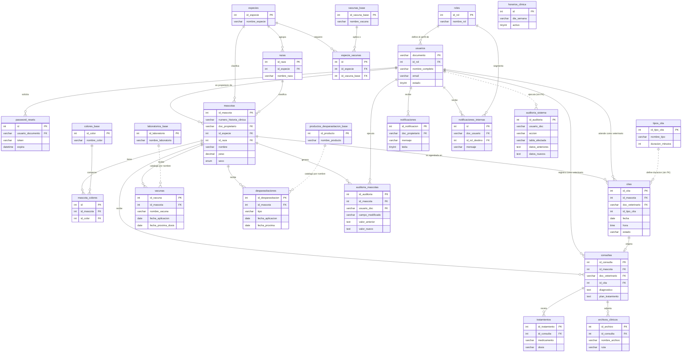

# Modelo Entidad-Relación (MER) - Zooki

Este documento describe la estructura y relaciones de la base de datos relacional de **Zooki**, diseñada para garantizar la integridad referencial, el historial clínico de los pacientes y la auditoría completa de los movimientos del sistema.

---

## Diagrama Entidad-Relación

El siguiente diagrama describe las tablas del sistema y sus relaciones. Está escrito en Mermaid, por lo que se versiona junto al código y se renderiza de forma nítida a cualquier nivel de zoom.

Las líneas continuas representan relaciones con clave foránea declarada; las punteadas, vínculos lógicos que el esquema no obliga a nivel de base de datos.

---

## Detalle de Entidades Principales

### 1. Gestión de Acceso y Usuarios
*   **roles**: Define los roles de usuario (`1: Administrador`, `2: Veterinario`, `3: Recepcionista`, `4: Propietario`).
*   **usuarios**: Almacena datos personales, credenciales cifradas (o UID de Google Identity) y estado de activación (`activo`/`inactivo`). Clave foránea: `id_rol` referenciando a `roles`.
*   **password_resets**: Almacena tokens de recuperación temporales vinculados al documento del usuario.

### 2. Pacientes (Mascotas) y Catálogos
*   **mascotas**: Ficha del animal (nombre, especie, raza, sexo, peso, fecha de nacimiento, estado). Claves foráneas referenciando a `especies`, `razas` y `usuarios` (propietario).
*   **especies** y **razas**: Catálogos dinámicos que restringen los tipos de mascota disponibles y organizan la taxonomía animal.
*   **colores_base** y **mascota_colores**: Relación de muchos a muchos (`N:M`) para permitir que una mascota posea múltiples colores de pelaje registrados de manera independiente.

### 3. Operación Clínica
*   **citas**: Control de agenda veterinaria. Registra la fecha, hora, duración estimada, tipo de cita y veterinario asignado. Previene cruces de horarios.
*   **tipos_cita**: Configura la duración base y nombre de los servicios médicos (`Consulta general`, `Control`, `Vacunación`, `Cirugía`, etc.).
*   **consultas**: Ficha clínica generada por el veterinario. Almacena anamnesis, constantes fisiológicas (peso, temperatura, frecuencia cardíaca), diagnóstico y plan de tratamiento. Vinculada opcionalmente a una cita previa.
*   **tratamientos**: Medicamentos recetados, dosis y frecuencia asociados a una consulta médica específica.
*   **archivos_clinicos**: Indexación de exámenes médicos externos, imágenes de soporte o radiografías vinculadas a la historia clínica.

### 4. Monitoreo y Prevención
*   **vacunas**: Historial de vacunas aplicadas a cada mascota con la fecha de aplicación y la próxima dosis obligatoria.
*   **desparasitaciones**: Control de tratamientos preventivos internos/externos con fecha de próxima aplicación.
*   **vacunas_base** y **especie_vacunas**: Relación paramétrica que asocia qué vacunas corresponden a qué especies biológicas.

### 5. Auditoría y Control
*   **auditoria_mascotas**: Log de cambios específicos sobre las fichas de las mascotas (quién modificó, qué campo, valor anterior y nuevo).
*   **auditoria_sistema**: Historial de seguridad y operaciones del sistema completo, registrando acciones (`LOGIN`, `LOGOUT`, `INSERT`, `UPDATE`, `DELETE`) con los payloads JSON de datos anteriores y nuevos para una auditoría forense íntegra.

### 6. Configuración y Parámetros
*   **horarios_clinica**: Define los horarios de atención y bloques de disponibilidad (mañana y tarde) por día de la semana para la gestión de citas.
*   **laboratorios_base**: Catálogo de laboratorios farmacéuticos fabricantes de vacunas y medicamentos.
*   **productos_desparasitacion_base**: Catálogo parametrizado de productos desparasitantes disponibles, clasificados por tipo (interna, externa o ambas).

