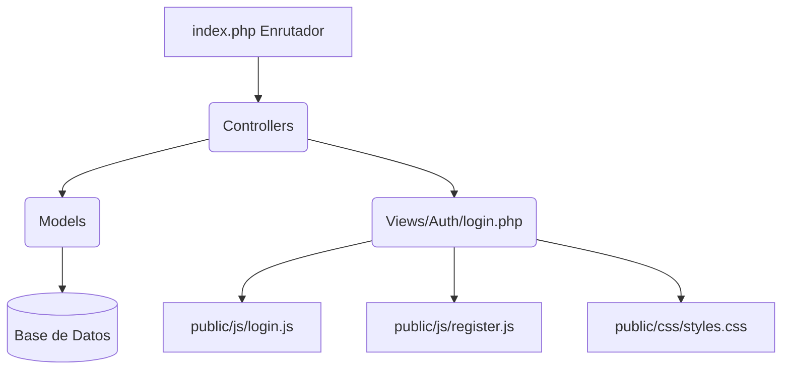

# Zooki - Sistema de Gestión Veterinaria Inteligente

Zooki es un sistema web moderno, robusto y eficiente diseñado para la gestión integral de clínicas veterinarias. Facilita la administración de pacientes (mascotas), historias clínicas, citas, y ofrece autenticación nativa segura e inicio de sesión integrado mediante Google Identity Services.

## Historial de Versiones

### Versión 1.10.0 (Actual)
Portal del propietario adaptado a móvil, tablet y escritorio, formularios del portal validados en el servidor, correo por Brevo y migraciones que se aplican solas al desplegar.

**Portal del propietario en cualquier pantalla (HU-15, RNF-07)**
*   **Tres tamaños:** barra inferior en móvil y tablet; menú lateral en escritorio (≥ 1024 px). En escritorio, Inicio, la agenda, la ficha de la mascota y el perfil se reparten en columnas.
*   **Navegación con dirección propia** (`#agenda`, `#perfil`, `#mascota-12`): el botón «atrás» vuelve a la sección anterior o cierra la ventana abierta, y la recarga conserva la sección.
*   **Horario real de la clínica** en Inicio (si está abierta ahora y el horario de la semana), en lugar del banner fijo de «24 horas», que no era cierto.
*   **Accesibilidad:** el zoom ya no está bloqueado, las ventanas se cierran con Esc y el foco no sale de ellas, y todas las tarjetas se abren con el teclado.
*   Los estilos se dividieron en módulos (`public/css/portal/`) y la vista quedó sin estilos en línea.

**Formularios del portal (RE-15.9, RE-15.10)**
*   **Validación en el servidor:** nombre, especie, raza de esa especie, sexo, peso y fecha de nacimiento; el teléfono de contacto y el motivo de la cita también se revisan.
*   **Foto segura:** el portal tenía una copia vieja de la subida de fotos que armaba el nombre del archivo con el de la mascota (una mascota llamada `../../algo` escribía fuera de la carpeta) y solo miraba la extensión. Ahora usa el mismo `helpers/FotoMascota.php` que el panel del personal.
*   **Razas:** el propietario ya no crea razas con texto libre. Si la suya no está, elige «Criollo» (mestiza), «No sé la raza» o «Mi raza no está en la lista» y la escribe; el personal la ve en la ficha, la atención y la lista de pacientes como raza indicada por el propietario.
*   **Más claros:** campos obligatorios marcados con `*` y opcionales con «(opcional)», sexo con dos botones y vista previa de la foto actual y de la nueva.
*   **Color:** lo registra la clínica en la consulta. Antes, guardar una edición desde el portal borraba los colores que había puesto la clínica.
*   **Agendar cita:** calendario siempre visible con los días sin atención bloqueados, horarios libres en botones de mañana y tarde, un texto que dice qué falta elegir y el botón de confirmar habilitado solo cuando todo está completo.

**Correo**
*   Los correos del sistema salen por Brevo desde `no-reply@zooki.secarvajal.com` con el dominio autenticado (DKIM y DMARC), en lugar de una cuenta de Gmail.

**Despliegue**
*   **Migraciones automáticas:** al arrancar, el contenedor web aplica las migraciones pendientes y las anota en `schema_migraciones` (ver «Migraciones de la base de datos»). Ya no hay que entrar al servidor a correrlas.
*   **Migración nueva:** `database/13_razas_portal.sql` (columna `raza_indicada` y la raza «Sin raza definida» en todas las especies). Se aplica sola en el primer despliegue.

**Correcciones**
*   La próxima cita del portal decía «Confirmada» aunque estuviera pendiente, y el estado «sin cerrar» se mostraba como «Sin_cerrar».
*   Esc llevaba a Inicio desde cualquier pantalla, aunque hubiera una ventana abierta.
*   La raza de la mascota se escapaba dos veces (una «&» salía como «&amp;amp;»), dos íconos no existían y la variable `--z-bg-light` no estaba definida.

**Pruebas**
*   Dos suites nuevas: `HorarioAtencionTest` y `ValidadorMascotaTest`.

### Versión 1.9.1
Rediseño de las pantallas de inicio, de «Mi perfil» y de la configuración de horarios, y limpieza de módulos que ya no se usaban.

**Panel de inicio del veterinario (HU-18, HU-20)**
*   **«Mi día»:** flyer de bienvenida con las citas de hoy, las atendidas y las que faltan; tarjeta del siguiente paciente con el botón para iniciar o continuar la atención, habilitado desde 15 minutos antes de la cita (RN-408).
*   **Su agenda, no la de todos:** antes mostraba las citas de todos los veterinarios, lo que incumplía el criterio de HU-18.
*   **Atenciones sin cerrar** (RN-410) y **vacunas y desparasitaciones de sus pacientes** agrupadas por día, con enlace a la ficha.

**Panel de inicio del administrador (HU-57, nueva)**
*   Citas de hoy, atendidas, no asistidas y consultas del mes comparadas con el mismo periodo del mes anterior.
*   Carga del día por veterinario, citas de hoy con filtro por estado y pendientes de la operación: atenciones sin cerrar, citas pasadas sin marcar y citas por confirmar.
*   Una sola gráfica: asistencia de los últimos 6 meses.

**Mi perfil (HU-42, HU-39)**
*   **Actividad reciente de la cuenta:** accesos, intentos fallidos y cambios, con fecha e IP, y aviso si hubo intentos fallidos en los últimos 30 días.
*   La contraseña actual solo se pide si la cuenta ya tiene una; las creadas con Google ven «Crear contraseña».
*   Requisitos de la contraseña marcados al escribir y botón para ver lo escrito.
*   El cambio de contraseña ahora queda en la auditoría, y el registro y el inicio de sesión con Google vuelven a registrarse: usaban una acción fuera del catálogo y la base los rechazaba.

**Configuración de horarios (HU-43)**
*   Una fila por día con sus bloques, las horas de cada día y un resumen de la semana; los días cerrados se leen «Cerrado».
*   Se corrigió el guardado: un día cerrado ya no envía bloques activos, que rompían la restricción `chk_afternoon` de la base.

**Correcciones y limpieza**
*   **Sin datos de ejemplo:** los paneles ya no inventan valores cuando no hay información, y el «hoy» usa la hora de la clínica y no la del servidor.
*   **Módulo de reportes eliminado** (HU-16 retirada), junto con 14 rutas, 4 vistas y 9 métodos de controlador que ninguna pantalla usaba.
*   **Interfaz:** los títulos de la cabecera quedaron alineados con el contenido y desapareció la barra de scroll que parpadeaba al cargar cada módulo.
*   El CSS y el JS de las pantallas rediseñadas salieron de las vistas a sus propios archivos.

**Pruebas**
*   Cuatro suites nuevas: `ResumenPanelTest`, `PanelTest`, `ActividadCuentaTest` y `ActividadCuentaAuditoriaTest`.

### Versión 1.9.0
Auditoría de cierre de los módulos de acceso, mascotas e historia clínica, y nueva pantalla de atención de citas para el veterinario.

**Seguridad**
*   **Aislamiento de datos por usuario:** las notificaciones y los adjuntos clínicos verifican a quién pertenecen. Antes cualquier sesión podía marcar notificaciones ajenas o descargar adjuntos de otras mascotas.
*   **Sesión reforzada:** se regenera el identificador de sesión al autenticarse, la cookie usa `HttpOnly`, `SameSite` y `Secure`, se envían cabeceras de seguridad HTTP y la cookie se elimina al cerrar sesión.
*   **Contraseñas temporales obligatorias:** mientras no se cambie, una contraseña temporal solo da acceso al formulario de cambio. Los propietarios registrados por el personal reciben una temporal por correo en lugar de usar su número de documento.
*   **Datos sensibles:** el hash de la contraseña ya no llega al navegador, los errores técnicos no se muestran al cliente y la auditoría solo acepta la IP reenviada por proxies de confianza (`TRUSTED_PROXIES`).
*   **Subida de archivos:** fotos y adjuntos se validan por su contenido y no por la extensión, y el nombre del archivo lo genera el servidor.
*   **Autorización cerrada por defecto:** se deniega cualquier acción que no figure en la matriz de roles.

**Acceso y perfil**
*   **Perfil propio para los cuatro roles (HU-42):** administrador, veterinario y recepcionista pueden consultar y editar sus datos de contacto y cambiar su contraseña.
*   **Notificaciones (HU-45):** botón para marcar todas como leídas en los paneles internos.
*   **Restablecimiento de contraseña (HU-54):** el administrador puede generar una contraseña temporal para un usuario, que se envía por correo.
*   **Mi perfil en el menú lateral:** el personal entra a su perfil desde el menú o desde su nombre en la cabecera, que ya no despliega una lista. El logo del menú usa el ícono azul de la marca.
*   **Contraseña actual al cambiarla:** se exige siempre que la cuenta tenga una contraseña conocida (`password_definida`). Las cuentas creadas con Google no la tienen, así que definen la primera sin ese paso.
*   **Correcciones:** cerrar sesión lleva al inicio de sesión en lugar de la landing page, y el interruptor para activar o desactivar colaboradores del panel de personal vuelve a funcionar. El registro y el inicio de sesión con Google vuelven a quedar en la auditoría, que los rechazaba por usar una acción fuera de su catálogo.

**Mascotas y propietarios**
*   **Validación en el servidor:** documentos y correos únicos, los siete campos obligatorios de la mascota y la raza acorde a la especie (RN-106).
*   **Integridad:** el registro y la edición se hacen en una transacción, la auditoría cubre todos los campos de la ficha (incluido el cambio de propietario) y ya no se crean razas duplicadas.
*   **Carrusel de mascotas:** cuando un propietario tiene muchas mascotas, sus tarjetas se recorren con flechas en lugar de salirse del contenedor.

**Historia clínica**
*   **Registro atómico (HU-34):** consulta, número de historia clínica, adjuntos y tratamientos se guardan juntos o no se guarda nada. Los adjuntos rechazados se informan uno por uno.
*   **Adjuntos:** se corrigió la apertura de los adjuntos clínicos, que no funcionaba ni en el área del veterinario ni en el portal.
*   **Atención sin cita (HU-56):** registro de consultas de urgencia desde Consultas Médicas, identificadas en el listado con la etiqueta «Sin cita».
*   **Consulta:** se guardan la frecuencia respiratoria y las observaciones, y el historial carga con un número fijo de consultas SQL sin importar cuántas entradas tenga.

**Pantalla de atención de la cita**
*   **Rediseño:** vista sin scroll organizada en pestañas (Consulta, Vacuna, Desparasitación e Historial). El botón «Finalizar atención» guarda la consulta y completa la cita en un solo paso.
*   **Resumen clínico:** última consulta, último peso, edad y vacunas o desparasitaciones vencidas o próximas a vencer.
*   **Estado «en curso»:** se corrigió este estado de las citas, que no existía en la base de datos y hacía desaparecer la cita de la agenda al iniciar la atención.

**Agenda de citas**
*   **Flujo de atención (RN-406, RN-408):** solo el veterinario asignado inicia la atención, el día de la cita y desde 15 minutos antes de su hora. La cita se completa al guardar su consulta, en la misma transacción, así que ya no existen citas completadas sin consulta. Una atención iniciada se retoma con «Continuar atención», aunque sea de un día anterior.
*   **Atenciones sin cerrar (RN-410, HU-45):** 10 minutos después de la hora de fin, si la atención sigue abierta, el veterinario recibe un aviso en la campana y por correo. Al terminar el día la cita pasa a «Sin cerrar». La revisión corre al cargar el calendario y con `scripts/vigilar_atenciones.php` cada 5 minutos.
*   **Cerrar sin consulta (RN-411):** el veterinario puede cerrar una atención iniciada por error indicando el motivo. La cita queda «Cerrada sin consulta», el motivo se audita y el horario se libera.
*   **Horario liberado:** una cita cancelada, no asistida o cerrada sin consulta ya no bloquea su horario. Antes agendar en ese horario respondía «Error de conexión».
*   **Estado «No asistió» (HU-29):** el veterinario lo marca cuando la hora de la cita ya pasó, y el espacio queda libre en la agenda.
*   **Hora real de atención (HU-27):** se registra la hora real de inicio y de fin de cada atención.
*   **Reglas de cancelación y reprogramación:** solo aplican a citas pendientes o confirmadas, y la reprogramación no admite un momento pasado. El veterinario puede reprogramar sus citas, lo que antes el servidor le negaba. El administrador puede reasignar el veterinario. Confirmar una cita cancelada ya no la reactiva.
*   **Agendamiento:** se rechazan las fechas pasadas y los formatos inválidos, y el propietario solo puede agendar citas para sus propias mascotas.
*   **Portal del propietario:** sus citas activas vuelven a mostrarse como «Activa» con la opción de cancelar. El portal buscaba un estado «programada» que no existe en la base de datos.
*   **Calendario:** un solo panel de detalle con las mismas reglas del servidor. Se eliminaron un segundo panel que fallaba al abrirse y cuatro métodos del controlador que no tenían ruta.
*   **Rediseño del calendario:** se marcan el día actual y los días pasados, el panel lateral tiene dos estados (lista del día y detalle de la cita), los colores de estado salen de una sola fuente y el modal «Agendar cita» cabe sin scroll. Se quitó el botón de imprimir, que no hacía nada.

**Notificaciones**
*   **Vigencia de las notificaciones:** las de citas caducan a la hora de la cita y se retiran al cancelarla, reprogramarla o atenderla.
*   **Confirmación de citas:** el calendario ya no se queda cargando mientras se envía el correo.

**Interfaz**
*   **Avisos unificados:** SweetAlert2 reemplaza los `alert()` nativos en los cuatro paneles, a través de `public/js/avisos.js`.
*   **Imagen por defecto:** las mascotas sin foto muestran una imagen local.

**Infraestructura y base de datos**
*   **Respaldos:** toman las credenciales del `.env`, admiten un destino externo configurable (`BACKUP_DIR`) y su programación queda en `scripts/zooki.cron`.
*   **Docker:** volumen `uploads` para conservar fotos y adjuntos al reconstruir el contenedor.
*   **Migraciones:** siete nuevas (`database/06_*.sql` a `database/12_*.sql`) para la vigencia de las notificaciones, los estados `en_curso`, `no_asistio`, `sin_cerrar` y `cerrada_sin_consulta` de las citas, la hora real de atención, los nuevos campos de la consulta, el horario único solo entre citas activas y la columna `password_definida`. La 06, la 07 y la 09 no se pueden repetir (ver «Migraciones de la base de datos»).
*   **Docker:** la imagen crea las carpetas de `uploads` para que el volumen nazca con permisos de Apache.
*   **Documentación:** los documentos del proyecto pasan a la carpeta `documentacion/`; en la raíz queda el README.
*   **`.env`:** PHP lo lee con `parse_ini_file`, así que un paréntesis en un comentario invalida el archivo completo. `.env.example` quedó corregido y advierte de ello.

**Despliegue de la v1.9.0 (Dokploy)**
1.  Respaldar la base de datos y ejecutar las migraciones `06` a `12` en orden sobre el contenedor de MySQL, antes de desplegar el código.
2.  Agregar al Environment `APP_URL`, `TZ`, `BACKUP_RETENCION_DIAS` y `TRUSTED_PROXIES`, sin paréntesis ni comillas en los comentarios.
3.  Marcar con `password_definida = 0` las cuentas que se registraron con Google.
4.  Desplegar y crear en Dokploy los Schedules del servicio `web`: `php /var/www/html/Zooki/scripts/vigilar_atenciones.php` cada 5 minutos y `php /var/www/html/Zooki/scripts/send_reminders.php` a las 7:00.

**Pruebas**
*   La suite pasa de 90 a 144 pruebas (608 aserciones).

### Versión 1.8.0
Endurecimiento de la seguridad del sistema y nuevo portal de documentación con búsqueda.

**Seguridad**
*   **Autorización central por rol (HU-32):** `Security::validateRole` aplica una matriz acción → roles en el front controller, antes del enrutador, cubriendo las 108 acciones no públicas. Un endpoint invocado directamente queda tan protegido como uno llamado desde la interfaz. Cierra 20 endpoints de lectura que respondían sin sesión alguna, entre ellos el listado de propietarios.
*   **Escalada de privilegios y último administrador (HU-33):** el rol asignable se valida contra la tabla `roles` y no se puede degradar ni desactivar al único administrador activo.
*   **Registros clínicos (HU-35):** consulta, vacunación y desparasitación exigen rol veterinario, verifican que la mascota exista y esté activa, validan que la cita vinculada sea del mismo paciente y rechazan fechas futuras, enumerados inválidos y signos vitales fuera de rango.
*   **Contraseñas, correo y Google (HU-36):** política única de contraseñas (mínimo 8 con mayúscula, minúscula y número, más lista de bloqueo, patrones triviales y datos del titular); el auto-registro ya no inicia sesión solo y exige confirmar el correo; el login con Google valida `aud` e `iss` contra el client_id propio, lo que impedía usar un token emitido para otra aplicación.
*   **Límite de intentos y enumeración (HU-38):** el contador pasó de `$_SESSION` a la tabla `intentos_login`, con límite por IP y por cuenta, de modo que descartar la cookie ya no lo reinicia. Los mensajes de login son idénticos exista o no la cuenta.

**Registro**
*   **Espera de la confirmación sin recargar:** el formulario de registro se envía por `fetch` y muestra una pantalla de espera que consulta `estado_verificacion_ajax` cada 4 segundos. Cuando el usuario abre el enlace del correo, la pestaña original entra sola al portal. Los errores de validación ya no expulsan del formulario y se conservan los datos escritos. El correo de verificación usa la plantilla común de `EmailService`.

**Portal de documentación**
*   **Rediseño de la navegación:** barra superior con buscador global, submenús colapsables generados desde los encabezados de cada documento, tabla de contenidos lateral y tema claro/oscuro.
*   **Búsqueda con Algolia:** paleta de comandos (Ctrl + K o `/`) sobre los ocho documentos publicados, con respaldo automático al buscador local si no hay credenciales.
*   **Anclas estables:** los encabezados generan slugs deterministas compartidos entre PHP y JavaScript, lo que permite enlazar una sección concreta (`#documento--seccion`).

**Base de datos**
*   Dos tablas nuevas: `intentos_login` y `verificaciones_email` (`database/04_*.sql` y `database/05_*.sql`).

**Pruebas**
*   La suite pasa de 26 a 90 pruebas (460 aserciones), con cobertura nueva sobre la matriz de autorización, la validación clínica, la política de contraseñas, los tokens de Google y el contador de intentos.

### Versión 1.7.3
Reconstrucción completa de la landing page pública, que hasta ahora era una beta de cuatro bloques, e incorporación de las páginas legales del sistema.

**Landing page**
*   **Nueva arquitectura de 8 secciones:** Hero, contraste problema/solución con el recorrido de puesta en marcha, módulos, perfiles de usuario, pacientes, seguridad, preguntas frecuentes y pie de página. La vista se dividió en parciales de responsabilidad única bajo `views/landing/partials/`, y `landing.css` pasó a ser un agregador de `@import` sobre `public/css/landing-modules/`, siguiendo el patrón ya usado en calendario y dashboard.
*   **Independencia de la aplicación privada:** La landing dejó de importar `styles.css` (27 KB de estilos internos) y define su propio sistema de tokens de marca, reduciendo peso y acoplamiento.
*   **Densidad optimizada:** Siete de las once secciones originales superaban el alto de un portátil, obligando a hacer scroll dentro de cada una. Tras comprimir el espaciado, acortar los textos y fusionar las secciones ligeras, la página pasó de 9.642 px a 5.402 px de alto (**-44%**) y cada sección entra completa en una pantalla.
*   **Interacción y accesibilidad:** Nuevo `public/js/landing.js` sin código en línea: menú móvil, estado del header al hacer scroll, resaltado de la sección activa, aparición progresiva con `IntersectionObserver`, pestañas con patrón ARIA y acordeón. Incluye enlace de salto al contenido, foco visible y soporte de `prefers-reduced-motion`.
*   **Identidad visual:** Paleta unificada en azul (el acento verde heredado de `--secondary` se sustituyó por un azul cielo) y hero a pantalla completa mediante `min-height: 100svh`, con señal de scroll para evitar el efecto de falso fondo. Los perfiles de usuario se ilustran con mini interfaces construidas en CSS que representan lo que ve cada rol, en lugar de fotografías decorativas.
*   **SEO y metadatos sociales:** Meta descripción, `canonical`, Open Graph, Twitter Card, `theme-color`, `apple-touch-icon` y datos estructurados JSON-LD de tipo `SoftwareApplication`.

**Páginas legales**
*   **Política de Tratamiento de Datos Personales** (`?action=privacidad`): estructurada según el artículo 2.2.2.25.3.1 del Decreto 1074 de 2015, con los plazos de los artículos 14 y 15 de la Ley 1581 de 2012. Distingue entre Responsable y Encargado del Tratamiento, previendo que la clínica que adopte Zooki pasará a ser la Responsable.
*   **Términos de Uso** (`?action=terminos`) **y Política de Cookies** (`?action=cookies`): los términos declaran que el sistema está en desarrollo y delimitan la responsabilidad clínica conforme a la Ley 576 de 2000; la política de cookies enumera el inventario real auditado sobre el código. No se incorpora banner de consentimiento porque el sistema no fija cookies no esenciales, decisión documentada en el propio texto.
*   **Autorización expresa en el registro:** Casilla de consentimiento en los dos formularios de registro, validada en el servidor —el atributo `required` del navegador es eludible— como exige el artículo 9 de la Ley 1581 de 2012.

**Correcciones**
*   **Navegación móvil inexistente:** El CSS anterior ocultaba el navbar por completo bajo 1024 px sin ofrecer alternativa, dejando a los usuarios móviles sin ninguna navegación. Se implementó un menú lateral con capa oscura, cierre por `Escape` y bloqueo de scroll.
*   **Contraseñas en el almacenamiento del navegador:** La casilla «Recuérdame» guardaba la contraseña en texto plano en `localStorage` y la reinyectaba en el formulario. Se eliminó ese almacenamiento, se añadió la purga de las credenciales ya guardadas por la versión anterior, y la preferencia pasó a persistirse al marcarla y no solo al enviar el formulario.
*   **Redirección tras un login fallido:** `redirectWithError()` apuntaba a `index.php` sin parámetro `action`, que el front controller resuelve como `landing`; cualquier credencial incorrecta expulsaba al usuario a la portada con el mensaje pendiente en sesión. Se corrigió la ruta, se añadió aviso al bloqueo por intentos y un enlace de regreso a la landing desde la pantalla de acceso.
*   **Variables CSS inexistentes:** Una auditoría detectó tres referencias a variables no definidas, que invalidaban silenciosamente sus declaraciones: `--primary-dark` teñía la marca del login del color de enlace visitado del navegador, y `--border` impedía que se dibujaran las líneas del separador. Queda pendiente `--z-bg-light` en `portal.css`.
*   **Contraste en botones:** El reset `.landing-body a { color: inherit }` prevalecía por especificidad sobre `.lp-btn--primary`, de modo que los botones azules heredaban el texto oscuro del body. Resuelto acotando el reset con `:where()`, igual que en el de imágenes.
*   **Versionado de assets:** Nueva clase `config/App.php` que centraliza la versión del producto y reemplaza el cache-busting con `time()`, el cual invalidaba la caché del navegador en cada petición.

### Versión 1.7.2
Esta versión corrige la visualización y compatibilidad del portal de documentación del sistema:
*   **Conversión de Tablas Grid a Markdown Estándar:** Migración de la Ficha Técnica (`FichaTecnica_Zooki.md`) y de los Requisitos (`ERS.md`) de formato grid a tablas estándar GFM, eliminando residuos de caracteres y garantizando un renderizado visual perfecto en el portal.

### Versión 1.7.1
Esta versión implementa la primera versión beta de la landing page para el proyecto Zooki:
*   **Landing Page (Beta):** Creación de una página de inicio moderna y responsiva basada en los colores, tipografía e identidad visual de la marca.
*   **Acceso Directo a la Documentación:** Enlace directo integrado en la navegación para acceder de forma rápida y sencilla al portal de documentación del sistema.
*   **Inicio de Sesión Unificado:** Botón de llamado a la acción (CTA) para redirigir a los usuarios al portal de login.
*   **Separación de Lógica y SOLID:** Creación de un controlador dedicado `LandingController` y segregación de estilos CSS en `landing.css`, asegurando un código limpio y mantenible.

### Versión 1.7.0
Esta versión implementa las recomendaciones de aseguramiento de calidad y mantenibilidad del sistema:
*   **Pruebas Automatizadas (PHPUnit):** Suite de pruebas unitarias y de integración que validan el flujo de autenticación, el helper de tokens CSRF, el middleware de Rate Limiting y las reglas críticas de negocio para evitar solapamiento de horarios en citas.
*   **Integración Continua (CI):** Configuración de un pipeline en GitHub Actions (`.github/workflows/ci.yml`) que verifica sintaxis PHP, instala dependencias y corre las pruebas automáticamente en cada push o pull request.
*   **Modularización de Estilos CSS:** Refactorización y división de las hojas de estilo más extensas (`medical-module.css`, `dashboard.css` y `calendario.css`) en sub-módulos atómicos ordenados por responsabilidad en directorios dedicados, simplificando el mantenimiento mediante directivas `@import`.
*   **Auditoría de Seguridad y Credenciales:** Verificación y documentación formal del estado ficticio de las credenciales de prueba en `EmailService.example.php`, actualizando su diseño HTML al formato Slack-style unificado.

### Versión 1.6.0
Esta versión optimiza la experiencia de usuario del portal del propietario incorporando un Calendario de Salud interactivo con filtros, la visualización de la ficha clínica detallada de consultas, la exportación de registros de salud a PDF, y la edición autónoma de su información de contacto.


*   **Edición Autónoma de Datos de Contacto:** Añadido un formulario colapsable en la vista de perfil que permite al propietario actualizar de manera segura su correo y teléfono a través de peticiones AJAX, con validaciones de formato y comprobación de correo en uso.
*   **Ficha Clínica y Recetario en Detalle de Cita:** Al presionar una cita completada, se realiza una consulta AJAX para recuperar e ilustrar en un Bottom Sheet nativo premium los signos vitales, motivo de consulta, diagnóstico, plan de tratamiento y la receta de medicamentos. Si la cita fue completada sin detalles médicos, se muestra un estado explicativo y claro.
*   **Filtro Rápido de Mascotas (Pet Chips):** Implementación de una barra horizontal de botones ("chips") con fotos miniatura de cada mascota para filtrar interactivamente las citas y el calendario de salud en un clic.
*   **Calendario Mensual de Salud (Win11 Overlay):** Cuadrícula mensual interactiva basada en CSS Grid que señala los días con eventos mediante puntos de color. Sustitución de selectores nativos por un panel overlay interactivo para elegir mes y año con límite estático en 2020 y dinámico en el año en curso.
*   **Leyenda e Interactividad en Calendario:** Incorporación de una leyenda descriptiva de colores (Azul para citas, Verde para vacunas, Amarillo para controles) y soporte para listar citas cliqueables dentro de la cronología al filtrar por fecha.
*   **Timeline de Salud Dividida:** Segmentación lógica de los registros médicos entre próximas dosis programadas (con indicador de días restantes: *"Faltan X días"*, *"¡Hoy!"*, o *"Vencido hace X días"*) e historial clínico aplicado.
*   **Exportar Ficha de Salud en PDF:** Botón optimizado para imprimir con estilos membretados dedicados (`@media print`) permitiendo al dueño descargar la cartilla de salud oficial de la mascota como PDF.
*   **Corrección de Desfase de Mes en Flatpickr:** Corrección del error en la selección de meses de nacimiento/citas que desplazaba los meses seleccionados al omitir el parámetro de offset en la API interna de Flatpickr (`changeMonth(i, false)`).
*   **Remoción de Servicio Obsoleto:** Eliminación del servicio no disponible "Grooming & Higiene" de la vista exploradora para alinear el catálogo con los servicios reales de la clínica.
*   **Corrección en Edición de Mascota:** Solución al bug que impedía guardar cambios en la información de una mascota debido a la falta del campo `'color'` en el payload AJAX enviado al modelo.

### Versión 1.5.0
Esta versión incluye optimizaciones mayores en el flujo de agendamiento y notificaciones de citas, la incorporación de interfaces móviles personalizadas nativas, y correcciones de adaptabilidad en vistas de autenticación.

*   **Modales Estilo TikTok (Action Sheets):** Implementación de una interfaz de Bottom Sheet/Drawer nativa y fluida (`showTikTokModal`) para móviles en el portal del propietario. Reemplaza los modales de SweetAlert y alertas de navegador en la confirmación de citas, advertencias de duplicidad y cancelación de citas.
*   **Reglas de Solapamiento Físico de Citas:** Bloqueo automático en el backend y frontend de citas simultáneas o solapadas para una misma mascota, permitiendo al mismo tiempo múltiples citas el mismo día en horas diferentes mediante una advertencia interactiva.
*   **Mapeo de Tipos de Cita en Portal:** Corrección de la propiedad de nombre del tipo de cita (`nombre_tipo`) enviada por el endpoint AJAX para asegurar su visualización en el listado del portal del propietario.
*   **Notificaciones de Citas Premium (Sin Emojis):** Migración de todos los correos del ciclo de vida de citas (confirmación, reprogramación y cancelación) a la plantilla unificada de `EmailService` con diseño limpio tipo Slack y sin emojis para un aspecto más formal.
*   **Adaptabilidad en Registro Móvil:** Solución al bug de CSS Grid que hacía que los campos de registro se vieran reducidos o apiñuscados en móvil, forzando un diseño de 1 columna a partir de 1023px.
*   **Compresión de Recursos de Email:** Reducción drástica del tamaño de las imágenes incrustadas CID para optimizar envíos y tiempo de carga (logotipo de 2.08 MB a 2.8 KB, ícono de 300 KB a 24 KB).

### Versión 1.4.0
Esta versión se enfoca en resolver fallas visuales de adaptabilidad móvil (responsive), optimizaciones críticas en la entrega y renderizado de correos electrónicos, y la mejora de la experiencia de usuario en la gestión de contraseñas.

*   **Incrustación de Imágenes CID (Emailing):** Las imágenes del logotipo y del ícono de Zooki ahora se adjuntan directamente en el cuerpo del correo como imágenes incrustadas usando CID (`cid:zooki_icon_blue`, `cid:zooki_logotipo`). Esto garantiza la carga inmediata y evita el bloqueo de imágenes externas en gestores de correo como Gmail y Outlook.
*   **Correos de Bienvenida Automáticos:** Implementación del envío inmediato de un correo de bienvenida a los nuevos usuarios al registrarse, tanto por el flujo tradicional de correo como al completar el registro con Google.
*   **Autenticación Inteligente en Perfil:** Se añadió la detección del método de inicio de sesión (`google` o `password`). Si un usuario ingresó con Google, se oculta el campo de "Contraseña Actual" en su perfil (ya que carece de ella), permitiéndole establecer una nueva contraseña de forma directa.
*   **Seguridad y Corrección en Cambio de Clave:** Se añadió la validación de la contraseña actual en el backend para usuarios que ingresaron con credenciales normales. Además, se solucionó un error que impedía guardar los cambios de contraseña voluntaria desde el perfil.
*   **Correcciones Visuales (UI/UX):**
    *   **Bordes de Inputs en Google Modal:** Se agregaron bordes consistentes e iconos visibles en los campos del modal de completar registro de Google.
    *   **Control de Desbordamiento:** Se implementó `word-break: break-all` y `min-width: 0` para evitar que correos electrónicos largos desborden la tarjeta de perfil del propietario o la tarjeta del modal de Google.

### Versión 1.3.0
*   **Gestión Autónoma de Mascotas por el Propietario:**
    *   Botón de agregar mascota (+) en el panel de inicio del portal del propietario.
    *   Botón de editar perfil de mascota en la barra del drawer de detalles.
    *   Integración de formularios móviles e intuitivos de registro y edición que admiten: foto de perfil (con limitación a 5MB, JPG/PNG), especie, raza (incluida creación dinámica con opción "Otra"), sexo, peso, fecha de nacimiento y selección múltiple de colores base (tipo tags/pills).
    *   Métodos y rutas seguras en el backend (`portal_registrar_mascota_ajax` y `portal_actualizar_mascota_ajax`) que aseguran que el dueño en sesión solo pueda crear o modificar mascotas de su pertenencia.
*   **Agendamiento de Citas Inteligente:**
    *   Modificación de la carga de horas disponibles en el formulario de citas del propietario.
    *   Integración de los endpoints `get_horas_disponibles_ajax` y `get_sugerencias_horario_ajax` para intersectar las horas hábiles de la clínica con la disponibilidad del veterinario. De esta manera, el propietario solo ve y puede agendar horas libres reales, evitando el solapamiento.
*   **Corrección de Bug en Carga de Datos de Mascotas (Entornos Unix/Linux):** Se solventó un error crítico de producción en el portal del propietario donde no se podían cargar los detalles de las mascotas. La causa raíz radicaba en la sensibilidad a mayúsculas/minúsculas de los nombres de tablas SQL en sistemas Linux (ej. referencias de Mascotas y Usuarios que debían ser estrictamente mascotas y usuarios en minúsculas).
*   **Estandarización de Consultas SQL:** Se normalizaron y corrigieron las consultas en los siguientes modelos y controladores:
    *   Vacuna.php
    *   Usuario.php
    *   Consulta.php
    *   VacunaController.php
    *   ConsultaController.php
    *   CitaController.php

### Versión 1.2.0
*   **UI/UX Frontend:**
    *   Rediseño completo del Portal de Propietario con apariencia inspirada en aplicaciones móviles.
    *   Implementación de barra de navegación inferior (Bottom Navigation Bar).
    *   Incorporación de carrusel de mascotas para una experiencia más dinámica.
    *   Actualización de la paleta de colores con un diseño más limpio y moderno.
*   **Módulo de Citas:**
    *   Agregadas las rutas AJAX faltantes en `index.php`: `portal_get_vets_ajax`, `portal_get_tipos_cita_ajax`, `portal_agendar_cita_ajax`.
    *   Los propietarios ahora pueden agendar citas directamente desde el portal.
*   **Seguridad y Gestión de Perfil:**
    *   Eliminado el modal de cambio de contraseña.
    *   Implementado un menú desplegable en la sección **Mi Cuenta** para gestionar opciones del perfil.
    *   Añadida validación de seguridad en tiempo real mediante una barra de fortaleza de contraseña.
    *   Actualizado el modelo `Usuario.php` para obtener y mostrar correctamente: Correo electrónico del propietario y número de teléfono del propietario.
*   **Corrección de Errores (Bug Fixes):**
    *   Corregido un Error 500 en el sistema de notificaciones: Ajuste de las claves de sesión `usuario_doc` y `usuario_id_rol` y corrección de la ruta absoluta hacia la base de datos en `NotificacionInterna.php`.
    *   Mejorada la visualización de estados vacíos (sin citas, sin vacunas, etc.) mediante componentes tipo tarjeta, eliminando la presentación en texto plano.

### Versión 1.1.0
Esta versión introduce una renovación completa del canal de comunicación por correo electrónico, mejoras críticas de estabilidad en entornos locales de desarrollo y optimizaciones en la seguridad de autenticación.

*   **Rediseño de Correos estilo Slack:** Todas las notificaciones por correo (restablecimiento de contraseña, bienvenida con credenciales y recordatorios de citas/vacunas) se actualizaron a una maquetación moderna de estilo Slack.
*   **Centralización de Plantillas HTML:** Se implementó `EmailService::obtenerPlantillaBaseHTML()` para unificar el header y el footer con el logotipo oficial, reduciendo la duplicación de código.
*   **Enlaces Absolutos Dinámicos:** Integración de la variable `APP_URL` en el archivo `.env` para construir enlaces seguros y absolutos tanto en local como en producción.
*   **Seguridad de Contraseñas (Reset & Registro):** Incorporación del medidor de seguridad, bloqueo de submit inseguro y botón de ojo de visibilidad para contraseñas.
*   **Corrección de Dobles Bordes y Padding:** Solución al error visual de herencia de inputs que producía un doble borde y recortaba la primera letra en las pantallas y modales de autenticación.
*   **Conexión Tolerante a Fallos:** Optimización del tiempo de respuesta DNS en Windows para bases de datos locales y fallback inteligente de credenciales (Docker/XAMPP).


---

## Guía de la Primera Versión Estable (v1.0.0)

Esta primera versión establece el núcleo de autenticación y acceso seguro al sistema. Se centra en proveer una experiencia de usuario (UX) sumamente fluida y atractiva mediante un diseño basado en Bento Grid, garantizando al mismo tiempo los más altos estándares de seguridad web.

### Funcionalidades Implementadas en v1.0.0
*   **Bento Grid Collage:** Interfaz visual premium inspirada en cuadrículas de estilo bento, adaptable y con animaciones de entrada.
*   **Animación de Flip Container:** Transición interactiva en 3D para alternar entre el formulario de inicio de sesión (Login) y el formulario de creación de cuenta (Registro) sin recargar la página.
*   **Google OAuth Integrado:** Autenticación rápida a través del SDK oficial de Google (Google Identity Services).
*   **Flujo de Registro Completo de Google:** Si un usuario de Google ingresa por primera vez, el sistema detecta que faltan datos clave y despliega un modal interactivo para capturar la cédula/documento, tipo de documento y número de teléfono antes de completar el registro.
*   **Seguridad CSRF:** Implementación de tokens CSRF para todos los formularios (Login y Registro) mediante una clase helper dedicada (`Csrf.php`).
*   **Validaciones en Tiempo Real:** Validación dinámica de fortaleza de contraseña, coincidencia de campos y números de identificación.
*   **Bloqueo de Interacción (Drag & Selection):** Deshabilitado el arrastre (`draggable="false"`) y la selección de texto en los elementos visuales del Bento Grid y el logotipo principal para brindar la sensación de una aplicación nativa.
*   **SweetAlert2 Integrado:** Notificaciones y modales interactivos para alertas de recuperación de contraseña y avisos de portal.

---

## Arquitectura del Sistema

El proyecto está construido bajo una arquitectura **MVC (Modelo-Vista-Controlador)** con PHP puro:


```mermaid
graph TD
    A[index.php Enrutador] --> B(Controllers)
    B --> C(Models)
    B --> D(Views/Auth/login.php)
    D --> E[public/js/login.js]
    D --> F[public/js/register.js]
    D --> G[public/css/styles.css]
    C --> H[(Base de Datos)]
```

### Estructura de Directorios
*   `/config/`: Configuración global del sistema, conexión a base de datos y utilidades.
*   `/controllers/`: Controladores encargados del procesamiento de peticiones y lógica del sistema.
*   `/models/`: Modelos de base de datos que representan las tablas principales (usuarios, mascotas).
*   `/views/`: Vistas PHP estructuradas. Las vistas de autenticación están en `/views/auth/`.
*   `/helpers/`: Clases de apoyo enfocadas en la seguridad (`Security.php`, `Csrf.php`).
*   `/public/`: Único punto de acceso del cliente. Contiene:
    *   `css/styles.css`: Estilos unificados del sistema.
    *   `js/login.js`: Lógica de animación de flip, alertas, modales e integración de Google.
    *   `js/register.js`: Validación en tiempo real y flujo de registro.
    *   `img/`: Recursos gráficos e imágenes del collage del Bento Grid.

---

## Guía de Instalación y Configuración

### Requisitos del Sistema
*   Servidor web Apache o Nginx.
*   PHP 8.0 o superior (con extensiones `pdo_mysql`, `openssl` y `json` habilitadas).
*   Servidor MySQL/MariaDB.
*   Composer (para gestión de dependencias en caso de requerirse).

### Configuración Paso a Paso

1.  **Clonar el Proyecto:**
    ```bash
    git clone <url_de_tu_repositorio>
    ```

2.  **Configurar Variables de Entorno (.env):**
    Duplica el archivo `.env.example` en la raíz, renombralo como `.env` e ingresa tus credenciales de base de datos y tu ID de cliente de Google:
    ```env
    DB_HOST=localhost
    DB_NAME=zooki_db
    DB_USER=root
    DB_PASS=tu_contraseña

    # Google Identity Services API Client ID
    GOOGLE_CLIENT_ID=tu_client_id_de_google.apps.googleusercontent.com
    ```

3.  **Configuración de Servidor Local (Virtual Host):**
    Se recomienda configurar un Host Virtual que apunte al directorio `public/` del proyecto para el correcto funcionamiento de las rutas relativas.

4.  **Importar la Base de Datos:**
    Importa el esquema SQL inicial ubicado en `database/01_schema.sql` en tu servidor MySQL y luego aplica las migraciones con `php scripts/migrar.php`.

## Migraciones de la base de datos

Las migraciones son los archivos `database/NN_nombre.sql` con número 04 o mayor. **En el servidor se aplican solas:** al arrancar, el contenedor `web` ejecuta `docker/iniciar.sh`, que corre `scripts/migrar.php` y después inicia Apache. Como Dokploy reconstruye el contenedor en cada despliegue, basta con subir el archivo `.sql` nuevo junto con el código.

*   **Registro:** cada migración aplicada queda en la tabla `schema_migraciones`, así que ninguna se repite.
*   **Línea base:** las migraciones 04 a 12 se aplicaron a mano antes de que existiera el registro, y la 06, la 07 y la 09 **no** se pueden repetir: la 07 y la 09 redefinen los estados de las citas con la lista de su época y borrarían `sin_cerrar` y `cerrada_sin_consulta`. La primera vez que el migrador corre en una base que ya tiene el esquema, las anota como aplicadas sin ejecutarlas.
*   **Si una falla:** se detiene ahí, no la anota (se reintenta en el siguiente arranque) y Apache arranca igual para no tumbar el sitio. El error aparece en los logs del contenedor en Dokploy con el prefijo `[migraciones] ERROR`.
*   **En local:** `php scripts/migrar.php` aplica las que falten; con `--revisar` solo muestra cuáles aplicaría.
*   **Al escribir una migración nueva:** usa el número siguiente y hazla repetible (comprueba si la columna o la fila ya existe antes de crearla, como en `database/13_razas_portal.sql`). En una instalación nueva, MySQL ejecuta todos los `.sql` al crear la base y luego el migrador vuelve a correr las posteriores a la 12.

## Modelo de Base de Datos

Zooki cuenta con un esquema relacional estructurado en MySQL para garantizar la integridad y auditoría de la información clínica. Las tablas principales se dividen en:

*   **Autenticación y Roles:**
    *   `roles`: Define accesos (`administrador`, `veterinario`, `recepcionista`, `propietario`).
    *   `usuarios`: Almacena documentos de identidad, correos (únicos) y contraseñas seguras.
    *   `password_resets`: Tokens temporales con caducidad para el restablecimiento de contraseñas.
*   **Gestión Veterinaria:**
    *   `especies` y `razas`: Catálogos precargados para la correcta catalogación de pacientes.
    *   `mascotas`: Pacientes asociados a su respectivo propietario, incluyendo raza, peso, sexo e historial.
    *   `colores_base` y `mascota_colores`: Relación de muchos a muchos para el pelaje de las mascotas.
    *   `vacunas`: Registro detallado del historial de vacunación y próximas dosis para los pacientes.
    *   `desparasitaciones`: Control y dosificación de tratamientos preventivos de desparasitación interna y externa.
*   **Operación Diaria:**
    *   `tipos_cita`: Tipos de cita parametrizados con su respectiva duración (Consulta general, cirugía, etc.).
    *   `citas`: Control de agenda médica con restricciones de unicidad para evitar cruces de horarios de veterinarios.
    *   `consultas`: Registros clínicos de anamnesis, constantes fisiológicas (peso, temperatura, frecuencia cardíaca), diagnóstico y plan de tratamiento.
    *   `tratamientos`: Medicamentos, dosis, vías de administración y duración asociados a las consultas clínicas.
    *   `archivos_clinicos`: Almacenamiento e indexación de archivos externos adjuntos (exámenes de laboratorio, radiografías) vinculados a una consulta.
    *   `notificaciones` (externas por email) y `notificaciones_internas` (en la plataforma): Canales de alerta para recordar citas, avisar eventos o enviar mensajes administrativos por rol o usuario.
*   **Seguridad y Control:**
    *   `auditoria_mascotas`: Historial de modificaciones de campos clave en los pacientes para mantener la trazabilidad de los cambios.
    *   `auditoria_sistema`: Log detallado de operaciones de seguridad (LOGIN, LOGOUT, LOGIN_FAIL) e inserción, modificación o eliminación de datos, registrando información en formato JSON (datos anteriores y nuevos) junto con la IP y fecha.

---

## Principios de Diseño (SOLID)

El diseño arquitectónico de Zooki cubre de forma parcial los principios **SOLID** para asegurar un código mantenible a medida que el sistema escala, adaptándolos pragmáticamente a un entorno PHP nativo rápido:

*   **Responsabilidad Única (SRP):** Aplicado parcialmente mediante helpers de seguridad (`Csrf.php`, `Security.php`) y enrutadores dedicados que aíslan la lógica de autenticación de la presentación visual.
*   **Abierto/Cerrado (OCP):** Modularidad en el enrutamiento centralizado que permite agregar nuevas rutas de controladores sin modificar la estructura del despachador inicial.
*   *Nota:* Para mantener la ligereza y rapidez en las operaciones CRUD, ciertos flujos de bases de datos y controladores acoplan directamente lógica para evitar sobrecarga de abstracciones innecesarias.

## Esquema de Versionamiento (Zooki SemVer)

Zooki utiliza un esquema de versionamiento semántico adaptado a la distribución de componentes del sistema: **`X.Y.Z`**

*   **`X` (Mayor):** Cambios de gran impacto en la lógica de negocio general, reestructuración masiva del sistema, cambios mayores de arquitectura o lanzamientos de nuevas versiones globales (Ej: de `1.0.0` a `2.0.0`).
*   **`Y` (Backend / Backend + Frontend):** Cambios en la lógica del backend (controladores, modelos, migraciones de base de datos). Si un cambio en el backend requiere actualizar vistas u hojas de estilos (afectando también al frontend), este dígito se incrementará (Ej: de `1.0.0` a `1.1.0`).
*   **`Z` (Frontend Puro):** Cambios exclusivos del frontend (mejoras de estilo CSS, animaciones, lógica JavaScript del lado del cliente, layouts) que no afectan ni modifican controladores ni bases de datos (Ej: de `1.0.0` a `1.0.1`).

---

© 2026 Zooki Veterinary Management App. Todos los derechos reservados.
