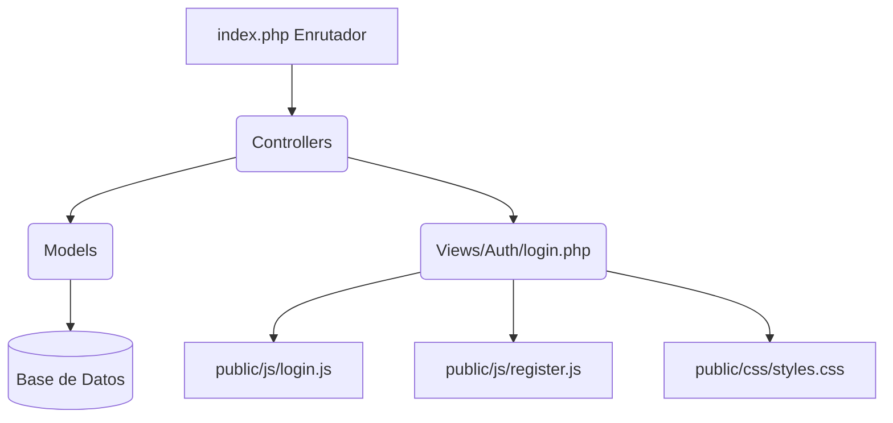

# Zooki - Sistema de Gestión Veterinaria Inteligente

Zooki es un sistema web moderno, robusto y eficiente diseñado para la gestión integral de clínicas veterinarias. Facilita la administración de pacientes (mascotas), historias clínicas, citas, y ofrece autenticación nativa segura e inicio de sesión integrado mediante Google Identity Services.

## Historial de versiones

El historial completo de versiones (v1.0.0 → v1.12.0), la guía de la primera versión estable y el esquema de versionamiento (Zooki SemVer) se documentan aparte en **[documentacion/HistorialVersiones.md](documentacion/HistorialVersiones.md)** (pestaña «Historial de versiones» del portal), para no inflar esta sinopsis.

## Arquitectura del Sistema

El proyecto está construido bajo una arquitectura **MVC (Modelo-Vista-Controlador)** con PHP puro:


```mermaid
graph TD
    A[index.php Enrutador] --> B(Controllers)
    B --> C(Models)
    B --> D(Views/Auth/login.php)
    D --> E[public/js/login.js]
    D --> F[public/js/register.js]
    D --> G[public/css/styles.css]
    C --> H[(Base de Datos)]
```

### Estructura de Directorios
*   `/config/`: Configuración global del sistema, conexión a base de datos y utilidades.
*   `/controllers/`: Controladores encargados del procesamiento de peticiones y lógica del sistema.
*   `/models/`: Modelos de base de datos que representan las tablas principales (usuarios, mascotas).
*   `/views/`: Vistas PHP estructuradas. Las vistas de autenticación están en `/views/auth/`.
*   `/helpers/`: Clases de apoyo enfocadas en la seguridad (`Security.php`, `Csrf.php`).
*   `/public/`: Único punto de acceso del cliente. Contiene:
    *   `css/styles.css`: Estilos unificados del sistema.
    *   `js/login.js`: Lógica de animación de flip, alertas, modales e integración de Google.
    *   `js/register.js`: Validación en tiempo real y flujo de registro.
    *   `img/`: Recursos gráficos e imágenes del collage del Bento Grid.

---
## Guía de Instalación y Configuración

### Requisitos del Sistema
*   Servidor web Apache o Nginx.
*   PHP 8.0 o superior (con extensiones `pdo_mysql`, `openssl` y `json` habilitadas).
*   Servidor MySQL/MariaDB.
*   Composer (para gestión de dependencias en caso de requerirse).

### Configuración Paso a Paso

1.  **Clonar el Proyecto:**
    ```bash
    git clone <url_de_tu_repositorio>
    ```

2.  **Configurar Variables de Entorno (.env):**
    Duplica el archivo `.env.example` en la raíz, renombralo como `.env` e ingresa tus credenciales de base de datos y tu ID de cliente de Google:
    ```env
    DB_HOST=localhost
    DB_NAME=zooki_db
    DB_USER=root
    DB_PASS=tu_contraseña

    # Google Identity Services API Client ID
    GOOGLE_CLIENT_ID=tu_client_id_de_google.apps.googleusercontent.com
    ```

3.  **Configuración de Servidor Local (Virtual Host):**
    Se recomienda configurar un Host Virtual que apunte al directorio `public/` del proyecto para el correcto funcionamiento de las rutas relativas.

4.  **Importar la Base de Datos:**
    Importa el esquema SQL inicial ubicado en `database/01_schema.sql` en tu servidor MySQL y luego aplica las migraciones con `php scripts/migrar.php`.
## Migraciones de la base de datos

Las migraciones son los archivos `database/NN_nombre.sql` con número 04 o mayor. **En el servidor se aplican solas:** al arrancar, el contenedor `web` ejecuta `docker/iniciar.sh`, que corre `scripts/migrar.php` y después inicia Apache. Como Dokploy reconstruye el contenedor en cada despliegue, basta con subir el archivo `.sql` nuevo junto con el código.

*   **Registro:** cada migración aplicada queda en la tabla `schema_migraciones`, así que ninguna se repite.
*   **Línea base:** las migraciones 04 a 12 se aplicaron a mano antes de que existiera el registro, y la 06, la 07 y la 09 **no** se pueden repetir: la 07 y la 09 redefinen los estados de las citas con la lista de su época y borrarían `sin_cerrar` y `cerrada_sin_consulta`. La primera vez que el migrador corre en una base que ya tiene el esquema, las anota como aplicadas sin ejecutarlas.
*   **Si una falla:** se detiene ahí, no la anota (se reintenta en el siguiente arranque) y Apache arranca igual para no tumbar el sitio. El error aparece en los logs del contenedor en Dokploy con el prefijo `[migraciones] ERROR`.
*   **En local:** `php scripts/migrar.php` aplica las que falten; con `--revisar` solo muestra cuáles aplicaría.
*   **Al escribir una migración nueva:** usa el número siguiente y hazla repetible (comprueba si la columna o la fila ya existe antes de crearla, como en `database/13_razas_portal.sql`). En una instalación nueva, MySQL ejecuta todos los `.sql` al crear la base y luego el migrador vuelve a correr las posteriores a la 12.
## Modelo de Base de Datos

Zooki cuenta con un esquema relacional estructurado en MySQL para garantizar la integridad y auditoría de la información clínica. Las tablas principales se dividen en:

*   **Autenticación y Roles:**
    *   `roles`: Define accesos (`administrador`, `veterinario`, `recepcionista`, `propietario`).
    *   `usuarios`: Almacena documentos de identidad, correos (únicos) y contraseñas seguras.
    *   `password_resets`: Tokens temporales con caducidad para el restablecimiento de contraseñas.
*   **Gestión Veterinaria:**
    *   `especies` y `razas`: Catálogos precargados para la correcta catalogación de pacientes.
    *   `mascotas`: Pacientes asociados a su respectivo propietario, incluyendo raza, peso, sexo e historial.
    *   `colores_base` y `mascota_colores`: Relación de muchos a muchos para el pelaje de las mascotas.
    *   `vacunas`: Registro detallado del historial de vacunación y próximas dosis para los pacientes.
    *   `desparasitaciones`: Control y dosificación de tratamientos preventivos de desparasitación interna y externa.
*   **Operación Diaria:**
    *   `tipos_cita`: Tipos de cita parametrizados con su respectiva duración (Consulta general, cirugía, etc.).
    *   `citas`: Control de agenda médica con restricciones de unicidad para evitar cruces de horarios de veterinarios.
    *   `consultas`: Registros clínicos de anamnesis, constantes fisiológicas (peso, temperatura, frecuencia cardíaca), diagnóstico y plan de tratamiento.
    *   `tratamientos`: Medicamentos, dosis, vías de administración y duración asociados a las consultas clínicas.
    *   `archivos_clinicos`: Almacenamiento e indexación de archivos externos adjuntos (exámenes de laboratorio, radiografías) vinculados a una consulta.
    *   `notificaciones` (externas por email) y `notificaciones_internas` (en la plataforma): Canales de alerta para recordar citas, avisar eventos o enviar mensajes administrativos por rol o usuario.
*   **Seguridad y Control:**
    *   `auditoria_mascotas`: Historial de modificaciones de campos clave en los pacientes para mantener la trazabilidad de los cambios.
    *   `auditoria_sistema`: Log detallado de operaciones de seguridad (LOGIN, LOGOUT, LOGIN_FAIL) e inserción, modificación o eliminación de datos, registrando información en formato JSON (datos anteriores y nuevos) junto con la IP y fecha.

---
## Principios de Diseño (SOLID)

El diseño arquitectónico de Zooki cubre de forma parcial los principios **SOLID** para asegurar un código mantenible a medida que el sistema escala, adaptándolos pragmáticamente a un entorno PHP nativo rápido:

*   **Responsabilidad Única (SRP):** Aplicado parcialmente mediante helpers de seguridad (`Csrf.php`, `Security.php`) y enrutadores dedicados que aíslan la lógica de autenticación de la presentación visual.
*   **Abierto/Cerrado (OCP):** Modularidad en el enrutamiento centralizado que permite agregar nuevas rutas de controladores sin modificar la estructura del despachador inicial.
*   *Nota:* Para mantener la ligereza y rapidez en las operaciones CRUD, ciertos flujos de bases de datos y controladores acoplan directamente lógica para evitar sobrecarga de abstracciones innecesarias.
