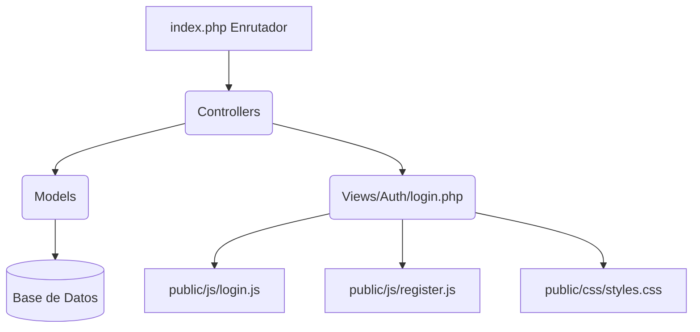

# Zooki - Sistema de Gestión Veterinaria Inteligente

Zooki es un sistema web moderno, robusto y eficiente diseñado para la gestión integral de clínicas veterinarias. Facilita la administración de pacientes (mascotas), historias clínicas, citas, y ofrece autenticación nativa segura e inicio de sesión integrado mediante Google Identity Services.

## Historial de versiones

El historial completo de versiones (v1.0.0 → v1.12.0), la guía de la primera versión estable y el esquema de versionamiento (Zooki SemVer) se documentan aparte en **[documentacion/HistorialVersiones.md](documentacion/HistorialVersiones.md)** (pestaña «Historial de versiones» del portal), para no inflar esta sinopsis.

## Arquitectura del Sistema

El proyecto está construido bajo una arquitectura **MVC (Modelo-Vista-Controlador)** con PHP puro:


```mermaid
graph TD
    A[index.php Enrutador] --> B(Controllers)
    B --> C(Models)
    B --> D(Views/Auth/login.php)
    D --> E[public/js/login.js]
    D --> F[public/js/register.js]
    D --> G[public/css/styles.css]
    C --> H[(Base de Datos)]
```

### Estructura de Directorios
*   `/config/`: Configuración global del sistema, conexión a base de datos y utilidades.
*   `/controllers/`: Controladores encargados del procesamiento de peticiones y lógica del sistema.
*   `/models/`: Modelos de base de datos que representan las tablas principales (usuarios, mascotas).
*   `/views/`: Vistas PHP estructuradas. Las vistas de autenticación están en `/views/auth/`.
*   `/helpers/`: Clases de apoyo enfocadas en la seguridad (`Security.php`, `Csrf.php`).
*   `/public/`: Único punto de acceso del cliente. Contiene:
    *   `css/styles.css`: Estilos unificados del sistema.
    *   `js/login.js`: Lógica de animación de flip, alertas, modales e integración de Google.
    *   `js/register.js`: Validación en tiempo real y flujo de registro.
    *   `img/`: Recursos gráficos e imágenes del collage del Bento Grid.

---
## Guía de Instalación y Configuración

### Requisitos del Sistema
*   Servidor web Apache o Nginx.
*   PHP 8.0 o superior (con extensiones `pdo_mysql`, `openssl` y `json` habilitadas).
*   Servidor MySQL/MariaDB.
*   Composer (para gestión de dependencias en caso de requerirse).

### Configuración Paso a Paso

1.  **Clonar el Proyecto:**
    ```bash
    git clone <url_de_tu_repositorio>
    ```

2.  **Configurar Variables de Entorno (.env):**
    Duplica el archivo `.env.example` en la raíz, renombralo como `.env` e ingresa tus credenciales de base de datos y tu ID de cliente de Google:
    ```env
    DB_HOST=localhost
    DB_NAME=zooki_db
    DB_USER=root
    DB_PASS=tu_contraseña

    # Google Identity Services API Client ID
    GOOGLE_CLIENT_ID=tu_client_id_de_google.apps.googleusercontent.com
    ```

3.  **Configuración de Servidor Local (Virtual Host):**
    Se recomienda configurar un Host Virtual que apunte al directorio `public/` del proyecto para el correcto funcionamiento de las rutas relativas.

4.  **Crear la Base de Datos (v2):**
    En una base **vacía** (por ejemplo, `zooki_db` recién creada con `utf8mb4`), importa en este orden `database/01_schema.sql` (el esquema) y `database/02_semilla.sql` (roles, planes y catálogos). Luego corre `php scripts/migrar.php`: aplica las migraciones que falten y vuelve a aplicar la semilla sin duplicar nada. La v2 no migra datos de la v1: sobre una base v1 el esquema falla y el migrador se niega a correr.

5.  **Crear el super-administrador:**
    `php scripts/crear_superadmin.php` pide por consola el correo, el nombre y la contraseña (sin mostrarla) y crea la cuenta de la plataforma. Se niega si el correo ya existe. Ninguna credencial queda en el código ni en el SQL. En producción: `docker exec -it zooki_web php scripts/crear_superadmin.php`.
## Migraciones de la base de datos

La base nace de dos archivos que no son migraciones: `database/01_schema.sql` (las 50 tablas de la v2) y `database/02_semilla.sql` (datos semilla). Las migraciones son los archivos `database/NN_nombre.sql` con número **03 o mayor**. **En el servidor se aplican solas:** al arrancar, el contenedor `web` ejecuta `docker/iniciar.sh`, que corre `scripts/migrar.php` y después inicia Apache. Como Dokploy reconstruye el contenedor en cada despliegue, basta con subir el archivo `.sql` nuevo junto con el código.

*   **Volumen nuevo:** cuando el volumen `db_data` está vacío, MySQL ejecuta en orden alfabético los `.sql` del primer nivel de `database/` (`01`, `02` y las migraciones). Las subcarpetas no se recorren: por eso el modelo de drawDB vive en `database/modelo/`.
*   **Registro:** cada migración aplicada queda en la tabla `schema_migraciones`, así que ninguna se repite.
*   **Semilla:** el migrador aplica `02_semilla.sql` en cada arranque, después de las migraciones. Solo inserta lo que falta (`INSERT IGNORE` con claves explícitas e índices únicos) y nunca sobrescribe: un precio o un nombre cambiados desde la plataforma se conservan.
*   **Base v1:** si la base no tiene la tabla `clinicas` o la columna `usuarios.id_usuario`, el migrador se niega con un mensaje claro. Hay que respaldarla y crear la base de nuevo.
*   **Si una falla:** se detiene ahí, no la anota (se reintenta en el siguiente arranque) y Apache arranca igual para no tumbar el sitio. El error aparece en los logs del contenedor en Dokploy con el prefijo `[migraciones] ERROR`.
*   **En local:** `php scripts/migrar.php` aplica las que falten y la semilla; con `--revisar` solo muestra qué aplicaría.
*   **Al escribir una migración nueva:** usa el número siguiente y hazla repetible (consulta `information_schema` antes de crear una columna o un índice, y revisa si la fila existe antes de insertarla), porque en una instalación nueva la corre MySQL al crear la base y luego el migrador. Si agrega filas a un catálogo global, van en `02_semilla.sql` con su id explícito.
*   **CI:** GitHub Actions carga `01_schema.sql` y `02_semilla.sql` en un MySQL 8 vacío, corre el migrador dos veces, comprueba los conteos de la semilla y crea la base desde un volumen vacío como lo hace `docker-compose.yml`.
## Modelo de Base de Datos

Zooki v2 es una plataforma **multi-inquilino**: cada clínica es un inquilino (`id_clinica`) y toda consulta de negocio se filtra por la clínica del contexto activo. El modelo completo está en [documentacion/MER.md](documentacion/MER.md); el ejecutable, en `database/01_schema.sql`. Las tablas se agrupan así:

*   **Plataforma:** `planes`, `clinicas`, `suscripciones` y `plantillas_comunicacion`.
*   **Identidad y acceso:** `usuarios` (una identidad por persona, con clave `id_usuario`; el documento y el correo son únicos pero corregibles), `roles` (`administrador`, `veterinario`, `propietario` y `super-administrador`), `usuario_clinica` (rol de personal en cada clínica), `propietario_clinica`, `consentimientos_datos`, `password_resets`, `verificaciones_email`, `intentos_login` y `casos_soporte`.
*   **Pacientes:** `mascotas` (ficha global con carnet QR), `mascota_clinica` (vínculo y número de historia por clínica), `mascota_colores`, `alertas_medicas`, `carnet_escaneos` e `ingresos_emergencia`; catálogos globales `especies`, `razas` y `colores_base`.
*   **Agenda:** `tipos_cita`, `horarios_clinica`, `horarios_veterinario`, `propuestas_horario`, `ausencias_veterinario`, `citas` (con triage de 4 niveles y protección contra doble reserva), `cita_sintomas` y `reasignaciones`.
*   **Historia clínica:** `consultas`, `consulta_sintomas`, `tratamientos` y `archivos_clinicos`.
*   **Prevención:** `vacunas` y `desparasitaciones`; catálogos por clínica `vacunas_base`, `especie_vacunas`, `laboratorios_base` y `productos_desparasitacion_base`.
*   **Grafo clínico (global):** `grafo_nodos` y `grafo_aristas`.
*   **Reputación:** `especialidades`, `veterinario_perfil`, `veterinario_especialidades` y `resenas_veterinario`.
*   **Comunicaciones y auditoría:** `notificaciones`, `notificaciones_internas`, `auditoria_mascotas` y `auditoria_sistema`.

---
## Principios de Diseño (SOLID)

El diseño arquitectónico de Zooki cubre de forma parcial los principios **SOLID** para asegurar un código mantenible a medida que el sistema escala, adaptándolos pragmáticamente a un entorno PHP nativo rápido:

*   **Responsabilidad Única (SRP):** Aplicado parcialmente mediante helpers de seguridad (`Csrf.php`, `Security.php`) y enrutadores dedicados que aíslan la lógica de autenticación de la presentación visual.
*   **Abierto/Cerrado (OCP):** Modularidad en el enrutamiento centralizado que permite agregar nuevas rutas de controladores sin modificar la estructura del despachador inicial.
*   *Nota:* Para mantener la ligereza y rapidez en las operaciones CRUD, ciertos flujos de bases de datos y controladores acoplan directamente lógica para evitar sobrecarga de abstracciones innecesarias.
