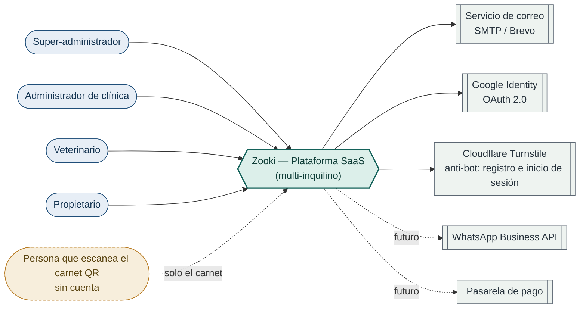
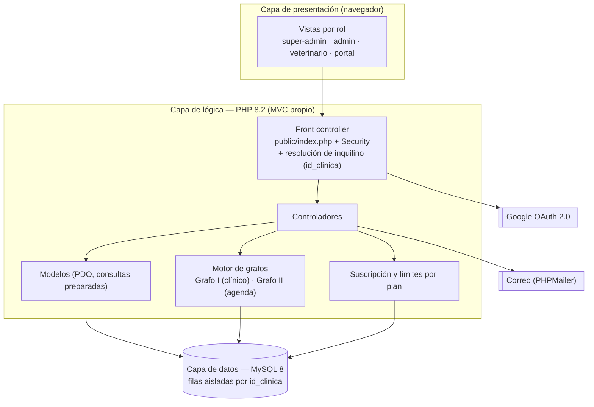

# Especificación de Requisitos de Software (ERS) — Proyecto Zooki v2.0

> **Revisión 3.1** · Conforme al estándar **ISO/IEC/IEEE 29148:2018** · Zooki — Sistema de gestión clínica veterinaria (arquitectura SaaS multi-inquilino) · SENA ADSO — Ficha 3142784

| Fecha | Revisión | Estándar | Autor |
|---|---|---|---|
| 27/04/2026 | 1.0 | IEEE 830-1998 | Juan Sebastián Carvajal Home |
| 31/08/2026 | 2.0 | IEEE 830-1998 | Juan Sebastián Carvajal Home |
| 22/09/2026 | 2.1 | IEEE 830-1998 | Juan Sebastián Carvajal Home |
| 23/09/2026 | 3.0 | ISO/IEC/IEEE 29148:2018 | Juan Sebastián Carvajal Home |
| 05/10/2026 | 3.1 | ISO/IEC/IEEE 29148:2018 | Juan Sebastián Carvajal Home |

**Historial.** Las revisiones 1.0–2.1 documentaron el producto de instalación única hasta la versión estable **v1.11.0**. La **revisión 3.0** reescribe el ERS para la versión **v2.0**, que transforma Zooki en una **plataforma SaaS multi-inquilino** e incorpora dos capacidades diferenciadoras basadas en grafos (soporte a la decisión clínica y agendamiento inteligente), además de suscripción por planes, registro autónomo de clínicas, carnet digital con QR y reputación de veterinarios. Esta revisión se alinea al estándar **ISO/IEC/IEEE 29148:2018**, sucesor del IEEE 830-1998. El documento maestro que fija el alcance de este cambio es *Visión y Alcance — Zooki v2.0*. La **revisión 3.1** (5 de octubre de 2026) recoge la revisión completa de la especificación: identifica cada requisito funcional con el número de su módulo (`RF-<módulo>.<n>`) y numera los no funcionales en orden (equivalencias en §5.5); hace global a la mascota, con historia clínica compartida bajo autorización del propietario (RF-1.8, RF-2.6); introduce la identidad única por persona con varios roles (RF-T.5), el registro con Google, la autorización de tratamiento de datos y la gestión segura del perfil (RF-T.6 a RF-T.8), con un `id_usuario` numérico como clave (§5.2); especifica el cálculo del triage y la agenda inteligente completa (RF-2.12, RF-4.11 a RF-4.15, RF-7.5); protege el registro de clínicas, el carnet QR y la reputación (RF-0.3, RF-5.7, RF-5.8, RF-8.3); fija los límites del plan gratuito, el comportamiento al bajar de plan y la excepción de las urgencias (RF-0.4 a RF-0.6); agrega el derecho de supresión, el dashboard y la página pública (RF-5.9, RF-6.1, RF-6.2, RF-9.1); endurece la sesión (RNF-12 a RNF-15); completa el modelo de datos (§5.2) y registra las capas avanzadas del plan profesional como requisito futuro (RF-F.8).

---

## 1. Introducción

### 1.1 Propósito

Este documento especifica, de forma precisa, completa y verificable, los requisitos funcionales y no funcionales del sistema **Zooki v2.0**, y sirve como referente principal para el diseño, la implementación, las pruebas y la validación. Cada requisito se enuncia siguiendo las características de calidad del estándar ISO/IEC/IEEE 29148:2018 (necesario, verificable, no ambiguo, singular y trazable), con un identificador único y un criterio de verificación asociado.

### 1.2 Alcance

Zooki es una **aplicación web SaaS multi-inquilino** que permite a varias clínicas veterinarias pequeñas gestionar su operación clínica sobre una misma plataforma, con los datos de cada clínica aislados entre sí. La versión v2.0 abarca:

- **Plataforma y clínicas:** registro autónomo (self-service) de clínicas, panel del super-administrador, suscripción por planes con control de límites (freemium) y configuración por clínica.
- **Pacientes e historia clínica:** registro de mascotas y propietarios, historia clínica con consultas, tratamientos y archivos adjuntos. La mascota es **única en toda la plataforma** aunque se atienda en varias clínicas, y su historia se comparte entre ellas con autorización del propietario.
- **Soporte a la decisión clínica (Grafo I):** copiloto que, durante la consulta, sugiere diagnósticos ordenados por peso y advierte sobre toxicidades e interacciones mediante un grafo de conocimiento con signo.
- **Agenda inteligente (Grafo II):** agendamiento que detecta conflictos, propaga retrasos de forma controlada, reasigna citas y prioriza por urgencia.
- **Prevención:** calendario de vacunación y desparasitación con recordatorios automáticos.
- **Portal del propietario:** auto-registro, vinculación a las clínicas que él elige, auto-agendamiento y cancelación de citas, centro de notificaciones, **carnet digital con código QR de emergencia** y ejercicio del derecho de supresión de sus datos.
- **Dashboard y reportes:** indicadores del día por rol, panel de operación del administrador y estadísticas.
- **Reputación:** perfil y calificación de veterinarios a partir de una encuesta breve posterior a la consulta.
- **Acceso y seguridad:** autenticación local y federada (Google), control de acceso por roles y **aislamiento de datos por clínica**.

**Fuera de alcance (v2.0):** inventario de medicamentos completo, facturación electrónica / punto de venta y telemedicina con video. El **cobro real mediante pasarela de pago** y los entregables *deseables* (recetas en PDF, motor de salud preventiva por protocolos y PWA instalable) se contemplan como evolución (§2.6).

### 1.3 Personal involucrado

Proyecto formativo de desarrollo individual; una sola persona asume la totalidad de los roles del ciclo de vida.

| Campo | Valor |
|---|---|
| Nombre | Juan Sebastián Carvajal Home |
| Rol | Desarrollador único (full-stack); Product Owner, Scrum Master y Development Team (roles formativos) |
| Categoría | Aprendiz SENA — Análisis y Desarrollo de Software (ADSO) |
| Responsabilidades | Análisis, diseño, desarrollo, pruebas, despliegue y documentación |
| Contacto | carvajal7lsch@gmail.com |

### 1.4 Definiciones, acrónimos y abreviaturas

| Término / Sigla | Definición |
|---|---|
| SaaS | Software as a Service — software ofrecido como servicio por suscripción. |
| Multi-inquilino (multi-tenant) | Arquitectura en la que una sola instancia sirve a varias organizaciones (clínicas) con datos aislados. |
| Inquilino (tenant) | Cada clínica registrada; su ámbito de datos se identifica con `id_clinica`. |
| Super-administrador | Operador de la plataforma; administra clínicas y planes por encima de todos los roles. |
| CDSS | Clinical Decision Support System — sistema de soporte a la decisión clínica. |
| Grafo con signo | Grafo cuyas aristas tienen signo positivo (favorece) o negativo (contraindica/veta). |
| Freemium | Modelo con un plan gratuito limitado y un plan de pago que amplía el servicio. |
| RF / RNF | Requisito Funcional / Requisito No Funcional. |
| RBAC | Role-Based Access Control — control de acceso basado en roles. |
| OAuth 2.0 | Protocolo de inicio de sesión federado (Google). |
| PDO / CSRF | PHP Data Objects (acceso a datos parametrizado) / Cross-Site Request Forgery. |
| Triage | Clasificación de la urgencia de un caso en 4 niveles de color (rojo, naranja, amarillo, verde), calculada por el Grafo I a partir de los síntomas. |
| Mascota global | La mascota pertenece a su propietario y no a una clínica: tiene una sola ficha, un solo carnet y un solo QR, y se vincula a cada clínica donde se atiende. |
| Carnet QR | Vista pública de emergencia de la mascota a la que se llega escaneando su código QR, identificada por un token aleatorio. |
| Token | Cadena aleatoria no predecible que identifica un recurso sin revelar su identificador interno (p. ej. el carnet QR). |
| CAPTCHA | Verificación anti-bot (Cloudflare Turnstile) del registro público de clínicas y del inicio de sesión tras fallos repetidos sobre una cuenta. |
| NIT / DV | Número de Identificación Tributaria de la clínica y su dígito de verificación, calculado con el algoritmo de la DIAN. |
| Anonimización | Sustitución irreversible de los datos personales de un titular, de modo que ya no puedan asociarse a él (derecho de supresión). |

### 1.5 Referencias normativas

- **ISO/IEC/IEEE 29148:2018** — Systems and software engineering — Requirements engineering (estándar principal de este documento).
- IEEE Std 830-1998 — Práctica recomendada para ERS (referencia histórica; sustituida por la anterior).
- Ley 1581 de 2012 y Decreto 1377 de 2013 — Protección de datos personales (Colombia).
- Ley 84 de 1989 — Estatuto Nacional de Protección de los Animales, modificada por la Ley 1774 de 2016 (los animales como seres sintientes).
- Ley 576 de 2000 — Código de Ética para el ejercicio profesional de la Medicina Veterinaria y Zootecnia (historia clínica veterinaria y su custodia).

---

## 2. Descripción general

### 2.1 Perspectiva del producto

Zooki v2.0 es una aplicación web **autónoma de tres capas** (presentación, lógica y datos) construida con tecnologías nativas (PHP 8.2 con arquitectura MVC propia y MySQL 8), desplegada en infraestructura propia. A diferencia de las versiones 1.x —de instalación para una sola clínica—, la v2.0 opera como **plataforma multi-inquilino**: una única instancia atiende a muchas clínicas, cada una con sus datos aislados mediante el identificador de inquilino `id_clinica`, y un **super-administrador** administra la plataforma por encima de las clínicas.

**Diagrama de contexto.** El sistema y sus actores y servicios externos:

**Diagrama de componentes / arquitectura.** Capas y componentes principales, con el aislamiento por inquilino:

### 2.2 Funciones principales

Agrupadas por módulo (los módulos marcados con ★ son nuevos o rehechos en v2.0):

- **★ Plataforma y clínicas:** registro self-service de clínicas, panel del super-administrador, suscripción por planes con límites (freemium), configuración por clínica.
- **Gestión de pacientes:** registro y búsqueda de mascotas y propietarios, ficha completa.
- **Historia clínica + ★ soporte a la decisión clínica (Grafo I):** consultas, tratamientos y archivos; sugerencia de diagnósticos y alertas de toxicidad/interacción.
- **Prevención:** calendario de vacunación y desparasitación con recordatorios.
- **★ Agenda inteligente (Grafo II):** citas con detección de conflictos, propagación de retrasos, reasignación y prioridad.
- **★ Portal del propietario:** auto-registro, auto-agendamiento y cancelación, notificaciones y **carnet QR de emergencia**.
- **Dashboard y reportes:** indicadores del día por rol, panel de operación y estadísticas.
- **★ Reputación y comunicaciones:** perfil y calificación de veterinarios; plantillas, tiempos y bitácora de correos.
- **Público e institucional:** página pública y políticas legales.
- **Acceso, seguridad y auditoría:** autenticación local y con Google, RBAC y **aislamiento por clínica**, auditoría de operaciones críticas.

### 2.3 Características de los usuarios (clases de usuario)

| Rol | Ámbito | Descripción y nivel de acceso |
|---|---|---|
| Super-administrador | Toda la plataforma | Administra las clínicas registradas, sus planes y suscripciones. No accede a los datos clínicos internos de una clínica salvo para soporte. |
| Administrador de clínica | Su clínica | Gestiona usuarios, configuración, catálogos y datos de su clínica. Nivel técnico medio-bajo; interfaz intuitiva. |
| Veterinario | Su clínica | Usuario clínico principal: pacientes, historia clínica, vacunación y agenda. Cuenta con **perfil público calificable**. |
| Propietario | Sus mascotas, en las clínicas que él elige | Accede al portal con credenciales propias o con Google. Se registra en una clínica y puede vincularse a otras cuando quiera; consulta sus mascotas, agenda, califica y puede pedir la eliminación de su cuenta. |
| Persona que escanea el carnet | Solo el carnet de emergencia | Quien encuentra a una mascota perdida o la atiende en una emergencia. **No tiene cuenta**: escanea el QR y ve únicamente la vista pública de emergencia, sin poder navegar a ningún otro dato. Se documenta como actor porque accede al sistema y su acceso debe protegerse (HU-5.11). |
| _Nota_ | — | Una misma persona puede tener varios de estos roles, por ejemplo veterinario en dos clínicas y propietario de su perro, con una sola cuenta (RF-T.5). |
| Visitante | Páginas públicas | Consulta la página pública y las políticas; desde ahí registra una clínica o se registra como propietario. |

> **Nota.** El rol *recepcionista* existente en v1.11.0 se **elimina** en v2.0 (depuración de alcance); el sistema conserva la escalabilidad necesaria para reincorporarlo en el futuro si se requiere.

### 2.4 Restricciones

- Accesible desde Chrome, Firefox, Edge y Safari vigentes, sin instalación adicional.
- Tecnologías nativas: **PHP 8.2 (MVC propio) + MySQL 8**, sin framework de backend ni bundler de frontend. Se decidió **mantener el stack** por ser suficiente a la escala objetivo; el rendimiento se cuida con índices compuestos por `id_clinica`, consultas optimizadas y el recorrido de los grafos en memoria.
- **Aislamiento multi-inquilino obligatorio:** toda operación sobre datos de negocio filtra por `id_clinica`; su omisión se considera defecto de seguridad.
- Datos clínicos y personales tratados conforme a la Ley 1581 de 2012.
- Los grafos operan **sin dependencia de servicios de inteligencia artificial externos**.
- Opera con conexión mínima de 1 Mbps; las metas de rendimiento (§3.3.1) se miden sobre una red de referencia de 5 Mbps.
- La autenticación federada depende de la disponibilidad de Google (OAuth 2.0).

### 2.5 Suposiciones y dependencias

- Infraestructura propia disponible (VPS Linux con Docker/Dokploy): Apache 2.4 con PHP 8.2 (mod_php) en contenedor, detrás de Traefik, y MySQL 8 operativos.
- Cuenta SMTP válida (Brevo) con el dominio autenticado (DKIM/DMARC) para el envío de correos con PHPMailer.
- Credenciales de Google Cloud (cliente OAuth 2.0) configuradas.
- Cada clínica dispone de al menos un usuario administrador y sus veterinarios; cada propietario tiene un correo válido.
- El conocimiento clínico del Grafo I se carga y se valida contra fuentes de farmacología veterinaria; se acota inicialmente a perros y gatos (otras especies se gestionan igual, con menor cobertura de sugerencias).
- Dependencias de terceros: PHPMailer, PHPUnit y una biblioteca de generación de QR del lado del servidor, gestionadas con Composer; y el servicio Cloudflare Turnstile para la verificación anti-bot.

### 2.6 Requisitos futuros y evolución previsible

No forman parte de la línea base de la v2.0; se registran para preservar la trazabilidad.

| ID | Descripción | Prioridad |
|---|---|---|
| RF-F.1 | Cobro real de la suscripción mediante pasarela de pago. | Futura |
| RF-F.2 | Recordatorios por WhatsApp Business API como canal adicional al correo. | Futura |
| RF-F.3 | Recetas / fórmulas médicas exportables en PDF. | Deseable |
| RF-F.4 | Motor de salud preventiva por protocolos (esquemas por especie y edad). | Deseable |
| RF-F.5 | Aplicación instalable (PWA) para el portal del propietario. | Deseable |
| RF-F.6 | Detección temprana de brotes con datos agregados y anonimizados entre clínicas. | Futura |
| RF-F.7 | Exportar los reportes a Excel/CSV respetando los filtros aplicados. | Deseable |
| RF-F.8 | Capas avanzadas del plan profesional: el grafo clínico aprende de los casos de la propia clínica (ajuste de pesos con sus diagnósticos confirmados). | Futura |

---

## 3. Requisitos específicos

Cada requisito tiene un identificador único y un criterio de verificación. Los requisitos funcionales se identifican como `RF-<módulo>.<n>`, igual que las historias de usuario (p. ej. `RF-4.7` es el séptimo requisito del Módulo 4), y van en orden dentro de cada módulo. Los requisitos futuros usan `RF-F.<n>` y los no funcionales `RNF-<n>`, numerados en orden de aparición. La equivalencia con la numeración anterior está en el §5.5.

### 3.1 Interfaces externas

#### 3.1.1 Interfaces de usuario

| Vista / Módulo | Descripción de la interfaz |
|---|---|
| Panel del super-administrador | Listado de clínicas con su plan y estado; alta, suspensión y reactivación; moderación de reseñas. |
| Registro de clínica (self-service) | Formulario público de alta de clínica y su administrador inicial, con verificación de correo. |
| Dashboard de clínica | Resumen del día por clínica: citas, vacunaciones próximas, alertas y estado del plan. |
| Gestión de pacientes | Listado con buscador en tiempo real, filtros por especie y formulario con validación en línea. |
| Historia clínica + copiloto | Vista cronológica con acordeón; el formulario de consulta muestra sugerencias del Grafo I y alertas de toxicidad/interacción. |
| Agenda inteligente | Vista mensual/semanal; marca conflictos, retrasos propagados y sugerencias de reasignación. |
| Portal del propietario | Interfaz mobile-first; auto-registro, agendamiento/cancelación, notificaciones y carnet QR. |
| Carnet de emergencia (QR) | Vista pública de solo lectura con vacunas vigentes, alertas y contacto, accesible al escanear el QR. |
| Perfil del veterinario | Ficha pública con promedio de calificación, número de reseñas y especialidades. |
| Configuración de la clínica | Horarios, catálogos, tipos de cita, veterinarios y datos de marca. |
| Página pública y políticas | Landing del servicio y páginas de privacidad, términos y cookies, accesibles sin sesión. |

#### 3.1.2 Interfaces de software y comunicación

| Interfaz | Descripción |
|---|---|
| Correo (SMTP / PHPMailer) | Correos transaccionales: bienvenida, verificación, confirmación y recordatorios. |
| Google Identity (OAuth 2.0) | Inicio de sesión federado como alternativa al login local. |
| Almacenamiento de archivos | Fotografías, archivos clínicos y logos de clínica en el filesystem del servidor, servidos por un script autenticado. |
| Base de datos | MySQL 8 con PDO y sentencias preparadas; datos de negocio aislados por `id_clinica`. |
| Generación de QR | Generación del código QR del carnet (biblioteca del lado del servidor, sin servicio externo). |
| Verificación anti-bot (Cloudflare Turnstile) | CAPTCHA del registro público de clínicas y del inicio de sesión cuando una cuenta acumula fallos; el token se valida en el servidor contra la API de Turnstile. |
| Tareas programadas | Cron para recordatorios, control de vencimiento de suscripciones y respaldos. |
| Navegadores soportados | Chrome ≥ 90, Firefox ≥ 88, Edge ≥ 90, Safari ≥ 14. |

#### 3.1.3 Interfaz de datos

El modelo relacional se aísla por inquilino: las tablas de negocio incorporan `id_clinica` y toda consulta lo filtra. Las excepciones son los catálogos globales, el grafo de conocimiento clínico, el propietario y la mascota, que son globales y se vinculan a cada clínica por tablas puente. El modelo entidad-relación completo de la v2.0 (con las entidades nuevas de clínicas, planes, suscripciones, grafos y reseñas) se especifica en el apéndice §5.2 y en el documento *[Modelo Entidad-Relación (MER)](MER.md)*.

### 3.2 Requisitos funcionales

Los módulos siguen la **misma numeración en todos los documentos** ([Historias de Usuario](HistoriasUsuario.md), [Requisitos Específicos](RequisitosEspecificos.md), [Reglas de Negocio](ReglasNegocio.md) y [Modelos](Modelos.md)).

#### 3.2.1 Módulo 0 — Plataforma: clínicas, planes y suscripción ★ (nuevo)

| ID | Descripción del requisito | Prioridad | Criterio de verificación |
|---|---|---|---|
| RF-0.1 | Registrar una clínica de forma autónoma (self-service), creando la clínica y su usuario administrador inicial, con verificación de correo. | Alta | La clínica queda «pendiente de verificación» y no opera; tras verificar el correo dentro del plazo, queda activa con el plan gratuito y su administrador puede iniciar sesión. |
| RF-0.2 | Panel del super-administrador para listar, activar, suspender y reactivar clínicas. | Alta | Una clínica suspendida no permite el acceso de sus usuarios. |
| RF-0.3 | Proteger el registro público de clínicas contra el abuso del plan gratuito: NIT único validado con el dígito de verificación de la DIAN, verificación anti-bot (CAPTCHA), rechazo de correos de dominios desechables y límite de registros por IP. | Alta | Un NIT inválido o repetido, un envío sin CAPTCHA válido o un correo desechable se rechazan; superado el límite por IP, el registro se bloquea temporalmente. |
| RF-0.4 | Definir planes con sus límites y precios: el gratuito admite 5 mascotas vinculadas, 30 citas por mes y 2 cuentas de personal; el profesional, sin límites de volumen. | Alta | Los planes existen con esos límites y son asignables a una clínica. |
| RF-0.5 | Asignar y controlar el estado de la suscripción por clínica; congelar beneficios si no está al día. Al bajar de plan o caer en mora no se oculta ni se borra ningún dato: solo se bloquea lo nuevo por encima de los límites del plan gratuito. | Alta | Una clínica en mora ve restringidas las funciones del plan de pago, pero sigue atendiendo a sus mascotas actuales. |
| RF-0.6 | Aplicar los límites del plan al operar (p. ej. máximo de mascotas y de citas/consultas por período en el plan gratuito), excepto en las urgencias 🔴, que nunca se bloquean por límite ni por mora. | Alta | Al superar el límite, el sistema impide la acción e informa el motivo; un caso 🔴 se atiende igual. |

#### 3.2.2 Módulo T — Acceso, seguridad y administración *(v1.x, con multi-inquilino)*

| ID | Descripción del requisito | Prioridad | Criterio de verificación |
|---|---|---|---|
| RF-T.1 | Autenticación federada con Google (OAuth 2.0) como alternativa al login local. | Media | El usuario inicia sesión con Google y accede según su rol. |
| RF-T.2 | Recuperación de contraseña por correo con token temporal de un solo uso. | Media | El enlace caduca y permite restablecer la contraseña una sola vez. |
| RF-T.3 | Notificaciones internas segmentadas por rol ante eventos operativos. | Media | El destinatario ve la notificación y puede marcarla como leída. |
| RF-T.4 | Incorporar el rol **super-administrador** y aplicar el **aislamiento por clínica** en cada acción de la matriz de autorización. | Alta | Un usuario de una clínica no accede a datos ni acciones de otra (403). |
| RF-T.5 | Manejar una identidad única por persona con varios roles (propietario y, por clínica, administrador o veterinario): al iniciar sesión se elige el contexto, los permisos son los del contexto activo, se puede cambiar de contexto sin volver a iniciar sesión y nadie puede calificarse a sí mismo. | Alta | Un veterinario que trabaja en dos clínicas y tiene perro entra con una sola cuenta y elige entre tres contextos; desde el portal no accede a acciones de personal. |
| RF-T.6 | Registro e inicio de sesión con Google solo para propietarios: crea la cuenta con los datos de Google (sin verificar el correo), la deja con el perfil incompleto hasta registrar documento, teléfono y autorización de datos, y vincula Google a una cuenta existente con el mismo correo. El registro de clínicas no admite Google. | Alta | Un propietario se registra con Google y no puede agendar hasta completar su perfil; con un correo existente no se crea una segunda cuenta. |
| RF-T.7 | Exigir y guardar la autorización de tratamiento de datos en todo registro (formulario, Google o alta por el personal), con versión, medio, fecha e IP, y pedir la nueva versión cuando la política cambie. | Alta | Sin aceptación no se crea la cuenta; cada cuenta tiene su prueba de aceptación. |
| RF-T.8 | Gestión segura del perfil: cambiar el correo solo tras verificar el nuevo (con aviso al anterior), corregir el documento confirmando la identidad, crear contraseña en cuentas de Google tras confirmar con Google, y editar la bio y la foto públicas del veterinario. | Alta | Un correo sin verificar no reemplaza al anterior; un documento ya usado por otra cuenta no se aplica y pasa a soporte. |

> El rol *recepcionista* de v1.11.0 se elimina en la v2.0; sus acciones se redistribuyen entre administrador y veterinario.

#### 3.2.3 Módulo 1 — Mascotas y propietarios *(v1.x, con mascota global)*

| ID | Descripción del requisito | Prioridad | Criterio de verificación |
|---|---|---|---|
| RF-1.1 | Registrar una mascota con nombre, especie, raza, fecha de nacimiento, peso, sexo, color(es) y fotografía. | Alta | El registro aparece en la búsqueda de su clínica con todos los campos. |
| RF-1.2 | Vincular cada mascota a un propietario con nombre, documento, dirección, teléfono y correo. | Alta | No es posible guardar una mascota sin propietario asignado. |
| RF-1.3 | Actualizar la ficha registrando automáticamente fecha y usuario del cambio. La especie, la raza, el sexo y la fecha de nacimiento solo los cambian el propietario o la clínica que registró la mascota, y todo cambio se notifica al propietario. | Alta | La auditoría refleja campo, valor anterior y nuevo; una clínica que no registró la mascota no puede cambiar su especie. |
| RF-1.4 | Buscar mascotas por nombre, propietario, documento o historia clínica, en tiempo real y **dentro de la clínica**. | Alta | Resultados en < 2 s; no aparecen mascotas que no estén vinculadas a la clínica. |
| RF-1.5 | Registrar múltiples mascotas por propietario, agrupadas en su perfil. | Media | Desde el perfil se listan todas sus mascotas. |
| RF-1.6 | Marcar una mascota como inactiva sin eliminar su historial. | Media | La inactiva no aparece en búsquedas activas; su historial permanece. |
| RF-1.7 | Registrar varios colores por mascota (relación N:M). | Baja | Una mascota puede almacenar y mostrar más de un color. |
| RF-1.8 | Manejar la mascota como **identidad global** del propietario, vinculable a varias clínicas: una sola ficha, un solo carnet y un solo QR; antes de registrar, ofrecer vincular una mascota existente del propietario; cada clínica asigna su propio número de historia clínica. | Alta | Una mascota atendida en dos clínicas existe una sola vez y aparece en ambas con su número de HC; vincularla consume cupo del plan. |

#### 3.2.4 Módulo 2 — Historia clínica y soporte a la decisión clínica (Grafo I) ★

| ID | Descripción del requisito | Prioridad | Criterio de verificación |
|---|---|---|---|
| RF-2.1 | Registrar consultas con fecha/hora, motivo, anamnesis, examen físico, diagnóstico y plan. | Alta | La consulta es visible en el historial cronológico. |
| RF-2.2 | Adjuntar archivos clínicos (JPG, PNG, PDF) de máximo 10 MB por archivo. | Alta | Los archivos se almacenan y son descargables por un usuario autorizado. |
| RF-2.3 | Registrar tratamientos con medicamento, dosis, vía, duración y observaciones. | Alta | El tratamiento queda vinculado a la consulta. |
| RF-2.4 | Generar un número de historia clínica único por mascota en su primera consulta en cada clínica. | Media | El número no se repite dentro de la clínica. |
| RF-2.5 | Visualizar el resumen cronológico de todas las consultas con acordeón. | Media | La vista carga en < 3 s para historiales de hasta 100 consultas. |
| RF-2.6 | Historia clínica compartida entre clínicas: cada registro conserva la clínica y el veterinario que lo hizo y solo esa clínica lo modifica; toda clínica vinculada ve alergias, alertas, vacunas y desparasitaciones de todas las clínicas; las consultas, tratamientos y archivos de otra clínica solo con autorización del propietario, revocable. | Alta | Sin autorización, una clínica no obtiene las consultas de otra ni por la interfaz ni por petición directa (403); con autorización, las ve marcadas con su clínica de origen. |
| RF-2.7 | Mantener el grafo de conocimiento clínico: nodos (síntomas, diagnósticos, fármacos, especies, razas, condiciones) y aristas con tipo y signo (positivo/negativo). | Alta | Es posible crear y consultar nodos y aristas con su tipo y signo. |
| RF-2.8 | Al registrar los síntomas de una consulta, sugerir diagnósticos probables ordenados por peso. | Alta | La lista sugerida corresponde a las aristas síntoma→diagnóstico y su orden por peso. |
| RF-2.9 | Al prescribir, detectar toxicidad por especie/raza y bloquear o advertir mediante aristas negativas (p. ej. paracetamol en felinos). | Alta | Prescribir un fármaco con arista negativa para la especie del paciente dispara la alerta/bloqueo. |
| RF-2.10 | Detectar interacciones con la medicación vigente del paciente usando su historia como subgrafo. | Alta | Al prescribir un fármaco que interactúa con otro activo del paciente, se advierte. |
| RF-2.11 | Mostrar las predisposiciones asociadas a la raza al abrir la cita. | Media | Al abrir la cita de una raza con predisposiciones cargadas, estas se muestran. |
| RF-2.12 | Calcular el nivel de triage con reglas explícitas: captura estructurada de síntomas y tiempo, nivel máximo sin promediar, escalamiento por combinación, modificadores del paciente, alarmas universales para cualquier especie, «revisión del personal» cuando no hay cobertura y aviso de posible contagio. | Alta | Los 26 casos clínicos de la batería de triage dan su nivel esperado. |

> El Grafo I es **apoyo**, no diagnóstico automático: la decisión final es del veterinario. Su cobertura depende del conocimiento cargado (acotado inicialmente a perros y gatos).

#### 3.2.5 Módulo 3 — Vacunación, desparasitación y recordatorios *(v1.x)*

| ID | Descripción del requisito | Prioridad | Criterio de verificación |
|---|---|---|---|
| RF-3.1 | Registrar vacunas con nombre, laboratorio, lote, fecha de aplicación y próxima dosis. | Alta | La vacuna aparece en el calendario y genera la alerta según los tiempos configurados por la clínica (por defecto, 7 días antes; RF-8.6). |
| RF-3.2 | Enviar recordatorios automáticos por correo antes del vencimiento, según los tiempos configurados por la clínica (por defecto, 7 días y 1 día antes; RF-8.6). | Alta | Los correos llegan en los tiempos configurados y con los datos correctos. |
| RF-3.3 | Panel de vacunaciones pendientes de la semana, agrupadas por día y especie. | Media | El panel muestra datos correctos contra la base de datos. |
| RF-3.4 | Registrar el esquema de desparasitación con periodicidad configurable. | Media | Las alertas se generan según la periodicidad. |

#### 3.2.6 Módulo 4 — Agenda de citas inteligente (Grafo II) ★ (nuevo sobre base v1.x)

| ID | Descripción del requisito | Prioridad | Criterio de verificación |
|---|---|---|---|
| RF-4.1 | Agendar citas con fecha, hora, mascota, tipo y veterinario, verificando disponibilidad y horario. | Alta | No permite doble cita al mismo veterinario ni fuera del horario. |
| RF-4.2 | Enviar confirmación automática de la cita al propietario por correo. | Alta | Correo de confirmación recibido con datos correctos. |
| RF-4.3 | Cancelar o reprogramar citas notificando al propietario. | Media | El propietario recibe la notificación del cambio. |
| RF-4.4 | Modelar la agenda como un grafo con aristas de secuencia, conflicto y emparejamiento cita–veterinario. | Alta | El sistema identifica conflictos de horario a partir de las aristas de conflicto. |
| RF-4.5 | Propagar un retraso por la cola del veterinario y recalcular las horas estimadas de las citas siguientes, avisando al propietario solo cuando el cambio acumulado supera un umbral configurable y como máximo una vez cada 30 minutos por cita. | Alta | Al extender una cita, las siguientes muestran su nueva hora estimada; diez recálculos pequeños no generan diez avisos. |
| RF-4.6 | Reasignar una cita a otro veterinario con disponibilidad cuando el retraso la saca de su horario; la reasignación en vivo la confirma el veterinario destino dentro de un plazo configurable (si no responde, se propone al siguiente), y si ninguno puede tomarla, la cita se reprograma con el propietario. | Media | Al confirmar el veterinario destino, la cita se mueve; sin respuesta en el plazo, pasa al siguiente; sin veterinario disponible, se ofrece reprogramar. |
| RF-4.7 | Priorizar las citas por triage de 4 niveles (🔴 rojo, 🟠 naranja, 🟡 amarillo, 🟢 verde) **calculado por el Grafo I** (RF-2.12): rojo deriva a urgencia, naranja toma sobrecupo hasta el tope del bloque (con desempate por severidad y luego por llegada), amarillo el primer espacio y verde se agenda por elección. | Alta | El nivel lo fija el Grafo I; cada nivel se ubica según su regla (RN-411, RN-422). |
| RF-4.8 | Configurar el horario recurrente de cada veterinario por día de la semana (franjas), sin solapamientos y dentro del horario de la clínica; lo configura el administrador, y el veterinario solo puede proponer cambios que el administrador aprueba. | Alta | La disponibilidad de agenda de un veterinario respeta sus franjas; un cambio que deja citas fuera las marca para reajuste. |
| RF-4.9 | Registrar ausencias del veterinario (por el administrador o solicitadas por el propio veterinario) y buscar cobertura: asignar sus citas a un veterinario con disponibilidad (sin veto) o reprogramarlas si ninguno puede cubrir. | Alta | Al registrar una ausencia con citas, el sistema asigna cobertura o propone reprogramar; la disponibilidad del ausente queda tapada. |
| RF-4.10 | Atender una urgencia (triage rojo o llegada directa) fuera de la agenda en línea: asignar un veterinario de inmediato —interrumpiendo una cita cuyo tipo sea pausable si no hay ninguno libre, que se retoma al terminar la urgencia— y, si todos están en atención no pausable, dejarla en espera por prioridad. | Alta | Un caso rojo no se agenda en línea: se deriva a atención de urgencia y la toma un veterinario según disponibilidad. |
| RF-4.11 | Recalcular el triage cuando el propietario actualiza los síntomas de una cita pendiente: si sube, reubicar y notificar; si baja, conservar el espacio. | Alta | Una cita que pasa de 🟢 a 🟠 se reubica en un sobrecupo y llega el aviso. |
| RF-4.12 | Permitir al veterinario ajustar el nivel de triage con motivo obligatorio y auditoría, guardando la diferencia con el nivel calculado. | Alta | Sin motivo no se permite el cambio; la auditoría muestra ambos niveles. |
| RF-4.13 | Ante un caso 🔴 fuera del horario de la clínica, informar que está cerrada, mostrar su teléfono de urgencias y recomendar un servicio de urgencias 24 horas. | Alta | A las 11 p. m. el mensaje no promete atención. |
| RF-4.14 | Manejar la llegada tarde del propietario: registrar la hora de llegada; dentro de la tolerancia configurable, atender en el tiempo restante (o atender igual o reprogramar si no cabe); pasada la tolerancia, marcar «no asistió», atender en el siguiente espacio libre o reprogramar; y recalcular la agenda. | Alta | Con retraso dentro y fuera de la tolerancia se ofrecen las opciones correctas y la agenda se recalcula. |
| RF-4.15 | Permitir al propietario confirmar o declinar su asistencia desde el recordatorio de la cita; al declinar, liberar el espacio y notificar a la clínica. | Media | Declinar desde el correo cambia el estado de la cita, libera el espacio y avisa a la clínica. |

#### 3.2.7 Módulo 5 — Portal del propietario (multi-clínica) ★ (ampliado)

| ID | Descripción del requisito | Prioridad | Criterio de verificación |
|---|---|---|---|
| RF-5.1 | Portal con credenciales propias: ficha, historial, citas y calendario de vacunas. | Alta | El propietario solo ve sus mascotas; acceso ajeno devuelve 403. |
| RF-5.2 | Auto-registro del propietario y agendamiento desde su portal. | Alta | El propietario crea su cuenta y agenda desde su sesión. |
| RF-5.3 | Registrar al propietario como **identidad global** (correo único en la plataforma) **vinculado solo a las clínicas que él elige**. Se registra siempre en el contexto de una clínica, por tres vías: alta por el personal, enlace/QR de la clínica o autoregistro directo eligiendo la clínica, y queda vinculado únicamente a ella. Si el correo ya existe, verificar que es el dueño y ligarlo a esa clínica sin duplicar; al activar, enviarle su enlace de acceso y su QR del portal. | Alta | Un mismo correo no se duplica; un propietario recién registrado solo aparece en la clínica que eligió. Tras iniciar sesión ve todas sus mascotas y su historia; al agendar, cancelar o calificar solo se le ofrecen sus clínicas vinculadas, y la acción queda acotada a esa `id_clinica`. |
| RF-5.4 | Desde el portal, vincularse con un clic a otra clínica activa de la plataforma o desvincularse de una (sin citas pendientes en ella). Las mascotas se vinculan a la clínica cuando el propietario agenda con ellas allí o cuando la clínica las atiende. | Alta | Tras vincularse, la clínica aparece en la selección al agendar; recién vinculada no ve las mascotas hasta cumplirse una de las dos condiciones; con citas pendientes no se permite desvincularse. |
| RF-5.5 | Agendar, cancelar y reprogramar citas desde el portal, usando la disponibilidad real del Grafo II. | Alta | El propietario completa las tres operaciones y se reflejan en la agenda. |
| RF-5.6 | Centro de notificaciones del propietario (recordatorios y cambios). | Media | El propietario ve las notificaciones y puede marcarlas como leídas. |
| RF-5.7 | Generar el carnet digital de la mascota con un código QR de emergencia, identificado por un token aleatorio no predecible (nunca el id de la mascota) que el propietario puede regenerar. | Media | El carnet muestra solo datos de emergencia (vacunas vigentes con su clínica, alergias, alertas y teléfonos de contacto); tras regenerar, el QR anterior deja de funcionar. |
| RF-5.8 | Acceder al carnet de emergencia por QR en modo de solo lectura, sin iniciar sesión, con aviso al propietario en cada escaneo (y la ubicación de quien escanea solo si la comparte), límite de consultas por IP y página no indexable. | Media | Escanear el QR muestra el carnet sin exponer datos ajenos a la emergencia y el propietario recibe el aviso; un token inválido muestra un mensaje genérico. |
| RF-5.9 | Atender el derecho de supresión (Ley 1581 de 2012): a petición del propietario, anonimizar de forma irreversible sus datos personales y cerrar su acceso, conservando anonimizada la historia clínica de sus mascotas (Ley 576 de 2000) y desactivando sus carnets QR. | Alta | Tras la solicitud confirmada, en la BD no queda dato personal del titular, su login falla, las clínicas conservan la historia sin sus datos y el QR muestra el mensaje genérico. |

#### 3.2.8 Módulo 6 — Dashboard y reportes *(v1.x)*

| ID | Descripción del requisito | Prioridad | Criterio de verificación |
|---|---|---|---|
| RF-6.1 | Dashboard por rol con el resumen del día (citas, vacunas y desparasitaciones próximas) y, para el administrador, el panel de operación (carga por veterinario, atenciones sin cerrar y citas por confirmar). | Alta | Cada rol ve sus indicadores, filtrados por su clínica, en menos de 3 s. |
| RF-6.2 | Estadísticas y gráficas de la clínica por periodo y categoría, incluida la tasa de ausentismo por veterinario, solo para roles internos. | Media | Los indicadores coinciden con la base de datos; un propietario no accede (403). |

> Los reportes en PDF (antiguo RF-21) se retiraron en v1.9.1; la exportación a Excel/CSV queda como evolución (RF-F.7, §2.6).

#### 3.2.9 Módulo 7 — Configuración del sistema

| ID | Descripción del requisito | Prioridad | Criterio de verificación |
|---|---|---|---|
| RF-7.1 | Configurar los datos y la marca de la clínica (nombre, logo, información de contacto). | Media | La clínica muestra su propia identidad en su espacio. |
| RF-7.2 | Configurar los horarios de atención de la clínica por día (bloques mañana/tarde). | Alta | La agenda solo ofrece franjas dentro del horario configurado. |
| RF-7.3 | Gestionar los catálogos propios de la clínica: vacunas base, laboratorios, productos de desparasitación y tipos de cita (con duración, margen y si son pausables). Las especies, razas y colores son catálogos **globales** de la plataforma (RN-702). | Media | Los formularios combinan los catálogos globales con los de la clínica; una clínica no ve ni altera los catálogos propios de otra. |
| RF-7.4 | Gestionar los veterinarios de la clínica (alta/baja y especialidades). | Media | Un veterinario dado de baja no recibe nuevas citas. |
| RF-7.5 | Configurar los parámetros de la agenda de la clínica: tolerancia de llegada tarde, plazo para confirmar reasignaciones, umbral de aviso de cambios de hora, tope de sobrecupos por bloque y teléfono de urgencias, con valores por defecto. | Media | Un parámetro sin configurar usa su valor por defecto; al cambiarlo, la agenda lo aplica. |

#### 3.2.10 Módulo 8 — Reputación y comunicaciones ★ (nuevo)

| ID | Descripción del requisito | Prioridad | Criterio de verificación |
|---|---|---|---|
| RF-8.1 | Registrar, tras una consulta **atendida**, una encuesta breve (estrellas 1–5 y comentario opcional); una reseña por cita. | Media | Solo el propietario de una cita atendida puede reseñarla, y una sola vez. |
| RF-8.2 | Mostrar el perfil público del veterinario (promedio, número de reseñas, especialidades), ocultando el promedio hasta alcanzar un mínimo de reseñas. | Media | Con reseñas por debajo del mínimo no se muestra promedio; por encima, sí. |
| RF-8.3 | Proteger la reputación: la clínica y sus veterinarios no pueden editar ni eliminar reseñas; solo el super-administrador puede ocultarlas por moderación, con motivo; solo cuentan las reseñas de propietarios con correo verificado cuya cita tenga consulta registrada. | Media | Una petición de la clínica para borrar una reseña se rechaza (403); una reseña de una cita sin consulta no altera el promedio. |
| RF-8.4 | Usar la reputación y la especialidad para sugerir veterinario al agendar (entrada al emparejamiento del Grafo II). | Baja | Al agendar, el sistema ofrece veterinarios ordenados por afinidad/valoración. |
| RF-8.5 | Gestionar las plantillas de los correos y notificaciones de la clínica: asunto, contenido y estilo/formato. | Media | El administrador edita una plantilla y el siguiente envío usa el nuevo formato. |
| RF-8.6 | Configurar los tiempos de envío de recordatorios y alertas (días de anticipación y hora de envío). | Media | Los recordatorios se envían según los tiempos configurados. |
| RF-8.7 | Consultar la bitácora de correos y notificaciones enviados, con su estado (enviado/fallido). | Media | El administrador ve el historial de envíos con fecha, destinatario y estado. |

#### 3.2.11 Módulo 9 — Público e institucional *(v1.x)*

| ID | Descripción del requisito | Prioridad | Criterio de verificación |
|---|---|---|---|
| RF-9.1 | Página pública con la presentación del servicio y las políticas de privacidad, términos y cookies, conforme a la Ley 1581 de 2012. | Baja | Las páginas son accesibles sin sesión desde la landing y la política de datos refleja la Ley 1581. |

### 3.3 Requisitos no funcionales

#### 3.3.1 Rendimiento

| ID | Descripción | Prioridad | Criterio de verificación |
|---|---|---|---|
| RNF-01 | Tiempo de respuesta ≤ 3 s para consultas y búsquedas sobre una red de referencia ≥ 5 Mbps. | Alta | En la misma prueba de carga de RNF-02 (100 usuarios concurrentes), el percentil 95 de las consultas y búsquedas es ≤ 3 s. |
| RNF-02 | Soportar al menos **100 usuarios concurrentes** sin degradación visible, con capacidad de crecer por escalamiento. | Alta | Prueba de carga con 100 usuarios simultáneos sin errores HTTP 5xx ni tiempos > 3 s. |
| RNF-03 | Las sugerencias del Grafo I y el recálculo de la agenda (Grafo II) se resuelven en ≤ 1 s a escala de una clínica. | Media | Medición del tiempo de respuesta del recorrido del grafo con datos de prueba. |
| RNF-04 | La aplicación es **sin estado (stateless)** para permitir el escalamiento horizontal (varias instancias tras un balanceador); la sesión y la caché pueden externalizarse (BD/Redis) sin cambiar el código de negocio. | Media | Dos instancias tras un balanceador mantienen la sesión de un usuario entre ambas. |

#### 3.3.2 Seguridad y privacidad

| ID | Descripción | Prioridad | Criterio de verificación |
|---|---|---|---|
| RNF-05 | HTTPS (TLS 1.2+). Contraseñas con hashing bcrypt + salt. | Alta | Headers confirman HTTPS; contraseñas no legibles en BD. |
| RNF-06 | Control de acceso basado en roles (RBAC): super-administrador, administrador, veterinario y propietario. Una persona puede tener varios roles, y los permisos son siempre los del contexto activo. La persona que escanea el carnet QR no tiene cuenta: solo accede a la vista pública del carnet mediante su token. | Alta | Cada rol solo accede a las acciones de su matriz de autorización (403 en caso contrario); sin sesión solo responden las páginas públicas y el carnet por token. |
| RNF-07 | Archivos clínicos y logos con acceso restringido, servidos por un script de control. Única excepción: la foto de la mascota en el carnet público, que se sirve solo a través del token del carnet. | Alta | URL directa sin autenticación devuelve 401/403; la foto del carnet solo responde con un token vigente y ningún otro archivo se obtiene con él. |
| RNF-08 | Auditoría de operaciones críticas con usuario, fecha, IP y datos previos/nuevos. | Media | El log muestra las entradas correctas tras operaciones de prueba. |
| RNF-09 | Protección contra CSRF en todos los formularios mediante tokens sincronizados. | Alta | Una petición sin token válido es rechazada. |
| RNF-10 | Prevención de inyección SQL mediante sentencias preparadas (PDO). | Alta | Revisión de código: ninguna consulta concatena entrada sin parametrizar. |
| RNF-11 | **Aislamiento multi-inquilino:** ninguna operación de negocio devuelve ni modifica datos de una clínica distinta a la del usuario, salvo las excepciones explícitas de la mascota global: toda clínica vinculada ve sus datos de seguridad (alergias, alertas, vacunas y desparasitaciones) y las consultas de otra clínica solo con autorización del propietario (RF-2.6). | Alta | Un usuario de la clínica A no obtiene registros de la clínica B fuera de esas excepciones y nunca modifica registros de otra clínica. |
| RNF-12 | Protección contra intentos fallidos: tras 5 intentos fallidos de inicio de sesión en 15 minutos desde una misma IP, esa IP se bloquea temporalmente; sobre una misma cuenta, tras 5 fallos se exige superar el CAPTCHA en lugar de bloquear la cuenta. Los contadores viven en el servidor y los mensajes no revelan si la cuenta existe. | Alta | Un script que envía 6 intentos seguidos desde una IP queda bloqueado en el sexto, con o sin cookie; 6 intentos sobre una cuenta desde IP distintas no bloquean al titular, pero exigen el CAPTCHA. |
| RNF-13 | La cookie de sesión es HttpOnly, SameSite=Lax y Secure bajo HTTPS, y el identificador de sesión se regenera al iniciar sesión. | Alta | Las cabeceras Set-Cookie muestran los tres atributos y el identificador cambia tras el login. |
| RNF-14 | La sesión expira tras 30 minutos de inactividad y al cerrar el navegador. | Media | Tras 30 minutos sin peticiones, la siguiente acción exige iniciar sesión; las peticiones AJAX reciben 401. |
| RNF-15 | Toda respuesta incluye cabeceras de seguridad: X-Frame-Options, X-Content-Type-Options, Referrer-Policy y, bajo HTTPS, Strict-Transport-Security. | Media | Inspección de las cabeceras de cualquier respuesta del sistema. |

#### 3.3.3 Usabilidad y accesibilidad

| ID | Descripción | Prioridad | Criterio de verificación |
|---|---|---|---|
| RNF-16 | Interfaz responsiva: escritorio (≥ 1024px), tablet (768–1023px) y móvil (320–767px). | Alta | Prueba visual en Chrome DevTools sin superposición. |
| RNF-17 | Un usuario nuevo registra una mascota y agenda una cita en < 10 minutos sin asistencia. | Media | Prueba con 3 usuarios reales; promedio < 10 min. |
| RNF-18 | Mensajes de error en español, descriptivos y con acción correctiva. | Media | Ningún error muestra texto en inglés o códigos técnicos. |

#### 3.3.4 Confiabilidad y disponibilidad

| ID | Descripción | Prioridad | Criterio de verificación |
|---|---|---|---|
| RNF-19 | Disponibilidad ≥ 95% en horario de operación. | Alta | Monitoreo de uptime durante el período de pruebas. |
| RNF-20 | Copias de seguridad automáticas de la BD cada 24 horas. | Alta | Verificación de existencia y restauración de respaldos. |

#### 3.3.5 Mantenibilidad y portabilidad

| ID | Descripción | Prioridad | Criterio de verificación |
|---|---|---|---|
| RNF-21 | Código documentado y cubierto por pruebas automatizadas en integración continua. | Media | Reporte de PHPUnit y workflow de CI en verde. |
| RNF-22 | Sistema desplegable en desarrollo y producción mediante variables de entorno y Docker. | Media | Despliegue exitoso en ambos entornos desde la misma imagen. |

## 4. Verificación

Conforme al ISO/IEC/IEEE 29148:2018, cada requisito es verificable y tiene asociado un criterio (columnas anteriores). La verificación se realiza por uno de cuatro métodos:

| Método | Cuándo se aplica | Ejemplo en Zooki |
|---|---|---|
| Inspección | Revisión de código o documento. | RNF-10 (consultas preparadas), RNF-11 (filtro por `id_clinica`). |
| Análisis | Razonamiento o cálculo sobre datos/resultados. | RNF-01/RNF-03 (tiempos de respuesta). |
| Demostración | Ejecución observable de una función. | RF-2.9 (bloqueo de fármaco tóxico), RF-4.5 (propagación de retraso). |
| Prueba | Caso automatizado con resultado esperado. | RF-1.1…RF-2.5 y helpers, con PHPUnit en integración continua. |

**Regla de verificación.** Todo `RF` nuevo debe quedar cubierto por una prueba automatizada o, si es puramente visual, por una demostración descrita en su plan (`specs/`). La matriz de trazabilidad (§5.3) enlaza cada requisito con su módulo y su medio de verificación.

## 5. Apéndices

### 5.1 Casos de uso

Cada caso de uso agrupa los requisitos funcionales que lo realizan; todo RF de la línea base pertenece al menos a uno.

| CU-ID | Nombre | Actor principal | Módulo | RF relacionados |
|---|---|---|---|---|
| CU-01 | Registrar una clínica (self-service) | Visitante (responsable de la clínica) | 0 | RF-0.1, RF-0.3 |
| CU-02 | Administrar clínicas, planes, suscripciones y límites | Super-administrador | 0 | RF-0.2, RF-0.4, RF-0.5, RF-0.6 |
| CU-03 | Iniciar sesión y recuperar el acceso | Usuario con cuenta | T | RF-T.1, RF-T.2, RF-T.4, RF-T.5, RF-T.6, RF-T.7, RF-T.8 |
| CU-04 | Recibir notificaciones internas | Administrador / Veterinario | T | RF-T.3 |
| CU-05 | Registrar o vincular mascota y propietario | Veterinario / Administrador | 1 | RF-1.1, RF-1.2, RF-1.3, RF-1.4, RF-1.5, RF-1.6, RF-1.7, RF-1.8 |
| CU-06 | Registrar consulta con apoyo del copiloto clínico | Veterinario | 2 | RF-2.1, RF-2.2, RF-2.3, RF-2.4, RF-2.5, RF-2.7, RF-2.8, RF-2.9, RF-2.10, RF-2.11 |
| CU-07 | Consultar la historia compartida entre clínicas | Veterinario | 2 | RF-2.6 |
| CU-08 | Registrar vacunación y desparasitación | Veterinario | 3 | RF-3.1, RF-3.3, RF-3.4 |
| CU-09 | Enviar recordatorio automático | Sistema | 3 | RF-3.2 |
| CU-10 | Agendar cita con agenda inteligente y triage | Veterinario / Propietario | 4 | RF-4.1, RF-4.2, RF-4.4, RF-4.7, RF-2.12, RF-4.11, RF-4.12, RF-4.15 |
| CU-11 | Gestionar retraso, reasignación y cancelación | Sistema / Veterinario | 4 | RF-4.3, RF-4.5, RF-4.6, RF-4.14 |
| CU-12 | Configurar el horario y las ausencias del veterinario | Administrador / Veterinario | 4 | RF-4.8, RF-4.9 |
| CU-13 | Atender una urgencia | Veterinario | 4 | RF-4.10, RF-4.13 |
| CU-14 | Usar el portal multi-clínica | Propietario | 5 | RF-5.1, RF-5.2, RF-5.5, RF-5.6, RF-5.3, RF-5.4 |
| CU-15 | Gestionar el carnet QR | Propietario | 5 | RF-5.7 |
| CU-16 | Consultar el carnet de emergencia | Persona que escanea el carnet (sin cuenta) | 5 | RF-5.8 |
| CU-17 | Eliminar mi cuenta (derecho de supresión) | Propietario | 5 | RF-5.9 |
| CU-18 | Consultar el dashboard y las estadísticas | Administrador / Veterinario | 6 | RF-6.1, RF-6.2 |
| CU-19 | Configurar la clínica | Administrador | 7 | RF-7.1, RF-7.2, RF-7.3, RF-7.4, RF-7.5 |
| CU-20 | Calificar al veterinario y consultar su perfil | Propietario | 8 | RF-8.1, RF-8.2, RF-8.4, RF-8.3 |
| CU-21 | Gestionar plantillas, tiempos y bitácora de comunicaciones | Administrador | 8 | RF-8.5, RF-8.6, RF-8.7 |
| CU-22 | Consultar la página pública y las políticas | Visitante | 9 | RF-9.1 |

### 5.2 Modelo de datos y diccionario de datos (v2.0)

El modelo v1.11.0 (27 tablas) evoluciona con: (a) la columna `id_clinica` en las tablas de negocio para el aislamiento por inquilino, y (b) nuevas entidades para la plataforma, los grafos, la reputación y las comunicaciones. El MER completo en Mermaid se especifica en el documento [Modelo Entidad-Relación (MER)](MER.md).

**Entidades nuevas principales:**

| Entidad | Descripción y atributos clave |
|---|---|
| clinicas | Inquilino de la plataforma. (id_clinica PK, nombre, nit UK, direccion, telefono, estado [pendiente_verificacion/activa/suspendida/baja], logo, datos_contacto, id_plan FK, parámetros de la agenda) |
| planes | Planes de suscripción. (id_plan PK, nombre, precio_mensual, precio_anual, limite_mascotas, limite_citas_mes, limite_personal) |
| suscripciones | Estado de la suscripción por clínica. (id_suscripcion PK, id_clinica FK, id_plan FK, estado, fecha_inicio, fecha_fin, al_dia) |
| grafo_nodos | Nodos del grafo clínico. (id_nodo PK, tipo [sintoma/diagnostico/farmaco/especie/raza/condicion], etiqueta) |
| grafo_aristas | Aristas dirigidas con signo. (id_arista PK, id_origen FK, id_destino FK, tipo_relacion, signo [+/−], peso) |
| resenas_veterinario | Calificación por cita atendida. (id_resena PK, id_cita FK, id_veterinario FK, id_propietario FK, estrellas, comentario, oculta, motivo_moderacion, fecha) |
| usuario_clinica | Roles de personal de cada persona en cada clínica. (id_usuario PK/FK, id_clinica PK/FK, id_rol FK, estado, fecha_vinculo) |
| veterinario_perfil | Datos públicos del veterinario. (id_veterinario PK/FK, bio, url_foto) |
| especialidades | Catálogo global de especialidades. (id_especialidad PK, nombre) |
| veterinario_especialidades | Especialidades de cada veterinario (N:M). (id_veterinario PK/FK, id_especialidad PK/FK) |
| consentimientos_datos | Prueba de la autorización de tratamiento de datos. (id_consentimiento PK, id_usuario FK, version_politica, medio, ip_address, fecha) |
| plantillas_comunicacion | Plantillas y tiempos de envío por clínica. (id_plantilla PK, id_clinica FK, tipo, asunto, cuerpo, dias_anticipacion, hora_envio) |
| propietario_clinica | Tabla puente propietario↔clínica (identidad global del propietario, correo único). (id_propietario PK/FK, id_clinica PK/FK, estado, fecha_vinculo, autoriza_historia_compartida) |
| mascota_clinica | Tabla puente mascota↔clínica (mascota global). (id_mascota PK/FK, id_clinica PK/FK, numero_historia_clinica, estado, fecha_vinculo) |
| carnet_escaneos | Escaneos del carnet público. (id_escaneo PK, id_mascota FK, fecha, ip_hash, latitud, longitud, notificado) |
| horarios_veterinario | Horario recurrente del veterinario por clínica y día. (id PK, id_veterinario FK, id_clinica FK, dia_semana, hora_inicio, hora_fin, activo) |
| propuestas_horario | Cambios de horario propuestos por el veterinario y revisados por el administrador. (id_propuesta PK, id_veterinario FK, id_clinica FK, franjas, estado, id_revisor FK, fecha) |
| ausencias_veterinario | Ausencias por clínica y fecha, y su cobertura. (id PK, id_veterinario FK, id_clinica FK, fecha_inicio, fecha_fin, id_cobertura FK, motivo) |
| reasignaciones | Reasignaciones en vivo que esperan confirmación. (id_reasignacion PK, id_cita FK, id_veterinario_origen FK, id_veterinario_destino FK, estado, fecha_limite, fecha_respuesta) |
| alertas_medicas | Alergias, condiciones crónicas y medicación continua de la mascota, visibles para toda clínica vinculada y en el carnet. (id_alerta PK, id_mascota FK, id_clinica FK, id_veterinario FK, tipo, id_nodo FK, descripcion, activa, fecha) |
| cita_sintomas, consulta_sintomas | Síntomas marcados del catálogo del Grafo I al agendar y en la consulta. (id_cita o id_consulta PK/FK, id_nodo PK/FK) |
| casos_soporte | Casos que pasan al super-administrador (documento duplicado, cuenta o clínica duplicada, abuso del plan). (id_caso PK, tipo, id_usuario FK, id_clinica FK, descripcion, estado, fecha) |

**Impacto sobre tablas existentes:** se agrega `id_clinica` (FK a `clinicas`) a `citas`, `consultas`, `vacunas`, `desparasitaciones`, `notificaciones`, `horarios_clinica`, catálogos y tablas de auditoría; `tipos_cita` suma `margen_minutos` (buffer) y `pausable`; `citas` suma `hora_llegada`, `prioridad_calculada` (nivel del Grafo I antes del ajuste del veterinario), `motivo_ajuste_prioridad`, `es_sobrecupo`, `sintomas_texto`, `inicio_sintomas` y los estados `sin_cerrar` y `pausada`, y `id_tipo_cita` pasa a ser clave foránea; `tratamientos` suma el nodo del fármaco en el Grafo I y sus fechas de inicio y fin, para conocer la medicación vigente; `notificaciones` cambia `id_propietario` por `id_usuario` y admite `id_clinica` NULL en los avisos de la plataforma; `password_resets` y `verificaciones_email` se ligan a `id_usuario`, y el contador por cuenta de `intentos_login` usa `id_usuario`; `clinicas` guarda los parámetros de la agenda (tolerancia, plazo de reasignación, umbral de aviso, tope de sobrecupos y teléfono de urgencias); `citas.prioridad` pasa a ser el nivel de triage de 4 niveles; `usuarios` pasa a tener como clave un `id_usuario` numérico (el documento queda como dato único y corregible, que puede anonimizarse) y deja de llevar `id_clinica` e `id_rol`; todas las relaciones con personas usan `id_usuario`; cada persona es una identidad única, sus roles de personal se asignan por clínica en `usuario_clinica`, su rol de propietario por `propietario_clinica`, y el super-administrador se marca en `usuarios`; `mascotas` guarda la clínica que la registró; y se **retira** el rol `recepcionista` del catálogo `roles`, incorporando el rol `super-administrador`. `mascotas` **no** lleva `id_clinica`: es global del propietario, se vincula a cada clínica por `mascota_clinica` y suma `token_carnet`, `carnet_activo` y `esterilizado`; `vacunas` y `desparasitaciones` suman además el veterinario que las aplicó.

### 5.3 Matriz de trazabilidad (requisito → módulo → verificación)

| Requisitos | Módulo | Origen | Verificación |
|---|---|---|---|
| RF-0.1…RF-0.6 | 0 · Plataforma: clínicas, planes y suscripción | Nuevo | Prueba + demostración |
| RF-T.1…RF-T.8 | T · Acceso, seguridad y administración | v1.x + nuevo | Inspección + prueba |
| RF-1.1…RF-1.8 | 1 · Mascotas y propietarios | v1.x + mascota global | Prueba |
| RF-2.1…RF-2.12 | 2 · Historia clínica y Grafo I | v1.x + nuevo | Demostración + prueba |
| RF-3.1…RF-3.4 | 3 · Vacunación y recordatorios | v1.x | Prueba |
| RF-4.1…RF-4.15 | 4 · Agenda inteligente (Grafo II) | v1.x + nuevo | Demostración + prueba |
| RF-5.1…RF-5.9 | 5 · Portal del propietario | v1.x + nuevo | Demostración + prueba |
| RF-6.1…RF-6.2 | 6 · Dashboard y reportes | v1.x | Prueba |
| RF-7.1…RF-7.5 | 7 · Configuración del sistema | v1.x + nuevo | Prueba |
| RF-8.1…RF-8.7 | 8 · Reputación y comunicaciones | Nuevo | Prueba + demostración |
| RF-9.1 | 9 · Público e institucional | v1.x | Inspección |
| RNF-01…RNF-22 | Transversal | v1.x + nuevo | Según §4 |

> La trazabilidad detallada **Regla de Negocio → Historia de Usuario → Requisito Específico** está en las matrices de [Historias de Usuario](HistoriasUsuario.md) y [Requisitos Específicos](RequisitosEspecificos.md).

### 5.4 Criterios de aceptación global

El sistema v2.0 se considera conforme cuando: (a) el 100% de los RF de prioridad Alta están implementados y superan su verificación; (b) el 80% o más de los RF de prioridad Media están implementados; (c) el **aislamiento multi-inquilino (RNF-11)** se verifica sin fugas entre clínicas; (d) los dos grafos (I y II) se demuestran funcionando en el flujo de consulta y de agenda; (e) no existen defectos críticos ni mayores sin cerrar; y (f) la documentación técnica (README, ERS, MER y manual) está en el repositorio.

### 5.5 Equivalencia de identificadores (Revisión 3.1)

Desde la Revisión 3.1 cada RF lleva el número de su módulo. Los documentos del repositorio ya usan el identificador nuevo.

| RF anterior | RF nuevo | | RF anterior | RF nuevo |
|---|---|---|---|---|
| RF-01 | RF-1.1 | | RF-44 | RF-4.5 |
| RF-02 | RF-1.2 | | RF-45 | RF-4.6 |
| RF-03 | RF-1.3 | | RF-46 | RF-4.7 |
| RF-04 | RF-1.4 | | RF-47 | RF-5.5 |
| RF-05 | RF-1.5 | | RF-48 | RF-5.6 |
| RF-06 | RF-1.6 | | RF-49 | RF-5.7 |
| RF-07 | RF-2.1 | | RF-50 | RF-5.8 |
| RF-08 | RF-2.2 | | RF-51 | RF-8.1 |
| RF-09 | RF-2.3 | | RF-52 | RF-8.2 |
| RF-10 | RF-2.4 | | RF-53 | RF-8.4 |
| RF-11 | RF-2.5 | | RF-54 | RF-T.4 |
| RF-12 | RF-3.1 | | RF-55 | RF-8.5 |
| RF-13 | RF-3.2 | | RF-56 | RF-8.6 |
| RF-15 | RF-3.3 | | RF-57 | RF-8.7 |
| RF-16 | RF-3.4 | | RF-58 | RF-4.8 |
| RF-17 | RF-4.1 | | RF-59 | RF-4.9 |
| RF-18 | RF-4.2 | | RF-60 | RF-5.3 |
| RF-19 | RF-5.1 | | RF-61 | RF-4.10 |
| RF-20 | RF-4.3 | | RF-62 | RF-1.8 |
| RF-22 | RF-5.2 | | RF-63 | RF-2.6 |
| RF-23 | RF-T.1 | | RF-64 | RF-0.3 |
| RF-24 | RF-T.2 | | RF-65 | RF-8.3 |
| RF-25 | RF-T.3 | | RF-66 | RF-5.4 |
| RF-28 | RF-1.7 | | RF-67 | RF-5.9 |
| RF-29 | RF-0.1 | | RF-68 | RF-9.1 |
| RF-30 | RF-0.2 | | RF-69 | RF-6.1 |
| RF-31 | RF-0.4 | | RF-70 | RF-6.2 |
| RF-32 | RF-0.5 | | RF-14 | RF-F.2 (pasó a futuro) |
| RF-33 | RF-0.6 | | RF-21 | Retirado en v1.9.1 (lo sustituyen RF-6.1 y RF-6.2) |
| RF-34 | RF-7.1 | | RF-26 | RF-7.2 (vía RF-35) |
| RF-35 | RF-7.2 | | RF-27 | RF-7.3 (vía RF-36) |
| RF-36 | RF-7.3 | | RF-F01 | RF-F.1 |
| RF-37 | RF-7.4 | | RF-F02 | RF-F.2 |
| RF-38 | RF-2.7 | | RF-F03 | RF-F.3 |
| RF-39 | RF-2.8 | | RF-F04 | RF-F.4 |
| RF-40 | RF-2.9 | | RF-F05 | RF-F.5 |
| RF-41 | RF-2.10 | | RF-F06 | RF-F.6 |
| RF-42 | RF-2.11 | | RF-F07 | RF-F.7 |
| RF-43 | RF-4.4 | |  |  |

**Requisitos no funcionales** (renumerados en orden de aparición):

| RNF anterior | RNF nuevo |
|---|---|
| RNF-16 | RNF-03 |
| RNF-18 | RNF-04 |
| RNF-03 | RNF-05 |
| RNF-04 | RNF-06 |
| RNF-05 | RNF-07 |
| RNF-06 | RNF-08 |
| RNF-14 | RNF-09 |
| RNF-15 | RNF-10 |
| RNF-17 | RNF-11 |
| RNF-19 | RNF-12 |
| RNF-20 | RNF-13 |
| RNF-21 | RNF-14 |
| RNF-22 | RNF-15 |
| RNF-07 | RNF-16 |
| RNF-08 | RNF-17 |
| RNF-09 | RNF-18 |
| RNF-10 | RNF-19 |
| RNF-11 | RNF-20 |
| RNF-12 | RNF-21 |
| RNF-13 | RNF-22 |

---

_Fin del ERS v3.8. Los modelos referenciados (MER v2, procesos de negocio, flujos del sistema y modelo de los grafos) están en [MER](MER.md) y [Modelos y diagramas](Modelos.md)._
