# Modelo Entidad-Relación (MER) - Zooki

Este documento describe la estructura y relaciones de la base de datos relacional de **Zooki**, diseñada para garantizar la integridad referencial, el historial clínico de los pacientes y la auditoría completa de los movimientos del sistema.

---

## Diagrama Entidad-Relación

El siguiente diagrama describe las tablas del sistema y sus relaciones. Está escrito en Mermaid, por lo que se versiona junto al código y se renderiza de forma nítida a cualquier nivel de zoom.

Las líneas continuas representan relaciones con clave foránea declarada; las punteadas, vínculos lógicos que el esquema no obliga a nivel de base de datos.

```mermaid
erDiagram
    roles {
        int id_rol PK
        varchar nombre_rol
    }
    usuarios {
        varchar documento PK
        int id_rol FK
        varchar nombre_completo
        varchar email
        tinyint estado
        tinyint password_definida
    }
    password_resets {
        int id PK
        varchar usuario_documento FK
        varchar token
        datetime expira
    }
    verificaciones_email {
        int id PK
        varchar usuario_documento FK
        varchar token_hash
        datetime expires_at
        tinyint used
    }
    intentos_login {
        int id_intento PK
        varchar identificador
        int intentos
        datetime bloqueado_hasta
    }
    especies {
        int id_especie PK
        varchar nombre_especie
    }
    razas {
        int id_raza PK
        int id_especie FK
        varchar nombre_raza
    }
    colores_base {
        int id_color PK
        varchar nombre_color
    }
    mascotas {
        int id_mascota PK
        varchar numero_historia_clinica
        varchar doc_propietario FK
        int id_especie FK
        int id_raza FK
        varchar nombre
        decimal peso
        enum sexo
        tinyint estado
        varchar raza_indicada
    }
    mascota_colores {
        int id PK
        int id_mascota FK
        int id_color FK
    }
    tipos_cita {
        int id_tipo_cita PK
        varchar nombre_tipo
        int duracion_minutos
    }
    citas {
        int id_cita PK
        int id_mascota FK
        varchar doc_veterinario FK
        int id_tipo_cita
        date fecha
        time hora
        time hora_fin
        int duracion_minutos
        enum estado
        tinyint slot_activo
        datetime hora_inicio_real
        datetime hora_fin_real
        datetime aviso_atencion_abierta
        varchar motivo_cierre
    }
    consultas {
        int id_consulta PK
        int id_mascota FK
        varchar doc_veterinario FK
        int id_cita FK
        text diagnostico
        text plan_tratamiento
        int frecuencia_respiratoria
        text observaciones
    }
    tratamientos {
        int id_tratamiento PK
        int id_consulta FK
        varchar medicamento
        varchar dosis
    }
    archivos_clinicos {
        int id_archivo PK
        int id_consulta FK
        varchar nombre_archivo
        varchar ruta
    }
    vacunas_base {
        int id_vacuna_base PK
        varchar nombre_vacuna
    }
    especie_vacunas {
        int id PK
        int id_especie FK
        int id_vacuna_base FK
    }
    vacunas {
        int id_vacuna PK
        int id_mascota FK
        varchar nombre_vacuna
        date fecha_aplicacion
        date fecha_proxima_dosis
    }
    desparasitaciones {
        int id_desparasitacion PK
        int id_mascota FK
        varchar tipo
        date fecha_aplicacion
        date fecha_proxima
    }
    laboratorios_base {
        int id_laboratorio PK
        varchar nombre_laboratorio
    }
    productos_desparasitacion_base {
        int id_producto PK
        varchar nombre_producto
    }
    notificaciones {
        int id_notificacion PK
        varchar doc_propietario FK
        varchar tipo_entidad
        int id_entidad
        varchar tipo_notificacion
        varchar destinatario_email
        enum estado
        datetime fecha_envio
    }
    notificaciones_internas {
        int id PK
        varchar doc_usuario FK
        int id_rol_destino FK
        int id_cita
        varchar tipo
        varchar mensaje
        tinyint leida
        datetime vigente_hasta
    }
    auditoria_mascotas {
        int id_auditoria PK
        int id_mascota FK
        varchar usuario_doc FK
        varchar campo_modificado
        text valor_anterior
        text valor_nuevo
    }
    auditoria_sistema {
        int id_auditoria PK
        varchar usuario_doc
        varchar accion
        varchar tabla_afectada
        text datos_anteriores
        text datos_nuevos
    }
    horarios_clinica {
        int id PK
        varchar dia_semana
        tinyint activo
    }
    schema_migraciones {
        varchar archivo PK
        enum modo
        datetime aplicada_en
    }

    roles     ||--o{ usuarios                : "define el perfil de"
    usuarios  ||--o{ password_resets         : "solicita"
    usuarios  ||--o{ verificaciones_email    : "verifica su correo con"
    usuarios  ||--o{ mascotas                : "es propietario de"
    especies  ||--o{ razas                   : "agrupa"
    especies  ||--o{ mascotas                : "clasifica"
    razas     ||--o{ mascotas                : "clasifica"
    mascotas  ||--o{ mascota_colores         : "tiene"
    colores_base ||--o{ mascota_colores      : "compone"
    mascotas  ||--o{ citas                   : "es agendada en"
    usuarios  ||--o{ citas                   : "atiende como veterinario"
    mascotas  ||--o{ consultas               : "recibe"
    usuarios  ||--o{ consultas               : "registra como veterinario"
    citas     ||--o| consultas               : "origina"
    consultas ||--o{ tratamientos            : "receta"
    consultas ||--o{ archivos_clinicos       : "adjunta"
    mascotas  ||--o{ vacunas                 : "recibe"
    mascotas  ||--o{ desparasitaciones       : "recibe"
    especies  ||--o{ especie_vacunas         : "requiere"
    vacunas_base ||--o{ especie_vacunas      : "aplica a"
    usuarios  ||--o{ notificaciones          : "recibe"
    usuarios  ||--o{ notificaciones_internas : "recibe"
    roles     ||--o{ notificaciones_internas : "segmenta"
    mascotas  ||--o{ auditoria_mascotas      : "genera"
    usuarios  ||--o{ auditoria_mascotas      : "ejecuta"

    tipos_cita ||..o{ citas                  : "define duracion (sin FK)"
    usuarios   ||..o{ auditoria_sistema      : "ejecuta (sin FK)"
    citas      ||..o{ notificaciones_internas : "avisa sobre (sin FK)"
    citas      ||..o{ notificaciones         : "recuerda (tipo_entidad, sin FK)"
    vacunas    ||..o{ notificaciones         : "recuerda (tipo_entidad, sin FK)"
    laboratorios_base ||..o{ vacunas         : "catalogo por nombre"
    productos_desparasitacion_base ||..o{ desparasitaciones : "catalogo por nombre"
```

---

## Detalle de Entidades Principales

### 1. Gestión de Acceso y Usuarios
*   **roles**: Define los roles de usuario (`1: Administrador`, `2: Veterinario`, `3: Recepcionista`, `4: Propietario`).
*   **usuarios**: Almacena datos personales, credenciales cifradas (o UID de Google Identity) y estado de activación (`activo`/`inactivo`). Clave foránea: `id_rol` referenciando a `roles`.
*   **password_resets**: Almacena tokens de recuperación temporales vinculados al documento del usuario.
*   **verificaciones_email**: Tokens de un solo uso para verificar el correo en el auto-registro; se guarda el hash, no el token.
*   **intentos_login**: Contador de intentos fallidos por identificador y bloqueo temporal (`bloqueado_hasta`). Sin clave foránea: el identificador puede no corresponder a ningún usuario.
*   `usuarios.password_definida` indica si la cuenta ya tiene contraseña propia (las creadas con Google no la tienen).

### 2. Pacientes (Mascotas) y Catálogos
*   **mascotas**: Ficha del animal (nombre, especie, raza, sexo, peso, fecha de nacimiento, estado). `raza_indicada` guarda la raza que escribió el propietario cuando la suya no estaba en la lista. Claves foráneas referenciando a `especies`, `razas` y `usuarios` (propietario).
*   **especies** y **razas**: Catálogos dinámicos que restringen los tipos de mascota disponibles y organizan la taxonomía animal.
*   **colores_base** y **mascota_colores**: Relación de muchos a muchos (`N:M`) para permitir que una mascota posea múltiples colores de pelaje registrados de manera independiente.

### 3. Operación Clínica
*   **citas**: Control de agenda veterinaria. Registra la fecha, hora, duración estimada, tipo de cita y veterinario asignado. Estados: `pendiente`, `confirmada`, `en_curso`, `completada`, `cancelada`, `no_asistio`, `sin_cerrar` y `cerrada_sin_consulta`. `hora_inicio_real` y `hora_fin_real` sellan la atención real; `aviso_atencion_abierta` marca que ya se avisó de una atención abierta y `motivo_cierre` guarda por qué se cerró sin consulta. `slot_activo` es una columna calculada (1 si la cita ocupa su horario, NULL si está cancelada, no asistió o se cerró sin consulta) que alimenta el índice único `uq_cita_vet_activa` (veterinario, fecha, hora).
*   **tipos_cita**: Configura la duración base y nombre de los servicios médicos (`Consulta general`, `Control`, `Vacunación`, `Cirugía`, etc.).
*   **consultas**: Ficha clínica generada por el veterinario. Almacena anamnesis, constantes fisiológicas (peso, temperatura, frecuencia cardíaca), diagnóstico y plan de tratamiento. Vinculada opcionalmente a una cita previa.
*   **tratamientos**: Medicamentos recetados, dosis y frecuencia asociados a una consulta médica específica.
*   **archivos_clinicos**: Indexación de exámenes médicos externos, imágenes de soporte o radiografías vinculadas a la historia clínica.

### 4. Monitoreo y Prevención
*   **vacunas**: Historial de vacunas aplicadas a cada mascota con la fecha de aplicación y la próxima dosis obligatoria.
*   **desparasitaciones**: Control de tratamientos preventivos internos/externos con fecha de próxima aplicación.
*   **vacunas_base** y **especie_vacunas**: Relación paramétrica que asocia qué vacunas corresponden a qué especies biológicas.

### 5. Auditoría y Control
*   **auditoria_mascotas**: Log de cambios específicos sobre las fichas de las mascotas (quién modificó, qué campo, valor anterior y nuevo).
*   **notificaciones**: Registro de cada correo enviado al propietario (recordatorios y confirmaciones). `tipo_entidad` e `id_entidad` señalan la cita, vacuna o desparasitación; `estado` es `enviado` o `error`, y un aviso con error se reintenta hasta 3 veces (RE-37.2).
*   **notificaciones_internas**: Avisos para el personal, dirigidos a un usuario o a un rol. Los de una cita llevan `id_cita` y caducan en `vigente_hasta`.
*   **auditoria_sistema**: Historial de seguridad y operaciones del sistema completo, registrando acciones (`LOGIN`, `LOGOUT`, `INSERT`, `UPDATE`, `DELETE`) con los payloads JSON de datos anteriores y nuevos para una auditoría forense íntegra.

### 6. Configuración y Parámetros
*   **schema_migraciones**: Migraciones de `database/` ya aplicadas; la crea y mantiene `scripts/migrar.php` al arrancar el contenedor.
*   **horarios_clinica**: Define los horarios de atención y bloques de disponibilidad (mañana y tarde) por día de la semana para la gestión de citas.
*   **laboratorios_base**: Catálogo de laboratorios farmacéuticos fabricantes de vacunas y medicamentos.
*   **productos_desparasitacion_base**: Catálogo parametrizado de productos desparasitantes disponibles, clasificados por tipo (interna, externa o ambas).

