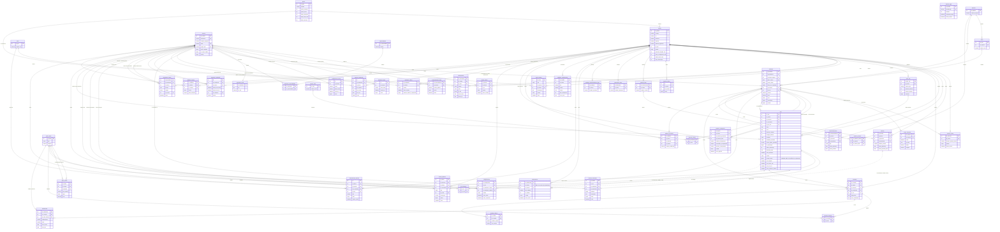

# Modelo Entidad-Relación (MER) - Zooki v2.0

Este documento describe la estructura y relaciones de la base de datos relacional de **Zooki** en su versión **v2.0** (arquitectura SaaS multi-inquilino). El modelo incorpora el aislamiento de datos por clínica (`id_clinica`), el grafo de conocimiento clínico, la suscripción por planes y la reputación de veterinarios, además del historial clínico y la auditoría ya existentes.

---

## Aislamiento multi-inquilino

Cada clínica es un **inquilino** identificado por `id_clinica`. Las tablas de negocio incorporan esa columna y toda consulta la filtra. Son **globales** (compartidas por todas las clínicas, sin `id_clinica`): los catálogos taxonómicos (`especies`, `razas`, `colores_base`), el catálogo de `planes` y `especialidades`, y el **grafo de conocimiento clínico** (`grafo_nodos`, `grafo_aristas`). El **super-administrador** no pertenece a ninguna clínica (`usuarios.es_super_admin`).

Los **propietarios** también son **identidades globales**: un único registro por persona, con **correo único en toda la plataforma**. Se vinculan a una o varias clínicas mediante la tabla puente **`propietario_clinica`** (el correo se verifica al crear la cuenta; si ya inició sesión y está verificado, puede elegir otra clínica sin repetir la verificación). Una misma persona puede tener **varios roles**: su rol de propietario (por `propietario_clinica`) y, en cada clínica donde trabaja, un rol de personal (administrador o veterinario) por la tabla **`usuario_clinica`**. Así un veterinario que trabaja en dos clínicas y tiene su propio perro usa una sola cuenta. Las **mascotas** también son **globales**: pertenecen a su propietario, no a una clínica, y se vinculan a cada clínica donde se atienden mediante la tabla puente **`mascota_clinica`** (que guarda además el número de historia clínica de esa clínica). Así una mascota tiene **una sola ficha, un solo carnet y un solo QR** en toda la plataforma. La ficha provisional de urgencia es la excepción temporal: se registra sin propietario verificado y con carnet inactivo hasta completarla o consolidarla (RE-4.15.3). El aislamiento se mantiene en los **registros clínicos**: `consultas`, `vacunas` y `desparasitaciones` llevan el `id_clinica` (y el veterinario) de la clínica que los creó, y solo esa clínica puede modificarlos. Otra clínica vinculada ve siempre las alergias y alertas médicas (`alertas_medicas`), las vacunas y desparasitaciones; las consultas de otras clínicas solo si el propietario la autorizó (`propietario_clinica.autoriza_historia_compartida`). Ver [Reglas de Negocio RN-110 a RN-115](ReglasNegocio.md#módulo-1--mascotas-y-propietarios).

## Diagrama Entidad-Relación

Escrito en Mermaid; se versiona junto al código y se renderiza a cualquier nivel de zoom. Las líneas continuas representan relaciones con clave foránea declarada; las punteadas, vínculos lógicos que el esquema no obliga.

```mermaid
erDiagram
    planes {
        int id_plan PK
        varchar nombre
        int precio_mensual
        int precio_anual
        int limite_mascotas
        int limite_citas_mes
        int limite_personal
    }
    clinicas {
        int id_clinica PK
        varchar nombre
        varchar nit UK
        varchar direccion
        varchar telefono
        varchar telefono_urgencias
        int id_plan FK
        enum estado
        int tolerancia_llegada_min
        int plazo_reasignacion_min
        int umbral_aviso_min
        int tope_sobrecupos
    }
    suscripciones {
        int id_suscripcion PK
        int id_clinica FK
        int id_plan FK
        enum estado
        enum ciclo
        tinyint al_dia
        date fecha_inicio
        date fecha_fin
    }
    plantillas_comunicacion {
        int id_plantilla PK
        int id_clinica FK
        varchar tipo
        varchar asunto
        text cuerpo
        int dias_anticipacion
        time hora_envio
    }
    roles {
        int id_rol PK
        varchar nombre_rol
    }
    usuarios {
        int id_usuario PK
        varchar documento UK
        varchar nombre_completo
        varchar email UK
        varchar google_uid UK
        tinyint perfil_completo
        tinyint es_super_admin
        tinyint estado
    }
    consentimientos_datos {
        int id_consentimiento PK
        int id_usuario FK
        varchar version_politica
        enum medio
        datetime fecha
    }
    usuario_clinica {
        int id_usuario PK
        int id_clinica PK
        int id_rol FK
        enum estado
        datetime fecha_vinculo
    }
    propietario_clinica {
        int id_propietario PK
        int id_clinica PK
        enum estado
        datetime fecha_vinculo
        tinyint autoriza_historia_compartida
    }
    mascota_clinica {
        int id_mascota PK
        int id_clinica PK
        varchar numero_historia_clinica
        enum estado
        datetime fecha_vinculo
    }
    password_resets {
        int id PK
        int id_usuario FK
        varchar token_hash
        datetime expires_at
        tinyint used
    }
    verificaciones_email {
        int id PK
        int id_usuario FK
        varchar email
        varchar token_hash
        datetime expires_at
        tinyint used
    }
    intentos_login {
        int id_intento PK
        varchar identificador UK
        int intentos
        datetime bloqueado_hasta
        datetime ultimo_intento
    }
    casos_soporte {
        int id_caso PK
        enum tipo
        int id_usuario FK
        int id_clinica FK
        text descripcion
        enum estado
        datetime fecha
    }
    carnet_escaneos {
        int id_escaneo PK
        int id_mascota FK
        datetime fecha
        char ip_hash
        decimal latitud
        decimal longitud
    }
    horarios_veterinario {
        int id PK
        int id_veterinario FK
        int id_clinica FK
        int dia_semana
        time hora_inicio
        time hora_fin
        tinyint activo
    }
    ausencias_veterinario {
        int id PK
        int id_veterinario FK
        int id_clinica FK
        datetime fecha_hora_inicio
        datetime fecha_hora_fin
        int id_cobertura FK
        varchar motivo
    }
    propuestas_horario {
        int id_propuesta PK
        int id_veterinario FK
        int id_clinica FK
        json franjas
        enum estado
        int id_revisor FK
        datetime fecha
    }
    reasignaciones {
        int id_reasignacion PK
        int id_cita FK
        int id_veterinario_origen FK
        int id_veterinario_destino FK
        enum estado
        datetime fecha_limite
        datetime fecha_respuesta
    }
    especialidades {
        int id_especialidad PK
        varchar nombre
    }
    veterinario_perfil {
        int id_veterinario PK
        text bio
        varchar url_foto
    }
    veterinario_especialidades {
        int id_veterinario PK
        int id_especialidad PK
    }
    resenas_veterinario {
        int id_resena PK
        int id_cita FK
        int id_veterinario FK
        int id_propietario FK
        tinyint estrellas
        text comentario
        tinyint oculta
        datetime fecha
    }
    grafo_nodos {
        int id_nodo PK
        enum tipo
        varchar etiqueta
    }
    grafo_aristas {
        int id_arista PK
        int id_origen FK
        int id_destino FK
        varchar tipo_relacion
        enum signo
        decimal peso
    }
    especies {
        int id_especie PK
        varchar nombre_especie
    }
    razas {
        int id_raza PK
        int id_especie FK
        varchar nombre_raza
    }
    colores_base {
        int id_color PK
        varchar nombre_color
    }
    mascotas {
        int id_mascota PK
        int id_propietario FK
        int id_clinica_registro FK
        char token_carnet UK
        tinyint carnet_activo
        tinyint ficha_por_completar
        int id_especie FK
        int id_raza FK
        varchar nombre
        decimal peso
        enum sexo
        tinyint esterilizado
        tinyint estado
    }
    ingresos_emergencia {
        int id_ingreso PK
        int id_clinica FK
        int id_mascota_provisional FK
        int id_mascota_final FK
        varchar nombre_acompanante
        varchar documento_acompanante
        varchar telefono_acompanante
        enum estado
        datetime fecha_ingreso
    }
    alertas_medicas {
        int id_alerta PK
        int id_mascota FK
        int id_clinica FK
        int id_veterinario FK
        enum tipo
        int id_nodo FK
        varchar descripcion
        tinyint activa
        datetime fecha
    }
    mascota_colores {
        int id_mascota PK
        int id_color PK
    }
    tipos_cita {
        int id_tipo_cita PK
        int id_clinica FK
        varchar nombre_tipo
        int duracion_minutos
        int margen_minutos
        tinyint pausable
    }
    citas {
        int id_cita PK
        int id_clinica FK
        int id_mascota FK
        int id_veterinario FK
        int id_tipo_cita FK
        date fecha
        time hora
        int duracion_minutos
        int margen_minutos
        enum prioridad
        enum prioridad_calculada
        varchar motivo_ajuste_prioridad
        tinyint es_sobrecupo
        int orden_sobrecupo
        text sintomas_texto
        datetime inicio_sintomas
        enum estado
        tinyint ocupa_horario "calculada: NULL si está libre o es sobrecupo"
        datetime hora_llegada
        datetime hora_inicio_real
        datetime hora_fin_real
        datetime aviso_atencion_abierta
    }
    cita_sintomas {
        int id_cita PK
        int id_nodo PK
    }
    consultas {
        int id_consulta PK
        int id_clinica FK
        int id_mascota FK
        int id_veterinario FK
        int id_cita FK
        text diagnostico
        text plan_tratamiento
    }
    consulta_sintomas {
        int id_consulta PK
        int id_nodo PK
    }
    tratamientos {
        int id_tratamiento PK
        int id_consulta FK
        int id_nodo_farmaco FK
        varchar medicamento
        varchar dosis
        date fecha_inicio
        date fecha_fin
    }
    archivos_clinicos {
        int id_archivo PK
        int id_consulta FK
        varchar nombre_original
        varchar ruta_archivo
    }
    vacunas_base {
        int id_vacuna_base PK
        int id_clinica FK
        varchar nombre_vacuna
    }
    especie_vacunas {
        int id_especie_vacuna PK
        int id_especie FK
        int id_vacuna_base FK
    }
    vacunas {
        int id_vacuna PK
        int id_clinica FK
        int id_mascota FK
        int id_veterinario FK
        varchar nombre_vacuna
        date fecha_aplicacion
        date fecha_proxima_dosis
    }
    desparasitaciones {
        int id_desparasitacion PK
        int id_clinica FK
        int id_mascota FK
        int id_veterinario FK
        enum tipo
        date fecha_aplicacion
        date fecha_proxima
    }
    laboratorios_base {
        int id_laboratorio PK
        int id_clinica FK
        varchar nombre_laboratorio
    }
    productos_desparasitacion_base {
        int id_producto PK
        int id_clinica FK
        varchar nombre_producto
    }
    notificaciones {
        int id_notificacion PK
        int id_clinica FK "NULL en avisos de la plataforma"
        int id_usuario FK
        varchar tipo_entidad
        int id_entidad
        enum estado
        datetime fecha_envio
    }
    notificaciones_internas {
        int id PK
        int id_clinica FK
        int id_usuario FK
        int id_rol_destino FK
        int id_cita FK
        varchar tipo
        tinyint leida
        datetime vigente_hasta
    }
    horarios_clinica {
        int id PK
        int id_clinica FK
        int dia_semana
        tinyint activo
    }
    auditoria_mascotas {
        int id_auditoria PK
        int id_clinica FK
        int id_mascota FK
        int id_usuario FK
        varchar campo_modificado
    }
    auditoria_sistema {
        int id_auditoria PK
        int id_clinica FK
        int id_usuario FK
        enum accion
        varchar tabla_afectada
    }

    planes    ||--o{ clinicas                : "clasifica"
    planes    ||--o{ suscripciones           : "se contrata en"
    clinicas  ||--o{ suscripciones           : "tiene"
    clinicas  ||--o{ usuario_clinica         : "emplea"
    usuarios  ||--o{ usuario_clinica         : "trabaja en"
    usuarios  ||--o{ consentimientos_datos    : "acepta la politica"
    usuarios  ||--o{ password_resets         : "recupera su clave"
    usuarios  ||--o{ verificaciones_email    : "verifica su correo"
    usuarios  ||--o{ casos_soporte           : "origina"
    clinicas  ||--o{ casos_soporte           : "involucra"
    clinicas  ||--o{ mascota_clinica         : "atiende"
    mascotas  ||--o{ mascota_clinica         : "se vincula a"
    clinicas  ||--o{ vacunas                 : "aplica"
    clinicas  ||--o{ desparasitaciones       : "aplica"
    mascotas  ||--o{ carnet_escaneos         : "registra escaneos"
    clinicas  ||--o{ citas                   : "agenda"
    clinicas  ||--o{ consultas               : "registra"
    clinicas  ||--o{ tipos_cita              : "configura"
    clinicas  ||--o{ horarios_clinica        : "define"
    clinicas  ||--o{ vacunas_base            : "cataloga"
    clinicas  ||--o{ laboratorios_base       : "cataloga"
    clinicas  ||--o{ productos_desparasitacion_base : "cataloga"
    clinicas  ||--o{ notificaciones          : "emite"
    clinicas  ||--o{ notificaciones_internas : "emite"
    clinicas  ||--o{ plantillas_comunicacion : "personaliza"
    clinicas  ||--o{ auditoria_mascotas      : "audita"
    clinicas  ||--o{ auditoria_sistema       : "audita"

    roles     ||--o{ usuario_clinica         : "define el rol en la clinica"
    usuarios  |o--o{ mascotas                : "es propietario de (salvo provisional)"
    mascotas  ||--o{ ingresos_emergencia     : "ficha provisional"
    mascotas  |o--o{ ingresos_emergencia     : "ficha final conciliada"
    clinicas  ||--o{ ingresos_emergencia     : "recibe urgencia"
    usuarios  ||--o| veterinario_perfil      : "tiene perfil"
    usuarios  ||--o{ veterinario_especialidades : "domina"
    especialidades ||--o{ veterinario_especialidades : "clasifica"
    usuarios  ||--o{ resenas_veterinario     : "es calificado en"
    citas     ||--o| resenas_veterinario     : "origina reseña"

    usuarios  ||--o{ propietario_clinica     : "se vincula (propietario)"
    clinicas  ||--o{ propietario_clinica     : "vincula propietarios"
    usuarios  ||--o{ horarios_veterinario    : "tiene horario (vet)"
    clinicas  ||--o{ horarios_veterinario    : "fija el horario"
    usuarios  ||--o{ ausencias_veterinario   : "registra ausencia (vet)"
    clinicas  ||--o{ ausencias_veterinario   : "registra"
    usuarios  ||--o{ ausencias_veterinario   : "cubre como reemplazo"
    usuarios  ||--o{ propuestas_horario      : "propone (vet)"
    clinicas  ||--o{ propuestas_horario      : "recibe"
    usuarios  ||--o{ propuestas_horario      : "aprueba o rechaza (admin)"
    citas     ||--o{ reasignaciones          : "se reasigna"
    usuarios  ||--o{ reasignaciones          : "cede (vet origen)"
    usuarios  ||--o{ reasignaciones          : "confirma (vet destino)"

    grafo_nodos ||--o{ grafo_aristas         : "es origen de"
    grafo_nodos ||--o{ grafo_aristas         : "es destino de"
    grafo_nodos ||--o{ alertas_medicas       : "codifica"
    grafo_nodos ||--o{ cita_sintomas         : "identifica"
    grafo_nodos ||--o{ consulta_sintomas     : "identifica"
    grafo_nodos ||--o{ tratamientos          : "codifica el farmaco"

    especies  ||--o{ razas                   : "agrupa"
    especies  ||--o{ mascotas                : "clasifica"
    razas     ||--o{ mascotas                : "clasifica"
    mascotas  ||--o{ mascota_colores         : "tiene"
    colores_base ||--o{ mascota_colores      : "compone"
    mascotas  ||--o{ citas                   : "es agendada en"
    mascotas  ||--o{ alertas_medicas         : "tiene"
    clinicas  ||--o{ alertas_medicas         : "registra"
    usuarios  ||--o{ alertas_medicas         : "registra (vet)"
    citas     ||--o{ cita_sintomas           : "reporta"
    consultas ||--o{ consulta_sintomas       : "registra"
    usuarios  ||--o{ citas                   : "atiende como veterinario"
    mascotas  ||--o{ consultas               : "recibe"
    citas     ||--o| consultas               : "origina"
    consultas ||--o{ tratamientos            : "receta"
    consultas ||--o{ archivos_clinicos       : "adjunta"
    mascotas  ||--o{ vacunas                 : "recibe"
    mascotas  ||--o{ desparasitaciones       : "recibe"
    especies  ||--o{ especie_vacunas         : "requiere"
    vacunas_base ||--o{ especie_vacunas      : "aplica a"
    usuarios  ||--o{ notificaciones          : "recibe"
    usuarios  ||--o{ notificaciones_internas : "recibe"
    roles     ||--o{ notificaciones_internas : "segmenta"
    citas     |o--o{ notificaciones_internas : "origina el aviso"
    mascotas  ||--o{ auditoria_mascotas      : "genera"

    tipos_cita ||--o{ citas                  : "define duracion"
    citas      ||..o{ notificaciones         : "recuerda (tipo_entidad, sin FK)"
    vacunas    ||..o{ notificaciones         : "recuerda (tipo_entidad, sin FK)"
    usuarios   ||--o{ auditoria_sistema      : "ejecuta"
```

---

## Detalle de Entidades Principales

### 1. Plataforma y suscripción (SaaS) — nuevo
*   **clinicas**: Cada inquilino de la plataforma; su `id_clinica` aísla los datos. Incluye nombre, `nit` (único, validado con el dígito de verificación de la DIAN; RN-010), dirección, teléfono, logo y el plan vigente. Su `estado` es `pendiente_verificacion` hasta que confirma el correo (RN-002), y luego `activa`, `suspendida` o `baja` (RN-012). Guarda también los parámetros de la agenda, con valores por defecto: `telefono_urgencias` (RN-421), `tope_sobrecupos` (2, RN-422), `tolerancia_llegada_min` (10, RN-426), `plazo_reasignacion_min` (10, RN-428) y `umbral_aviso_min` (15, RN-429).
*   **planes**: Catálogo **global** de planes (gratuito y profesional) con sus precios (mensual/anual) y límites (`limite_mascotas`, `limite_citas_mes`, `limite_personal`; NULL significa sin límite; RN-003).
*   **suscripciones**: Estado de la suscripción de cada clínica (`activa`/`suspendida`/`cancelada`), ciclo de cobro, indicador `al_dia` y vigencia.
*   **plantillas_comunicacion**: Plantillas de correo/notificación por clínica (asunto, cuerpo, formato) y parámetros de envío (días de anticipación, hora). Es la base de las comunicaciones del Módulo 8 (reputación y comunicaciones); la bitácora de envíos reutiliza `notificaciones`.

### 2. Acceso y usuarios
*   **roles**: Perfiles del sistema: `1 Administrador`, `2 Veterinario`, `4 Propietario`, `5 Super-administrador`. **El rol 3 (Recepcionista) se elimina en v2.0.** Los roles 1 y 2 se asignan por clínica en `usuario_clinica`; el 4 lo da el vínculo en `propietario_clinica` y el 5 la marca `usuarios.es_super_admin`. El catálogo conserva el 4 y el 5 para nombrar el contexto activo de la sesión (RN-G01) y para dirigir avisos internos por rol.
*   **usuarios**: Identidad única de cada persona. Su clave es `id_usuario`, un número que no cambia y no revela datos personales; el **documento** y el **correo** son únicos en toda la plataforma pero son datos corregibles, no la clave. Así el documento puede cambiar (de tarjeta de identidad a cédula, un error de digitación) o anonimizarse (RN-G16) sin tocar las demás tablas, que se relacionan por `id_usuario`. `documento` es NULL mientras una cuenta creada con Google no completa su perfil (`perfil_completo`); `password` es NULL hasta que esa cuenta cree una contraseña; `google_uid` vincula la cuenta de Google. Ya no lleva `id_clinica` ni `id_rol`: los roles se asignan por contexto. `es_super_admin` marca al operador de la plataforma, que no tiene roles de clínica. Al suprimir una cuenta (RN-G16) sus datos personales se reemplazan, `documento`, `email` y `google_uid` quedan en NULL y el `id_usuario` se conserva, por lo que la historia clínica y la auditoría siguen íntegras.
*   **consentimientos_datos**: Prueba de la autorización de tratamiento de datos (Ley 1581 de 2012 y Decreto 1377 de 2013): quién aceptó, qué versión de la política, por qué medio, cuándo y desde qué IP (RN-G19).
*   **usuario_clinica**: Roles de personal de una persona en cada clínica (`id_rol`: 1 administrador o 2 veterinario), con su estado. Inactivar a alguien en una clínica no afecta sus otros roles (RN-G08).
*   **propietario_clinica**: Tabla puente que vincula un propietario (global) con una o varias clínicas. Un propietario se crea una sola vez (correo único) y se liga a cada clínica mediante este registro, previa **verificación del correo** al ligar a una clínica nueva. Esto permite las tres vías de registro (alta por el personal, enlace/QR de la clínica, autoregistro directo eligiendo clínica) sin duplicar la persona ni romper la regla de correo único. `autoriza_historia_compartida` guarda si el propietario permite que esa clínica vea las consultas registradas por otras clínicas (revocable; RN-113).
*   **password_resets** y **verificaciones_email**: Enlaces de un solo uso, guardados como hash y con vencimiento, ligados a `id_usuario` (antes al documento). `verificaciones_email` guarda el correo que se verifica, así que sirve para el registro y para el cambio de correo: el correo nuevo solo reemplaza al anterior cuando se verifica (RN-G23).
*   **intentos_login**: Contadores de intentos fallidos, sin clave foránea. La clave del contador (`identificador`, única) lleva prefijo: `ip:<dirección>` para el bloqueo por IP, `cuenta:<id_usuario>` para exigir el CAPTCHA por cuenta (RN-G15) y `chk:<dirección>` para limitar las verificaciones de documento y correo del formulario de registro. El contador por cuenta usa `id_usuario` y no el documento, porque la persona puede entrar con su documento, su correo o Google y los tres deben sumar al mismo contador.
*   **casos_soporte**: Casos que pasan al super-administrador: un documento que ya pertenece a otra cuenta (RN-G24), una posible cuenta o clínica duplicada y el abuso del plan gratuito (RN-012). Guarda el tipo, la persona y la clínica involucradas, la descripción y el estado (`abierto`, `resuelto`, `descartado`).

### 3. Reputación de veterinarios — nuevo
*   **especialidades**: Catálogo global de especialidades veterinarias.
*   **veterinario_perfil**: Datos públicos del veterinario (biografía, foto).
*   **veterinario_especialidades**: Relación N:M entre veterinarios y especialidades.
*   **resenas_veterinario**: Calificación (`estrellas` 1–5 y comentario opcional) atada a una **cita atendida**; una reseña por cita. Alimenta el promedio del perfil y el emparejamiento del Grafo II. `oculta` marca una reseña ocultada por moderación del super-administrador; la clínica no puede editarla ni borrarla (RN-804).

### 4. Grafo de conocimiento clínico (Grafo I) — nuevo, global
*   **grafo_nodos**: Conceptos clínicos con su `tipo` (`sintoma`, `diagnostico`, `farmaco`, `especie`, `raza`, `condicion`).
*   **grafo_aristas**: Relaciones dirigidas entre nodos con `tipo_relacion`, `signo` (`positivo`/`negativo`) y `peso`. Es un **grafo con signo**: lo positivo favorece, lo negativo contraindica o veta. Compartido por todas las clínicas.
*   Los datos de cada paciente se cruzan con el grafo por cuatro puntos: `alertas_medicas.id_nodo`, `cita_sintomas`, `consulta_sintomas` y `tratamientos.id_nodo_farmaco`. Sin esos enlaces el triage y las advertencias de prescripción no tendrían de dónde leer.

> El **Grafo II (agenda)** no guarda el grafo: lo construye en tiempo real a partir de `citas` (estado, nivel de triage, horas reales, sobrecupos), `tipos_cita` (duración, margen, pausable), `horarios_clinica`, `horarios_veterinario`, `ausencias_veterinario` y los parámetros de la clínica. Solo persiste lo que debe sobrevivir entre una petición y otra: las reasignaciones que esperan confirmación (`reasignaciones`) y las propuestas de horario (`propuestas_horario`).

### 5. Pacientes y catálogos taxonómicos
*   **mascotas**: Ficha **global** del animal, del propietario y no de una clínica (sin `id_clinica`). FKs a `especies`, `razas` y `usuarios` (propietario). En una urgencia roja sin identificación verificable, `id_propietario`, especie, raza, nombre y peso pueden quedar NULL solo con `ficha_por_completar = 1`; la aplicación exige esos datos al completar la ficha ordinaria (RE-4.15.3). `raza_indicada` guarda la raza escrita cuando no está en la lista, con el mismo largo que `razas.nombre_raza` (50 caracteres) para que pueda pasar al catálogo sin recortarse. `esterilizado` es NULL si no se sabe; el triage lo usa. `token_carnet` es aleatorio (≥ 128 bits) y nunca expone `id_mascota` en la URL (RN-502); el carnet de una ficha provisional permanece inactivo. `id_clinica_registro` guarda la clínica que la registró: junto con el propietario, es la única que puede cambiar especie, raza, sexo y fecha de nacimiento (RN-110). `carnet_activo` apaga el carnet sin borrar el token, cuando la mascota se inactiva o su propietario suprime la cuenta (RN-502, RN-G16).
*   **ingresos_emergencia**: Guarda el ingreso **presencial** provisional de una urgencia roja con `id_clinica`, la mascota provisional y los datos disponibles del acompañante, sin atribuirle la propiedad ni crearle una cuenta. `id_mascota_final` identifica la misma mascota al completar la ficha o una ficha existente después de verificar su titularidad y consolidar los actos clínicos en una transacción; la ficha provisional queda inactiva y el ingreso conserva la trazabilidad. Un rojo iniciado en el portal autenticado usa el propietario de la sesión y la mascota seleccionada. También en un ingreso presencial con relación verificada se usan los registros existentes: ninguno de esos casos crea un ingreso provisional (RE-4.15.3, RN-G19, RN-420).
*   **alertas_medicas**: Alergias, condiciones crónicas y medicación continua de la mascota (`tipo`). Cada alerta guarda la clínica y el veterinario que la registró y, si existe, el nodo del Grafo I al que corresponde (`id_nodo`), para que el triage y la prescripción la crucen con el grafo. Es global para la mascota: la ven todas las clínicas vinculadas y el carnet público (RN-113, RN-416, RN-503). Una alerta no se borra: se desactiva (`activa = 0`).
*   **mascota_clinica**: Tabla puente mascota↔clínica. Se crea al registrar o vincular la mascota en una clínica; `numero_historia_clinica` se asigna al guardar la primera consulta en esa clínica (RN-102) y es único por `id_clinica`. Es la base del límite de mascotas del plan.
*   **carnet_escaneos**: Registro de cada escaneo del carnet público: fecha, IP anonimizada (hash) y ubicación solo si quien escanea la comparte. Alimenta el aviso al propietario y el límite de consultas por IP (RN-504, RN-505).
*   **especies**, **razas**, **colores_base** y **mascota_colores**: Catálogos **globales** de taxonomía y la relación N:M de colores.

### 6. Operación clínica
*   **citas**: Agenda por clínica (`id_clinica`). El campo `prioridad` guarda el **nivel de triage de 4 niveles** — 🔴 rojo (crítico), 🟠 naranja (urgente), 🟡 amarillo (prioritario), 🟢 verde (no urgente) — **calculado por el Grafo I** a partir de los síntomas; conserva estados, horas reales y control de solapamientos. `prioridad_calculada` conserva el nivel que dio el Grafo I cuando el veterinario lo ajusta (RN-419); `hora_llegada` registra la llegada del propietario (RN-426); los estados incluyen `sin_cerrar` y `pausada` (RN-427). Los síntomas se guardan de forma estructurada (RN-424): los marcados del catálogo del grafo en `cita_sintomas`, el texto libre en `sintomas_texto` y su comienzo en `inicio_sintomas`. `motivo_ajuste_prioridad` es obligatorio cuando el veterinario cambia el nivel (RN-419); `es_sobrecupo` marca las citas que cuentan contra el tope de sobrecupos del bloque y `orden_sobrecupo` conserva su posición, inicialmente por llegada y modificable por veterinario con motivo auditado (RN-422). `id_tipo_cita` pasa a ser clave foránea. `duracion_minutos` y `margen_minutos` guardan los valores aplicados al reservar; cambiar después el tipo no altera las citas existentes. `aviso_atencion_abierta` guarda cuándo se avisó que la atención seguía abierta después de su hora de fin, para avisar una sola vez (RN-409). `ocupa_horario` es una columna calculada que vale 1 mientras la cita ocupa su horario y NULL cuando está libre (`cancelada` o `no_asistio`) o es sobrecupo; con ella, el índice único `(id_veterinario, fecha, hora, ocupa_horario)` impide en la base dos reservas del mismo veterinario a la misma hora (RN-401). El índice no lleva `id_clinica`, así que tampoco deja reservar dos veces a un veterinario que trabaja en dos clínicas; el tope de sobrecupos (RN-422) se controla en la transacción de reserva.
*   **tipos_cita**: Servicios y su duración base, ahora por clínica. Suma `margen_minutos`: el **colchón (buffer)** por tipo de cita que absorbe los retrasos y alimenta el cálculo de disponibilidad y el reajuste en vivo (Grafo II). `pausable` indica si una cita de ese tipo puede interrumpirse por una urgencia (RN-427).
*   **horarios_veterinario**: Horario **recurrente** de cada veterinario por clínica (`id_clinica`) y día de la semana (franjas `hora_inicio`–`hora_fin`); un veterinario que trabaja en dos clínicas tiene un horario en cada una, y no pueden chocar entre sí. Lo configura el administrador de esa clínica (RN-706). Reemplaza el supuesto de disponibilidad 24/7: la disponibilidad real es `horario de la clínica ∩ horario del veterinario − ausencias`.
*   **ausencias_veterinario**: Excepciones por clínica y rango de fecha y hora (permiso, incapacidad, "ese día no vino") que tapan la disponibilidad del veterinario en ese rango. `fecha_hora_inicio` es inclusiva y `fecha_hora_fin` exclusiva, en la zona horaria de la clínica; un día completo va de las 00:00 de ese día a las 00:00 del siguiente. `id_cobertura` es la clave foránea del veterinario que lo reemplaza; así un "intercambio de turnos" queda registrado como **ausencia del titular + cobertura del reemplazo** (reasignación de sus citas). La trazabilidad de quién atendió realmente la da la historia clínica, no la agenda.
*   **propuestas_horario**: Cambios de horario que propone el veterinario (`franjas`), con estado `pendiente`, `aprobada` o `rechazada` y el administrador que la revisó (`id_revisor`). Al aprobarse, las franjas pasan a `horarios_veterinario` y las citas que queden fuera se marcan para reajuste (RN-706).
*   **reasignaciones**: Cada reasignación en vivo de una cita: veterinario de origen y de destino, plazo para confirmar (`fecha_limite`) y estado (`pendiente`, `aceptada`, `rechazada`, `vencida`). Si vence o se rechaza, se crea la propuesta al siguiente veterinario (RN-428).
*   **consultas**, **tratamientos**, **archivos_clinicos**: Historia clínica; `consultas` lleva `id_clinica`, y `tratamientos`/`archivos_clinicos` heredan la clínica por su consulta. `consulta_sintomas` guarda los síntomas registrados en la consulta, a partir de los cuales el Grafo I sugiere diagnósticos (RN-210). `tratamientos` enlaza el fármaco con su nodo del grafo (`id_nodo_farmaco`) y guarda `fecha_inicio` y `fecha_fin`: la **medicación vigente** es la de los tratamientos aún no terminados más la medicación continua de `alertas_medicas`. El motor evalúa internamente esa medicación de todas las clínicas para RN-211; sin autorización para ver un tratamiento ajeno, la respuesta solo da una alerta genérica y no expone los datos del tratamiento.

### 7. Prevención
*   **vacunas**, **desparasitaciones**: Historial por mascota; cada registro lleva el `id_clinica` y el veterinario que lo aplicó, para mostrar en el carnet y en la historia compartida qué clínica lo hizo (RN-112).
*   **vacunas_base**, **laboratorios_base**, **productos_desparasitacion_base**: Catálogos configurables **por clínica** (`id_clinica`). **especie_vacunas** no lleva `id_clinica`: hereda la clínica de su vacuna base. Al activarse, cada clínica recibe una copia de los valores por defecto de estos catálogos, de `tipos_cita` y de `horarios_clinica` (RE-0.2.5).

### 8. Comunicaciones y auditoría
*   **notificaciones**: Correos a las personas (`id_usuario`, antes `id_propietario`), por clínica; `estado` (`enviado`/`error`); sirve además de bitácora de envíos (Módulo 8). `id_clinica` es NULL en los avisos de la plataforma que no pertenecen a una clínica: escaneo del carnet, cambio de correo o de documento.
*   **notificaciones_internas**: Avisos al personal por usuario o rol, por clínica. `id_cita` liga el aviso a su cita para retirarlo cuando la cita se cancela, se reprograma o se atiende, y `vigente_hasta` marca desde cuándo deja de mostrarse (NULL: no caduca).
*   **horarios_clinica**: Bloques de atención (mañana/tarde) por día y por clínica.
*   **auditoria_mascotas**, **auditoria_sistema**: Trazabilidad de cambios y de seguridad, con `id_clinica`. `auditoria_sistema.id_usuario` pasa a ser clave foránea (NULL cuando el intento no corresponde a una cuenta): como las cuentas nunca se borran, solo se anonimizan, la referencia siempre es válida.

### 9. Infraestructura
*   **schema_migraciones**: Migraciones aplicadas (archivo y fecha); la crea y mantiene `scripts/migrar.php`. En la v2 ya no guarda el modo «línea base»: la base nace con `database/01_schema.sql` y las migraciones empiezan en `03`. Los datos semilla (`02_semilla.sql`) no se anotan aquí, porque el migrador los aplica en cada arranque.

### 10. Índices y restricciones

Además de las claves primarias, foráneas y únicas del diagrama, el esquema ejecutable (`database/01_schema.sql`) declara:

*   **Unicidad:** `consultas.id_cita` (una consulta por cita), `especie_vacunas (id_especie, id_vacuna_base)`, `horarios_clinica (id_clinica, dia_semana)`, `roles.nombre_rol`, `planes.nombre`, `especies.nombre_especie`, `razas (id_especie, nombre_raza)` y `colores_base.nombre_color`. Los de los catálogos globales hacen que la semilla se pueda aplicar varias veces sin duplicar filas.
*   **Doble reserva:** `citas (id_veterinario, fecha, hora, ocupa_horario)`, único y sin `id_clinica` (ver §6).
*   **Aislamiento:** índices compuestos que empiezan por `id_clinica` en las tablas de negocio (`citas`, `consultas`, `vacunas`, `desparasitaciones`, `tipos_cita`, `horarios_veterinario`, `ausencias_veterinario`, `propuestas_horario`, catálogos por clínica, `notificaciones`, `notificaciones_internas`, `auditoria_*`, `usuario_clinica`, `propietario_clinica`, `mascota_clinica`, `suscripciones`, `plantillas_comunicacion` e `ingresos_emergencia`), para que el filtro por clínica (RNF-11) no recorra la tabla completa.
*   Todas las tablas usan InnoDB y `utf8mb4` (`utf8mb4_general_ci`). Ninguna clave foránea borra en cascada salvo `mascota_colores`: las personas, las citas y la historia clínica no se borran (RN-G08, RN-405, RN-206).
