# Modelos y diagramas — Zooki v2.0

Este documento reúne los modelos de la Fase 2: el modelo conceptual de los dos grafos (soporte a la decisión clínica y agendamiento inteligente), los diagramas de proceso de negocio (BPMN) y los flujos del sistema. Complementa al [ERS](ERS.md) y al [MER](MER.md), y se renderiza en el portal mediante Mermaid.

> **Cómo verlos:** cada diagrama tiene arriba un visor con zoom, desplazamiento y pantalla completa (ajusta al ancho y al alto de la pantalla). El botón **draw.io** descarga o abre la versión con estilo (archivo con todas las hojas). Estos diagramas son la versión **detallada**: incluyen las validaciones, las ramas de error, el triage de 4 niveles, la cobertura de ausencias y el propietario multi-clínica. El detalle normativo (reglas de negocio, requisitos, diccionario de datos) vive en el ERS, el MER y las [Reglas de Negocio](ReglasNegocio.md).

**Convención de formas:** rombo `{ }` = pregunta/decisión · rectángulo `[ ]` = acción · `[/ /]` = mensaje al usuario · `[[ ]]` = subproceso · `{{ }}` = evento · `([ ])` = inicio/fin.

---

## Arquitectura — Diagrama de componentes

Vista de componentes de la plataforma v2.0 (SaaS multi-inquilino, tres capas). El cliente entra siempre por el **front controller**, que resuelve el inquilino y pasa por **Security** (rol + CSRF + `id_clinica`) antes de llegar a los controladores. La lógica de dominio incluye los dos motores de grafos, que se recorren **en memoria**: el Grafo I se guarda en tablas y se carga para recorrerlo; el Grafo II se arma en cada cálculo con los datos de la agenda. Los datos viven en MySQL con las filas **aisladas por `id_clinica`**, y las tareas programadas (cron) alimentan recordatorios, vencimiento de suscripciones, el vigilante de atenciones, el vencimiento de las reasignaciones sin confirmar y los respaldos.

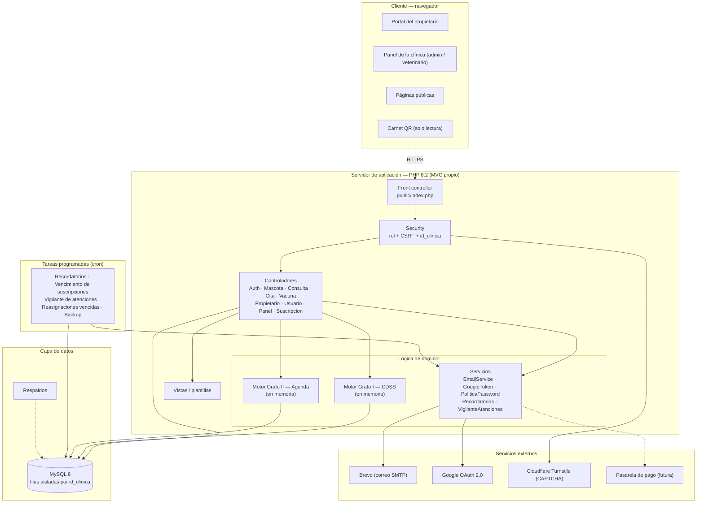

---

## 1. Grafo I — Conocimiento clínico (grafo con signo)

El conocimiento clínico se modela como un **grafo dirigido, ponderado y con signo**. Los nodos son conceptos (síntomas, diagnósticos, fármacos, especies, razas, condiciones) y las aristas sus relaciones: las **positivas** (`＋ trata`) favorecen una opción y las **negativas** (`－ tóxico-para`, `contraindica`) la vetan. Los pesos en las aristas `síntoma → diagnóstico` permiten ordenar los diagnósticos probables.

El siguiente ejemplo recorre un caso real: tres síntomas apuntan con distinto peso a un diagnóstico, que propone dos fármacos; el nodo *Especie: Gato* dispara una arista negativa que descarta el paracetamol antes de recetarlo.

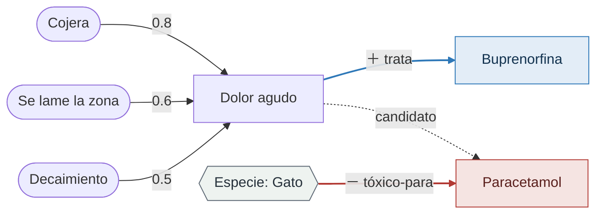

**Lectura:** lo azul (positivo) suma a favor; lo rojo (negativo) veta. El motor recorre el grafo durante la consulta y, en la prescripción, cruza el fármaco con la especie, la raza, las alergias y la medicación vigente del paciente (RN-211). Se almacena como lista de aristas (`grafo_nodos`, `grafo_aristas`) y se recorre en memoria como lista de adyacencia.

---

## 2. Grafo II — Agendamiento inteligente

La agenda se modela como un grafo cuyos nodos son las citas del día por veterinario, con tres tipos de arista: **secuencia** (una cita depende del fin real de la anterior), **conflicto** (dos citas que chocan en horario y veterinario) y **emparejamiento** (asignación cita–veterinario, que permite reasignar). El grafo no se guarda: se construye en tiempo real desde `citas`, `tipos_cita`, los veterinarios (`usuarios`), `horarios_clinica`, `horarios_veterinario` y `ausencias_veterinario`. Solo se guardan las reasignaciones que esperan confirmación (`reasignaciones`) y las propuestas de horario (`propuestas_horario`); ver el [MER](MER.md#6-operación-clínica).

El ejemplo muestra el **efecto cascada**: la cirugía de las 09:30 se extiende y el retraso se propaga por la cola del veterinario A; el sistema detecta un espacio libre en el veterinario B y **propone reasignarle** la última cita para absorberlo.

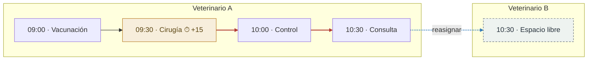

**Lectura:** las aristas rojas son la propagación del retraso; la azul punteada es la reasignación que propone el Grafo II y que el veterinario B debe confirmar (RN-428). Sobre este grafo actúa además la **prioridad (triage)** de 4 niveles que calcula el Grafo I: una cita urgente pesa más y puede tomar el próximo espacio (o un sobrecupo) antes que una ordinaria.

---

## 3. Proceso de negocio — Consulta clínica (con Grafo I)

Actores: Veterinario. Entrada desde una cita del calendario, o sin cita vía el módulo de Atención/Urgencias. El sistema apoya en cada paso; la decisión final es siempre del veterinario.

```mermaid
flowchart TD
  A([Veterinario va a atender]) --> B{Como atiende?}

  B -- Desde una cita (calendario) --> C{"Puede iniciar? Es el vet asignado, es el dia de la cita y faltan 15 min o menos (RN-407)"}
  C -- No --> C1[/"Mensaje: no puede iniciar esta atencion"/]
  C1 --> ZF([Fin])
  C -- Si --> D[Iniciar atencion y sellar hora_inicio_real]
  D --> CTX

  B -- "Sin cita / urgencia (modulo Atencion)" --> F{La mascota esta vinculada a la clinica?}
  F -- Si --> F1[Seleccionar la mascota activa]
  F1 --> CTX
  F -- No --> FX{"Ya existe en la plataforma? (buscar por el documento de quien la trae)"}
  FX -- Si --> FX1["Vincularla a esta clinica al atenderla (RN-110, RN-208)"]
  FX1 --> CTX
  FX -- No --> G["Registro rapido de emergencia: nombre, especie, raza o edad de la mascota<br/>y nombre, documento y telefono de quien la trae"]
  G --> G1["Guardar la mascota con marca 'ficha por completar', a nombre de esa persona<br/>(si no tiene cuenta, queda creada pendiente de activar, §11)"]
  G1 --> CTX

  CTX["Contexto del paciente: especie, raza, edad, alergias y alertas, historia<br/>(consultas de otras clinicas solo si el propietario lo autorizo, RN-113)<br/>+ predisposiciones por raza (Grafo I)"] --> H["Form Consulta: motivo, anamnesis,<br/>examen fisico (peso, temperatura, FC, FR), sintomas"]
  H --> I{Campos obligatorios y rangos validos?}
  I -- No --> I1[/"Mensaje: corrige los campos marcados"/]
  I1 --> H
  I -- Si --> J[Grafo I: ordena diagnosticos probables por peso segun los sintomas]
  J --> K{El grafo encontro coincidencias?}
  K -- No --> L[El veterinario escribe el diagnostico]
  K -- Si --> M[Mostrar diagnosticos probables rankeados]
  M --> L
  L --> N{"Diagnostico registrado? (RN-202)"}
  N -- No --> N1[/"Mensaje: el diagnostico es obligatorio"/]
  N1 --> L
  N -- Si --> O[Grafo I sugiere examenes y tratamiento]
  O --> O2[El veterinario revisa y decide: acepta la sugerencia o define el suyo]
  O2 --> P["Form Tratamiento: medicamento, dosis,<br/>via, duracion, observaciones"]
  P --> Q{"Alergia registrada del paciente, toxico para la especie<br/>o contraindicado por raza? (RN-211)"}
  Q -- Si --> Q1[/"Mensaje de bloqueo: elige otro farmaco"/]
  Q1 --> P
  Q -- No --> R{Interaccion con la medicacion vigente?}
  R -- Si --> R1[Advertencia: el vet confirma o cambia. Queda en auditoria]
  R -- No --> S[Calcular dosis por peso del examen fisico y especie]
  R1 --> S
  S --> T{"Hay condicion que ajuste la dosis? (falla renal/hepatica, preñez)"}
  T -- Si --> T1[Ajustar o advertir la dosis]
  T -- No --> U{Agregar otro tratamiento?}
  T1 --> U
  U -- Si --> P
  U -- No --> AL{"Detecto una alergia o alerta nueva?"}
  AL -- Si --> AL1["Registrarla en las alertas de la mascota<br/>(visible para toda clinica vinculada y en el carnet)"]
  AL1 --> V
  AL -- No --> V{Adjuntar archivos?}
  V -- Si --> W{"Tipo y tamaño validos? (JPG/PNG/PDF, max 10MB, RN-204)"}
  W -- No --> W1[/"Mensaje: archivo no permitido o demasiado grande"/]
  W1 --> V
  W -- Si --> X[Confirmar y guardar]
  V -- No --> X
  X --> Y[["Guardado atomico: consulta + tratamientos + archivos;<br/>N de historia si es la 1a (RN-102);<br/>completar la cita si venia de una (RN-406)"]]
  Y --> Y1{Guardado correcto?}
  Y1 -- No --> Y2[/"Mensaje: error al guardar, reintentar"/]
  Y2 --> X
  Y1 -- Si --> Z1[Registrar en auditoria]
  Z1 --> Z2{Fue registro rapido de emergencia?}
  Z2 -- Si --> Z3[Dejar tarea pendiente: completar la ficha del paciente]
  Z2 -- No --> ZF
  Z3 --> ZF
```

---

## 4. Proceso de negocio — Agendamiento de cita (con Grafo II y triage)

Actores: Propietario (desde su portal) y Veterinario (agenda interna de la clínica). El administrador no participa de este flujo. La prioridad (triage) la calcula el Grafo I a partir de los síntomas; el propietario no la elige.

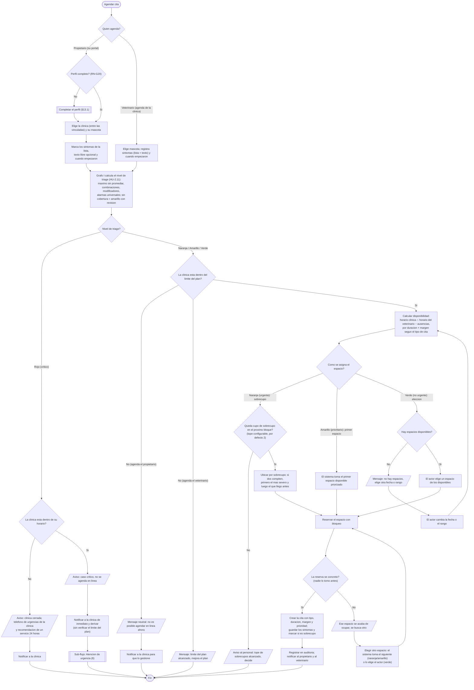

> **Orden del flujo:** el triage se calcula **antes** de verificar el límite del plan, porque una urgencia 🔴 nunca se bloquea por límite ni por mora (RN-420). Las pruebas del triage están en la batería de casos del repositorio (`documentacion/CasosTriage.md`).
>
> **Niveles de triage (4):** 🔴 Rojo = crítico (no se agenda, va a urgencias), 🟠 Naranja = urgente (sobrecupo, porque la mascota puede agravarse antes del primer espacio), 🟡 Amarillo = prioritario (primer espacio disponible), 🟢 Verde = no urgente (el actor elige). El nivel lo define el Grafo I (RN-411).

---

## 5. Proceso de negocio — Reajuste de agenda en vivo (efecto cascada)

Actores: Veterinario (origen y destino). El umbral de retraso es el **margen (buffer) por tipo de cita**: mientras el retraso cabe en el margen, no pasa nada; cuando lo supera, se propaga y, si una cita **se sale del horario disponible del veterinario**, el Grafo II busca reasignarla. La reasignación la confirma el **veterinario destino** dentro de un plazo (RN-428), y los avisos al propietario se agrupan para no saturarlo (RN-429). La llegada tarde del propietario sigue la RN-426 y también dispara este recálculo.

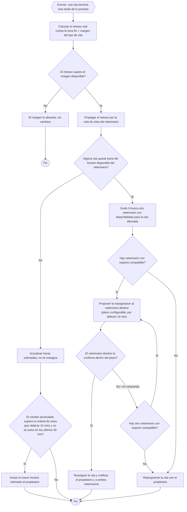

---

## 6. Proceso de negocio — Atención de urgencia (caso Rojo / llegada directa)

Actores: Veterinario y Propietario (que trae la mascota). Se dispara cuando el Grafo I marca un caso Rojo o cuando llega una urgencia directa a la clínica. El uso inmediato del espacio altera la agenda, por eso enlaza con el reajuste en vivo (§5) y con la consulta (§3).

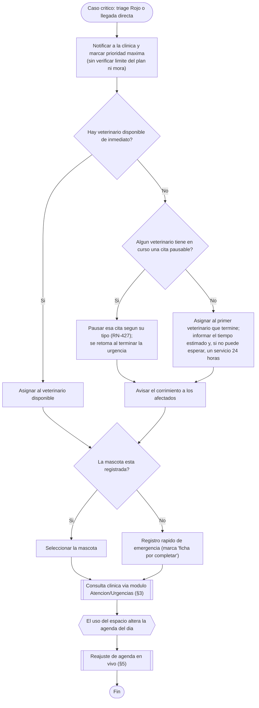

---

## 7. Proceso de negocio — Configurar horario del veterinario

Actores: Administrador de la clínica. Define el horario **recurrente** por día de la semana en su clínica (el veterinario solo propone cambios, §13.4); esto reemplaza el supuesto de que todos los veterinarios atienden 24/7. Si al cambiar el horario quedan citas por fuera, se marcan para reajuste (§5).

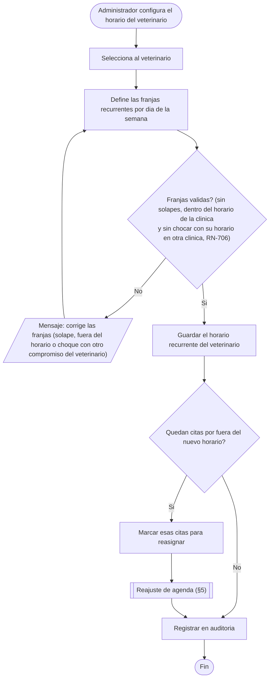

---

## 8. Proceso de negocio — Ausencia y cobertura del veterinario

Actores: Administrador (registra la ausencia) y Veterinario de cobertura (destino). Una ausencia es la excepción por fecha que tapa la disponibilidad recurrente. El "intercambio de turnos" no es una entidad nueva: es **ausencia del titular + cobertura del reemplazo** (reasignación de sus citas). La trazabilidad de quién atendió de verdad la da la historia clínica (RN-208), no la agenda.

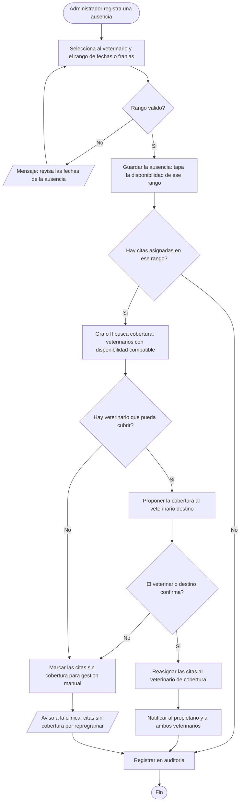

---

## 9. Flujo del sistema — Acceso y aislamiento por clínica (multi-inquilino)

Cómo el sistema resuelve el contexto (una persona puede tener varios roles: propietario y personal en una o varias clínicas) y confina cada sesión a la clínica de ese contexto. El aislamiento por `id_clinica` es transversal: no depende de la buena voluntad de cada consulta, sino que se centraliza en `helpers/Security.php` y en la capa de modelos, y se cubre con pruebas (RNF-11).

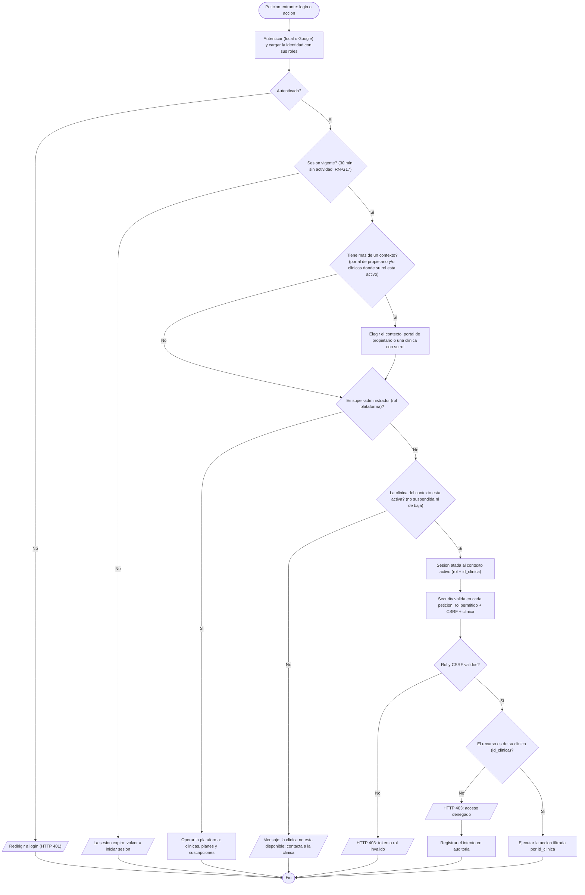

---

## 10. Flujo del sistema — Login del propietario (multi-clínica)

El propietario entra con su documento o correo y su contraseña, o con Google. Antes de llegar a su portal, el sistema revisa tres cosas: que la cuenta esté verificada, que el perfil esté completo (las cuentas de Google lo completan una vez, §13.1) y que haya aceptado la versión vigente de la política de datos. Una vez adentro ve **todas** sus mascotas y su historia; al agendar, cancelar o calificar elige **solo entre las clínicas a las que está vinculado** ([HU-5.9](HistoriasUsuario.md#hu-59--iniciar-sesión-en-el-portal-multi-clínica), [HU-T.18](HistoriasUsuario.md#hu-t18--registrarme-e-iniciar-sesión-con-google-propietario)). Si la persona tiene además roles de personal, elige el contexto como en el §9.

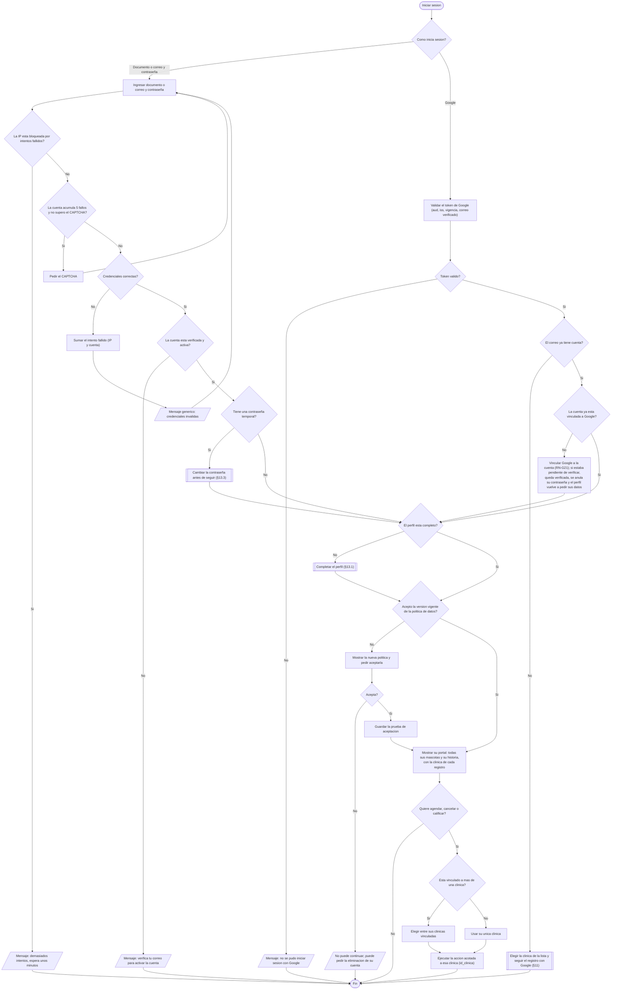


---

## 11. Flujo del sistema — Registro del propietario (multi-clínica)

Tres caminos de registro, siempre en el contexto de una clínica: **alta por el personal**, **enlace o QR de la clínica** y **autoregistro directo** eligiendo la clínica de la lista. En los dos últimos el propietario puede usar el formulario o **Google**; el alta por el personal no usa Google. Todo registro exige aceptar la política de tratamiento de datos ([RN-G19](ReglasNegocio.md#módulo-t--acceso-seguridad-y-administración-reglas-transversales)). Si el correo ya existe, no se duplica la identidad: se **liga** la cuenta existente a la nueva clínica, previa verificación de que es el dueño del correo ([RN-109](ReglasNegocio.md#módulo-1--mascotas-y-propietarios), [RN-G20](ReglasNegocio.md#módulo-t--acceso-seguridad-y-administración-reglas-transversales)).

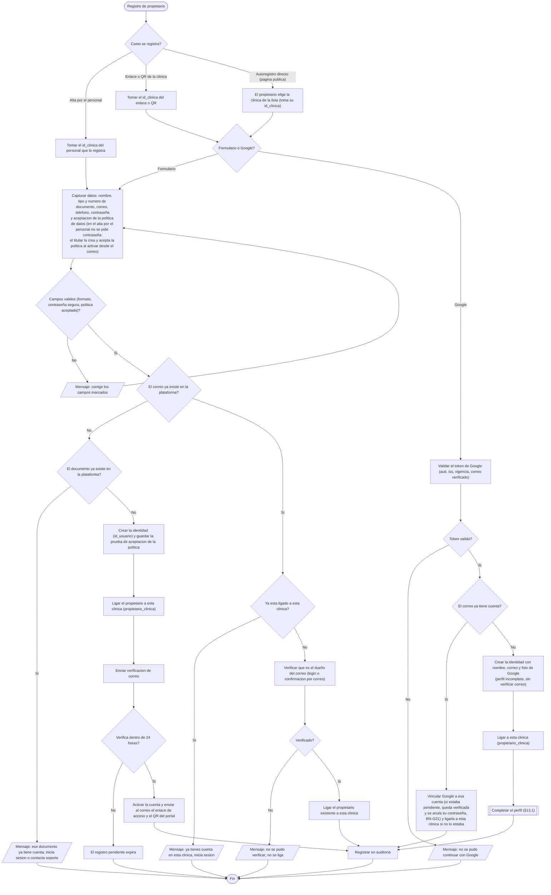


---

## 12. Flujos de proceso por módulo

Detalle del funcionamiento de cada proceso de módulo. Cada flujo se corresponde con una o varias historias de usuario (Fase 3), donde se detalla el comportamiento con sus criterios de aceptación.

### 12.1 Registro de clínica (self-service) — Módulo 0

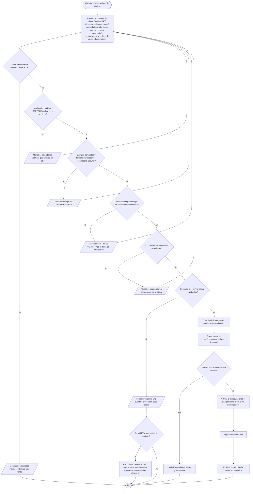

### 12.2 Control de límites del plan (freemium) — Módulo 0

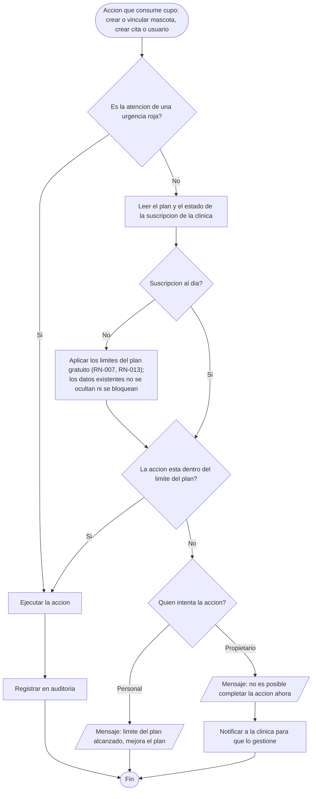

### 12.3 Registro de mascota y propietario — Módulo 1

La mascota es **global** del propietario: si él ya tiene la mascota en la plataforma (registrada en otra clínica), se **vincula** en lugar de crear una ficha duplicada ([RN-110, RN-111](ReglasNegocio.md#módulo-1--mascotas-y-propietarios)).

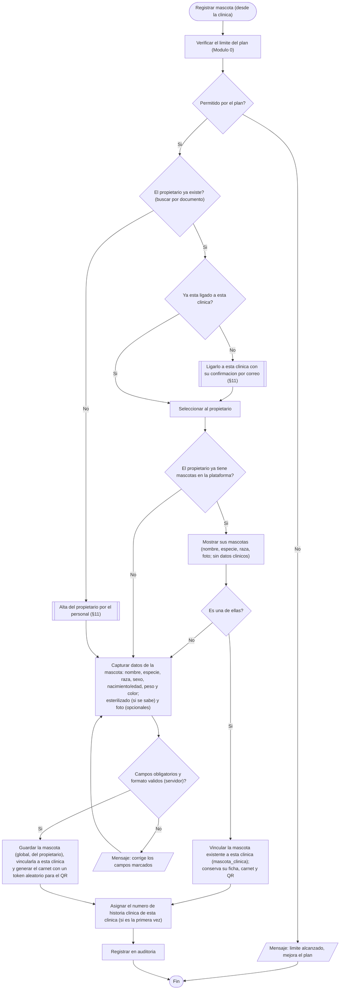

### 12.4 Vacunación y recordatorio automático — Módulo 3

Dos sub-flujos: **A)** el veterinario registra la vacuna; **B)** el sistema envía los recordatorios automáticos.

```mermaid
flowchart TD
  subgraph A["A) Registro de la vacuna (Veterinario)"]
    A1([Registrar vacuna aplicada]) --> A2[Capturar: vacuna, laboratorio, lote, fecha de aplicacion, veterinario]
    A2 --> A3{Campos validos?}
    A3 -- No --> A3a[/"Mensaje: corrige los campos marcados"/]
    A3a --> A2
    A3 -- Si --> A4[Calcular y guardar la proxima dosis segun el esquema]
    A4 --> A5[Programar el recordatorio en el calendario]
    A5 --> A6[Registrar en auditoria]
    A6 --> A7([Fin])
  end

  subgraph B["B) Recordatorio automatico (Sistema)"]
    B1{{Evento: cron diario}} --> B2["Buscar dosis que vencen en 7 y en 1 dia (por defecto, configurable por la clinica);<br/>sin mascotas inactivas ni dosis ya renovadas"]
    B2 --> B3{Hay dosis por vencer?}
    B3 -- No --> B9([Fin])
    B3 -- Si --> B4["Enviar recordatorio por correo al propietario,<br/>a nombre de la clinica que aplico la dosis"]
    B4 --> B5[Registrar el envio en notificaciones]
    B5 --> B6{El envio fue exitoso?}
    B6 -- Si --> B9
    B6 -- No --> B7["Reintentar el envio (hasta 3 veces)"]
    B7 --> B8{Se entrego en algun intento?}
    B8 -- Si --> B9
    B8 -- No --> B8a[Marcar como no entregado y avisar a la clinica]
    B8a --> B9
  end
```

### 12.5 Carnet de emergencia por QR — Módulo 5

El QR lleva un **token aleatorio**, nunca el id de la mascota; el propietario puede regenerarlo ([RN-502 a RN-505](ReglasNegocio.md#módulo-5--portal-del-propietario-multi-clínica)).

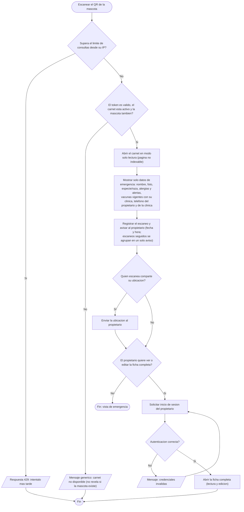

### 12.6 Calificación del veterinario — Módulo 8

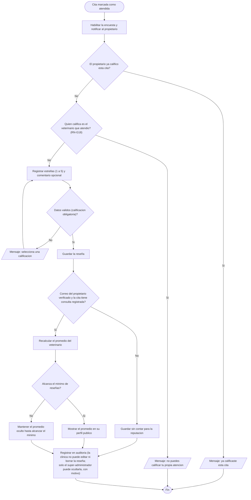

---

## 13. Flujos del sistema — Cuenta y perfil

Lo que una persona puede hacer con su propia cuenta: completar el perfil cuando se registró con Google, cambiar sus datos y su contraseña, y, si es veterinario, mantener su perfil público. Las reglas están en el Módulo T de las [Reglas de Negocio](ReglasNegocio.md#módulo-t--acceso-seguridad-y-administración-reglas-transversales) (RN-G19 a RN-G24) y las historias en [HU-T.2](HistoriasUsuario.md#hu-t2--cambiar-mi-contraseña), [HU-T.5](HistoriasUsuario.md#hu-t5--ver-y-actualizar-mi-perfil-y-datos-de-contacto) y [HU-T.18](HistoriasUsuario.md#hu-t18--registrarme-e-iniciar-sesión-con-google-propietario).

### 13.1 Completar el perfil (cuenta creada con Google)

No es una pantalla aparte que la persona busque: aparece sola apenas termina el registro con Google y vuelve a aparecer en cada inicio de sesión hasta que el perfil esté completo.

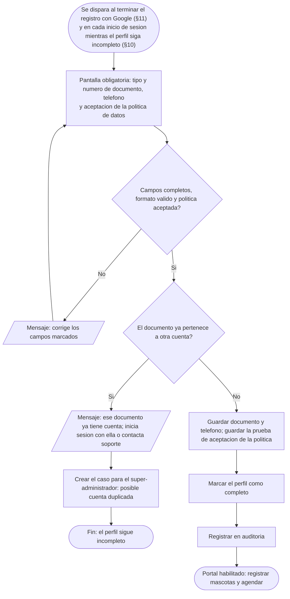

### 13.2 Cambiar mis datos: teléfono, correo y documento

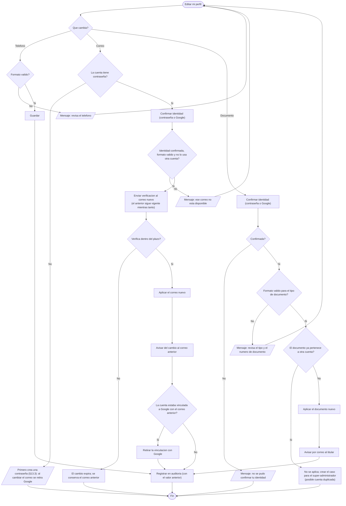

### 13.3 Crear o cambiar mi contraseña

```mermaid
flowchart TD
  A([Contraseña en mi perfil]) --> B{La cuenta ya tiene contraseña?}
  B -- Si --> C[Cambiar contraseña: pedir la contraseña actual]
  C --> C1{La contraseña actual es correcta?}
  C1 -- No --> C2[/"Mensaje: la contraseña actual no es correcta"/]
  C2 --> C
  C1 -- Si --> N
  B -- "No (cuenta creada con Google)" --> G["Crear contraseña: volver a confirmar la identidad con Google"]
  G --> G1{Confirmada?}
  G1 -- No --> G2[/"Mensaje: no se pudo confirmar con Google"/]
  G2 --> ZF([Fin])
  G1 -- Si --> N
  N["Ingresar la nueva contraseña<br/>(se muestran los requisitos de la politica mientras se escribe)"] --> P{Cumple la politica de contraseñas?}
  P -- No --> P1[/"Mensaje: la contraseña no cumple los requisitos"/]
  P1 --> N
  P -- Si --> S[Guardar el hash de la nueva contraseña]
  S --> SS[Cerrar las demas sesiones abiertas y avisar del cambio por correo]
  SS --> AUD[Registrar en auditoria, sin la contraseña]
  AUD --> F([Fin: puede entrar con contraseña y, si tenia, con Google])
```

### 13.4 Perfil del veterinario

```mermaid
flowchart TD
  A([El veterinario abre su perfil]) --> Q{Que hace?}

  Q -- Editar bio o foto publicas --> B1{"Foto con tipo y tamaño validos?"}
  B1 -- No --> B2[/"Mensaje: revisa el archivo de la foto"/]
  B2 --> A
  B1 -- Si --> B3[Guardar; el perfil publico se actualiza]
  B3 --> AUD

  Q -- Ver sus especialidades --> E1[Solo lectura: las asigna el administrador de la clinica]
  E1 --> ZF([Fin])

  Q -- Proponer un cambio de horario --> H1[Proponer franjas por dia para la clinica del contexto activo]
  H1 --> H2{"Sin solapamientos, dentro del horario de la clinica<br/>y sin chocar con su horario en otra clinica?"}
  H2 -- No --> H3[/"Mensaje: la franja se solapa, queda fuera del horario o choca con otro compromiso"/]
  H3 --> H1
  H2 -- Si --> H4[Enviar la propuesta al administrador]
  H4 --> H5{El administrador la aprueba?}
  H5 -- No --> H6[Avisar al veterinario el rechazo y el motivo]
  H6 --> AUD
  H5 -- Si --> H7[Aplicar el nuevo horario]
  H7 --> H8{Quedan citas fuera del nuevo horario?}
  H8 -- Si --> H9[["Marcar esas citas para reajuste (§5)"]]
  H9 --> AUD
  H8 -- No --> AUD

  Q -- Ver sus calificaciones --> R1{Tiene 5 o mas reseñas validas?}
  R1 -- Si --> R2[Ver su promedio y sus reseñas]
  R1 -- No --> R3[Ver sus reseñas; el promedio publico aun no se muestra]
  R2 --> ZF
  R3 --> ZF

  AUD[Registrar en auditoria] --> ZF
```
